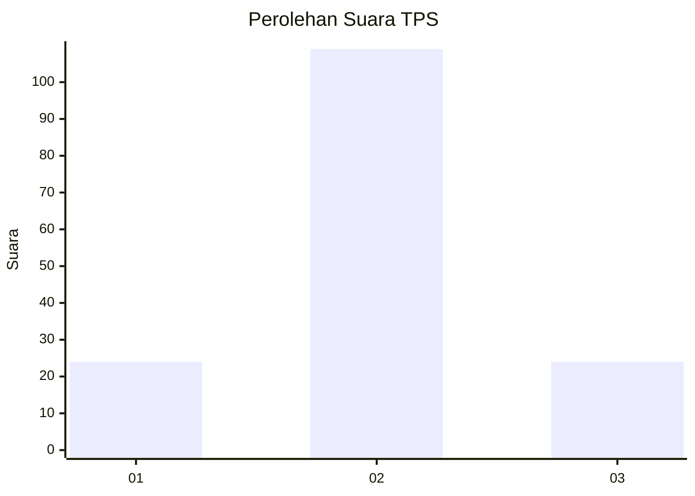

# Hasil

## Grafik

## Tabel

| No. | Nama Paslon    | Suara | Suara (raw) | Persentase |
|:--- |:-------------- | -----:| -----------:| ----------:|
| 1   | ANIES MUHAIMIN | 24    | [24][p-1]   | 15,29      |
| 2   | PRABOWO GIBRAN | 109   | [109][p-2]  | 69,43      |
| 3   | GANJAR MAHFUD  | 24    | [24][p-3]   | 15,29      |

[p-1]: https://github.com/gigit-pemilu/pemilu-2024/blob/main/pilpres/hitung-suara/sub/35-jawa-timur/sub/09-jember/sub/27-kalisat/sub/2006-glagahwero/sub/021-tps/sub/paslon-1.txt
[p-2]: https://github.com/gigit-pemilu/pemilu-2024/blob/main/pilpres/hitung-suara/sub/35-jawa-timur/sub/09-jember/sub/27-kalisat/sub/2006-glagahwero/sub/021-tps/sub/paslon-2.txt
[p-3]: https://github.com/gigit-pemilu/pemilu-2024/blob/main/pilpres/hitung-suara/sub/35-jawa-timur/sub/09-jember/sub/27-kalisat/sub/2006-glagahwero/sub/021-tps/sub/paslon-3.txt

## Foto C Plano

https://sirekap-obj-formc.kpu.go.id/04c7/pemilu/ppwp/35/09/27/20/06/3509272006021-20240214-225843--4be3d9d5-0b20-49dc-adff-7ab9811e9077.jpg

https://sirekap-obj-formc.kpu.go.id/04c7/pemilu/ppwp/35/09/27/20/06/3509272006021-20240214-190802--2f67a1d6-443f-4c74-9c9f-d2e1911243f7.jpg

https://sirekap-obj-formc.kpu.go.id/04c7/pemilu/ppwp/35/09/27/20/06/3509272006021-20240214-190829--7424182c-922c-4326-a40a-15c5b2b8f4be.jpg

## Metadata

| Key        | Value               |
| ---------- | ------------------- |
| Time Stamp | 2024-02-15 15:00:29 |

