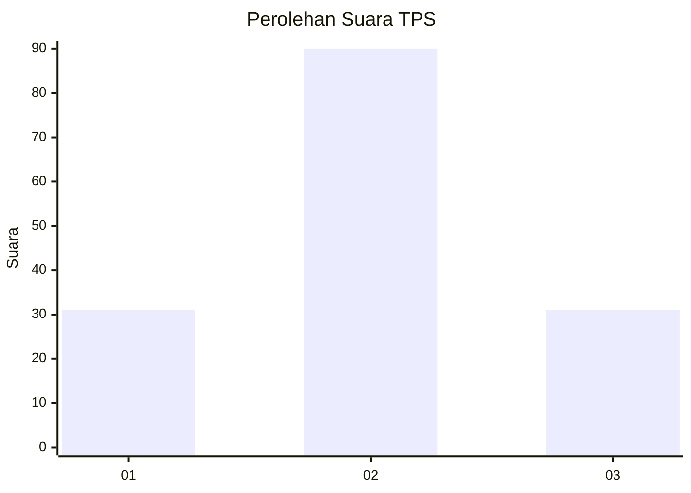
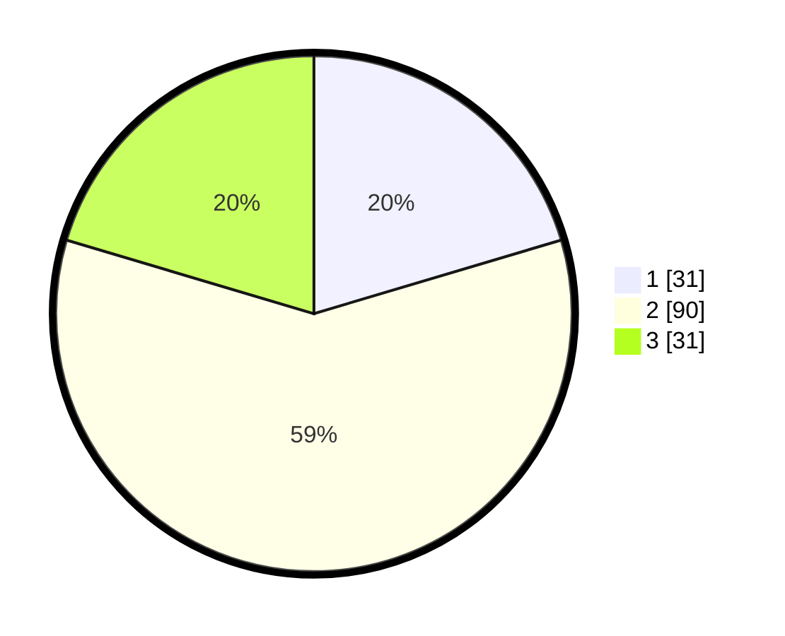

# Hasil

## Grafik

## Tabel

| No. | Nama Paslon    | Suara | Suara (raw) | Persentase |
|:--- |:-------------- | -----:| -----------:| ----------:|
| 1   | ANIES MUHAIMIN | 31    | [31][p-1]   | 20,39      |
| 2   | PRABOWO GIBRAN | 90    | [90][p-2]   | 59,21      |
| 3   | GANJAR MAHFUD  | 31    | [31][p-3]   | 20,39      |

[p-1]: https://github.com/gigit-pemilu/pemilu-2024-35-jawa-timur/blob/main/pilpres/hitung-suara/sub/35-jawa-timur/sub/09-jember/sub/27-kalisat/sub/2006-glagahwero/sub/023-tps/sub/paslon-1.txt
[p-2]: https://github.com/gigit-pemilu/pemilu-2024-35-jawa-timur/blob/main/pilpres/hitung-suara/sub/35-jawa-timur/sub/09-jember/sub/27-kalisat/sub/2006-glagahwero/sub/023-tps/sub/paslon-2.txt
[p-3]: https://github.com/gigit-pemilu/pemilu-2024-35-jawa-timur/blob/main/pilpres/hitung-suara/sub/35-jawa-timur/sub/09-jember/sub/27-kalisat/sub/2006-glagahwero/sub/023-tps/sub/paslon-3.txt

## Foto C Plano

https://sirekap-obj-formc.kpu.go.id/3f78/pemilu/ppwp/35/09/27/20/06/3509272006023-20240215-123137--bcffe1a2-4a65-4084-95ac-6988c218a358.jpg

https://sirekap-obj-formc.kpu.go.id/3f78/pemilu/ppwp/35/09/27/20/06/3509272006023-20240215-123141--3bed6d49-bd28-416e-a3f8-41e3aa432888.jpg

https://sirekap-obj-formc.kpu.go.id/3f78/pemilu/ppwp/35/09/27/20/06/3509272006023-20240215-123145--db050f95-c29f-45c0-8027-0be99b2865a3.jpg

## Metadata

| Key        | Value               |
| ---------- | ------------------- |
| Time Stamp | 2024-02-15 19:00:26 |

