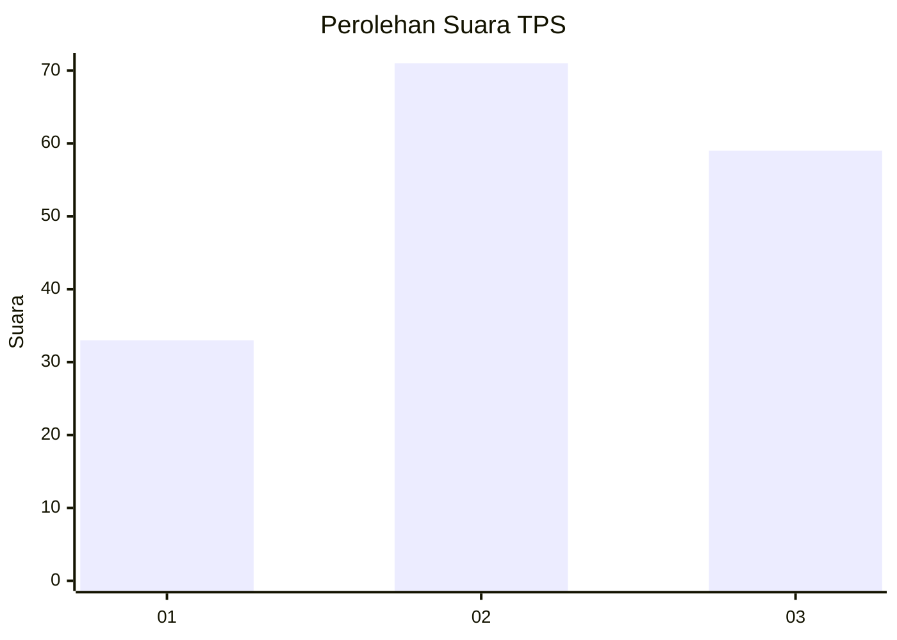
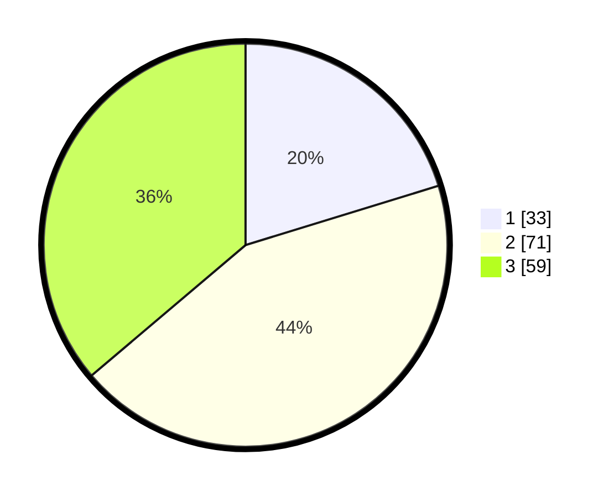

# Hasil

## Grafik

## Tabel

| No. | Nama Paslon    | Suara | Suara (raw) | Persentase |
|:--- |:-------------- | -----:| -----------:| ----------:|
| 1   | ANIES MUHAIMIN | 33    | [33][p-1]   | 20,25      |
| 2   | PRABOWO GIBRAN | 71    | [71][p-2]   | 43,56      |
| 3   | GANJAR MAHFUD  | 59    | [59][p-3]   | 36,20      |

[p-1]: https://github.com/gigit-pemilu/pemilu-2024-35-jawa-timur/blob/main/pilpres/hitung-suara/sub/35-jawa-timur/sub/09-jember/sub/27-kalisat/sub/2007-kalisat/sub/006-tps/sub/paslon-1.txt
[p-2]: https://github.com/gigit-pemilu/pemilu-2024-35-jawa-timur/blob/main/pilpres/hitung-suara/sub/35-jawa-timur/sub/09-jember/sub/27-kalisat/sub/2007-kalisat/sub/006-tps/sub/paslon-2.txt
[p-3]: https://github.com/gigit-pemilu/pemilu-2024-35-jawa-timur/blob/main/pilpres/hitung-suara/sub/35-jawa-timur/sub/09-jember/sub/27-kalisat/sub/2007-kalisat/sub/006-tps/sub/paslon-3.txt

## Foto C Plano

https://sirekap-obj-formc.kpu.go.id/7096/pemilu/ppwp/35/09/27/20/07/3509272007006-20240215-033510--a8581eac-56b0-4da6-a5e8-88b051c8197f.jpg

https://sirekap-obj-formc.kpu.go.id/7096/pemilu/ppwp/35/09/27/20/07/3509272007006-20240215-033536--8cd1d0ea-e976-451e-97fe-80dead1efb1b.jpg

https://sirekap-obj-formc.kpu.go.id/7096/pemilu/ppwp/35/09/27/20/07/3509272007006-20240215-033606--9d59e514-7802-491d-acc0-606bcb39541c.jpg

## Metadata

| Key        | Value               |
| ---------- | ------------------- |
| Time Stamp | 2024-02-15 15:00:29 |

