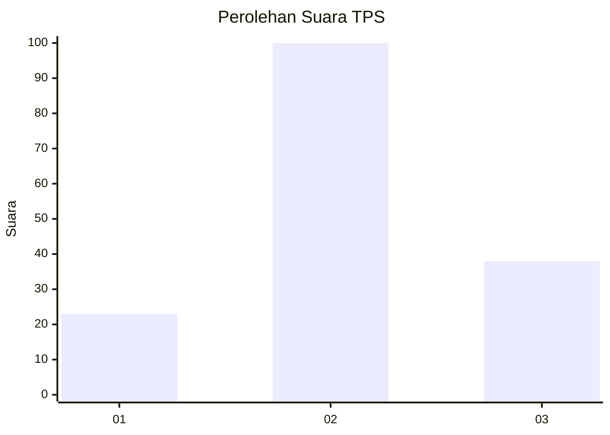
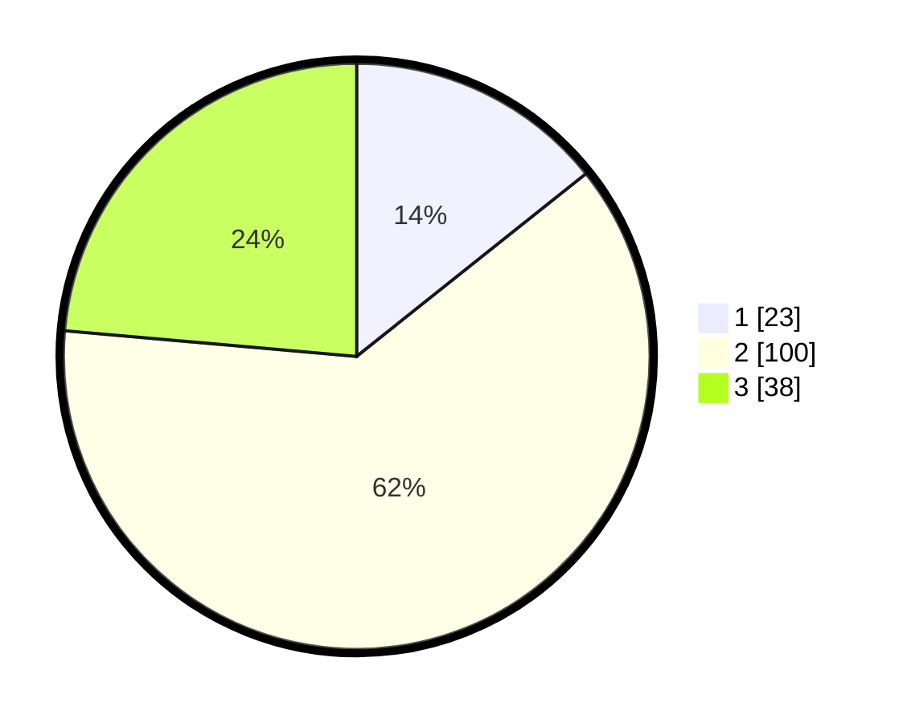

# Hasil

## Grafik

## Tabel

| No. | Nama Paslon    | Suara | Suara (raw) | Persentase |
|:--- |:-------------- | -----:| -----------:| ----------:|
| 1   | ANIES MUHAIMIN | 23    | [23][p-1]   | 14,29      |
| 2   | PRABOWO GIBRAN | 100   | [100][p-2]  | 62,11      |
| 3   | GANJAR MAHFUD  | 38    | [38][p-3]   | 23,60      |

[p-1]: https://github.com/gigit-pemilu/pemilu-2024-35-jawa-timur/blob/main/pilpres/hitung-suara/sub/35-jawa-timur/sub/09-jember/sub/27-kalisat/sub/2007-kalisat/sub/029-tps/sub/paslon-1.txt
[p-2]: https://github.com/gigit-pemilu/pemilu-2024-35-jawa-timur/blob/main/pilpres/hitung-suara/sub/35-jawa-timur/sub/09-jember/sub/27-kalisat/sub/2007-kalisat/sub/029-tps/sub/paslon-2.txt
[p-3]: https://github.com/gigit-pemilu/pemilu-2024-35-jawa-timur/blob/main/pilpres/hitung-suara/sub/35-jawa-timur/sub/09-jember/sub/27-kalisat/sub/2007-kalisat/sub/029-tps/sub/paslon-3.txt

## Foto C Plano

https://sirekap-obj-formc.kpu.go.id/2472/pemilu/ppwp/35/09/27/20/07/3509272007029-20240215-005230--1f919ba2-c0ff-4b28-9849-e2669622497d.jpg

https://sirekap-obj-formc.kpu.go.id/2472/pemilu/ppwp/35/09/27/20/07/3509272007029-20240215-005335--c1863c86-61c9-42de-a27f-a2d120296d61.jpg

https://sirekap-obj-formc.kpu.go.id/2472/pemilu/ppwp/35/09/27/20/07/3509272007029-20240215-005445--a5303f57-1829-4d44-8ae9-bab5874bc0dd.jpg

## Metadata

| Key        | Value               |
| ---------- | ------------------- |
| Time Stamp | 2024-02-25 17:00:00 |

