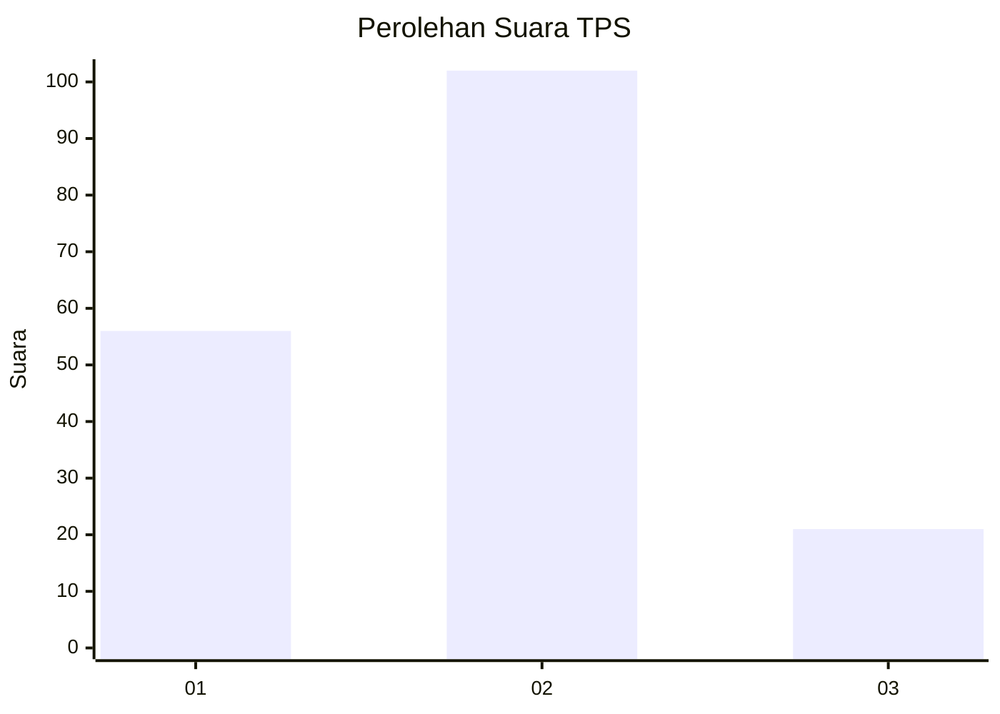
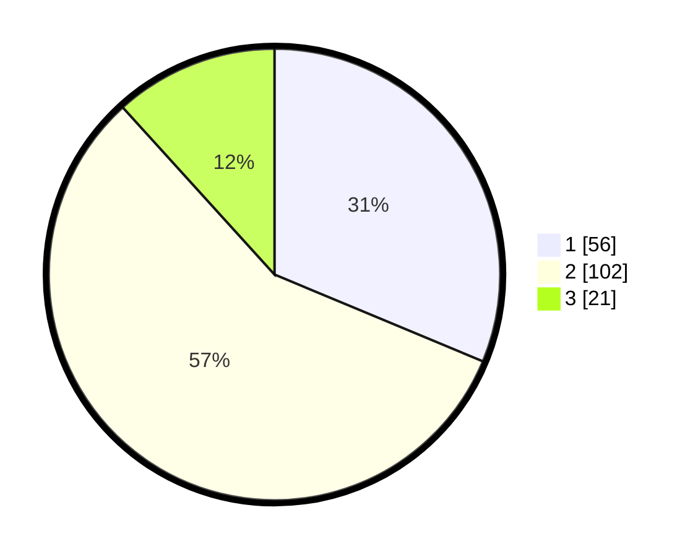

# Hasil

## Grafik

## Tabel

| No. | Nama Paslon    | Suara | Suara (raw) | Persentase |
|:--- |:-------------- | -----:| -----------:| ----------:|
| 1   | ANIES MUHAIMIN | 56    | [56][p-1]   | 31,28      |
| 2   | PRABOWO GIBRAN | 102   | [102][p-2]  | 56,98      |
| 3   | GANJAR MAHFUD  | 21    | [21][p-3]   | 11,73      |

[p-1]: https://github.com/gigit-pemilu/pemilu-2024/blob/main/pilpres/hitung-suara/sub/35-jawa-timur/sub/09-jember/sub/27-kalisat/sub/2007-kalisat/sub/034-tps/sub/paslon-1.txt
[p-2]: https://github.com/gigit-pemilu/pemilu-2024/blob/main/pilpres/hitung-suara/sub/35-jawa-timur/sub/09-jember/sub/27-kalisat/sub/2007-kalisat/sub/034-tps/sub/paslon-2.txt
[p-3]: https://github.com/gigit-pemilu/pemilu-2024/blob/main/pilpres/hitung-suara/sub/35-jawa-timur/sub/09-jember/sub/27-kalisat/sub/2007-kalisat/sub/034-tps/sub/paslon-3.txt

## Foto C Plano

https://sirekap-obj-formc.kpu.go.id/4284/pemilu/ppwp/35/09/27/20/07/3509272007034-20240215-012601--8086296a-ae5d-4474-9269-ee5ef5212602.jpg

https://sirekap-obj-formc.kpu.go.id/4284/pemilu/ppwp/35/09/27/20/07/3509272007034-20240215-013116--4033f7aa-b626-42e6-bb83-dc497e0bfa19.jpg

https://sirekap-obj-formc.kpu.go.id/4284/pemilu/ppwp/35/09/27/20/07/3509272007034-20240215-013229--788cb160-4a8a-4479-9f07-f60e1f4b5615.jpg

## Metadata

| Key        | Value               |
| ---------- | ------------------- |
| Time Stamp | 2024-02-15 12:00:28 |

