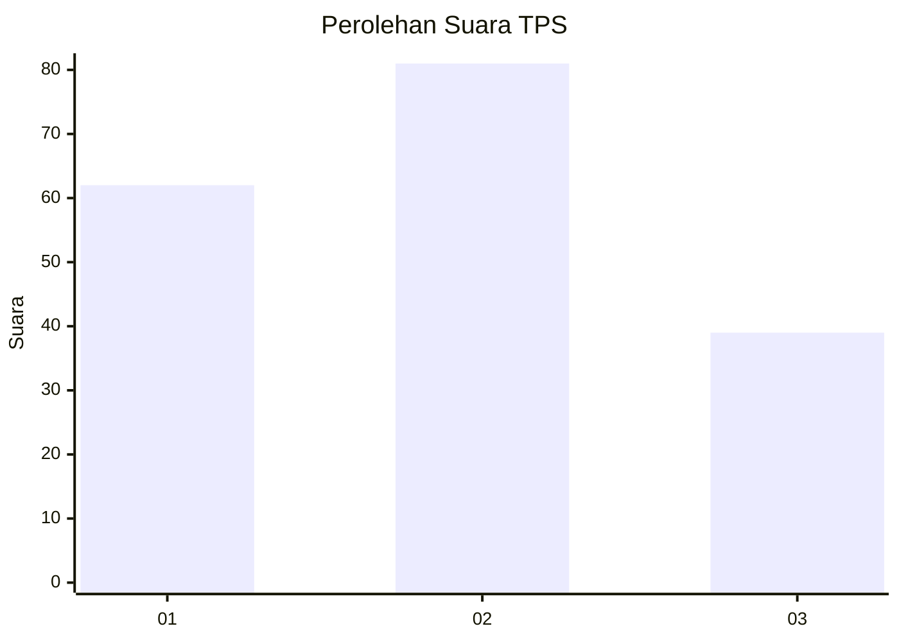
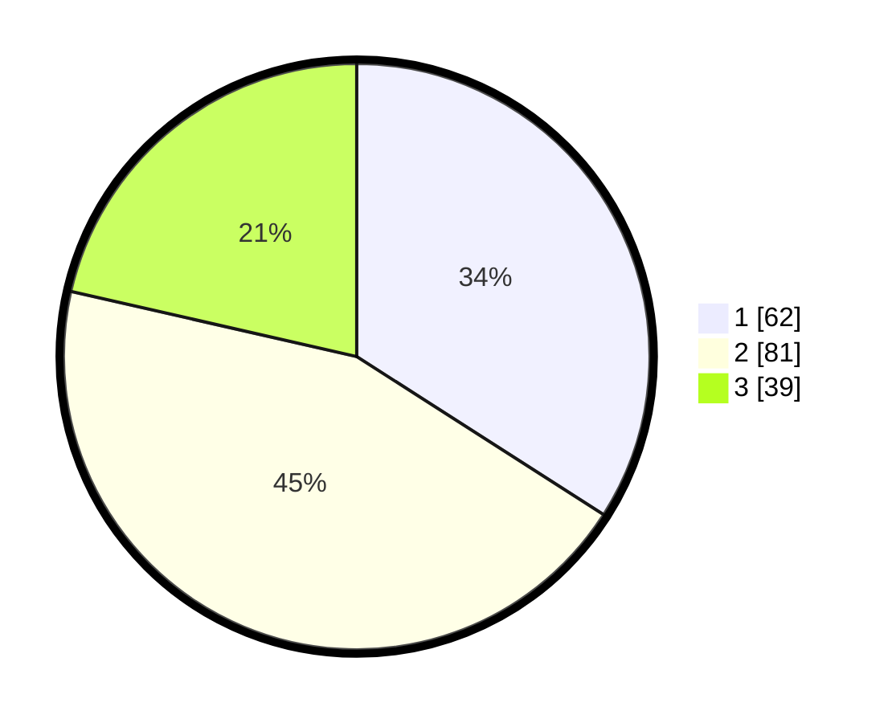

# Hasil

## Grafik

## Tabel

| No. | Nama Paslon    | Suara | Suara (raw) | Persentase |
|:--- |:-------------- | -----:| -----------:| ----------:|
| 1   | ANIES MUHAIMIN | 62    | [62][p-1]   | 34,07      |
| 2   | PRABOWO GIBRAN | 81    | [81][p-2]   | 44,51      |
| 3   | GANJAR MAHFUD  | 39    | [39][p-3]   | 21,43      |

[p-1]: https://github.com/gigit-pemilu/pemilu-2024-35-jawa-timur/blob/main/pilpres/hitung-suara/sub/35-jawa-timur/sub/09-jember/sub/27-kalisat/sub/2007-kalisat/sub/036-tps/sub/paslon-1.txt
[p-2]: https://github.com/gigit-pemilu/pemilu-2024-35-jawa-timur/blob/main/pilpres/hitung-suara/sub/35-jawa-timur/sub/09-jember/sub/27-kalisat/sub/2007-kalisat/sub/036-tps/sub/paslon-2.txt
[p-3]: https://github.com/gigit-pemilu/pemilu-2024-35-jawa-timur/blob/main/pilpres/hitung-suara/sub/35-jawa-timur/sub/09-jember/sub/27-kalisat/sub/2007-kalisat/sub/036-tps/sub/paslon-3.txt

## Foto C Plano

https://sirekap-obj-formc.kpu.go.id/ec0a/pemilu/ppwp/35/09/27/20/07/3509272007036-20240215-065621--de7630b7-7f47-4021-8398-80d1f0811c02.jpg

https://sirekap-obj-formc.kpu.go.id/ec0a/pemilu/ppwp/35/09/27/20/07/3509272007036-20240214-194004--07e3f4e7-6297-4896-9229-9213161d860e.jpg

https://sirekap-obj-formc.kpu.go.id/ec0a/pemilu/ppwp/35/09/27/20/07/3509272007036-20240214-222925--3ca17f57-2652-487f-b8df-59fa6616d622.jpg

## Metadata

| Key        | Value               |
| ---------- | ------------------- |
| Time Stamp | 2024-02-15 15:00:29 |

