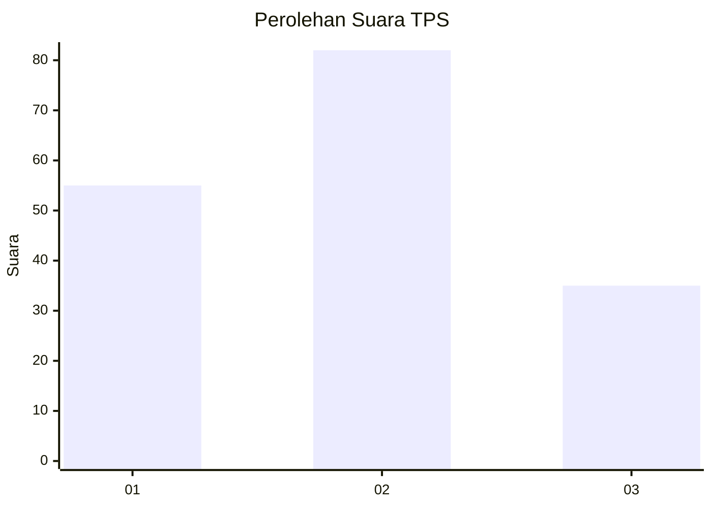
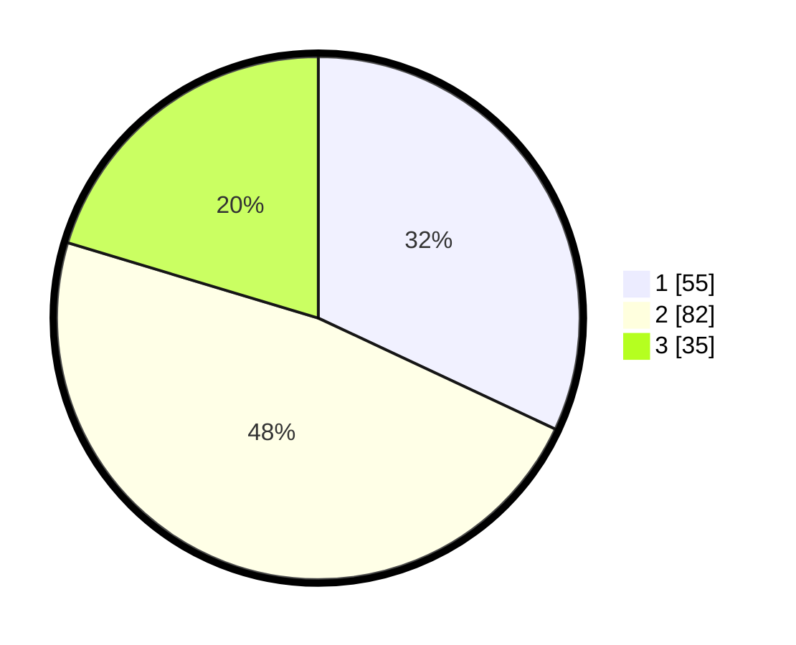

# Hasil

## Grafik

## Tabel

| No. | Nama Paslon    | Suara | Suara (raw) | Persentase |
|:--- |:-------------- | -----:| -----------:| ----------:|
| 1   | ANIES MUHAIMIN | 55    | [55][p-1]   | 31,98      |
| 2   | PRABOWO GIBRAN | 82    | [82][p-2]   | 47,67      |
| 3   | GANJAR MAHFUD  | 35    | [35][p-3]   | 20,35      |

[p-1]: https://github.com/gigit-pemilu/pemilu-2024/blob/main/pilpres/hitung-suara/sub/35-jawa-timur/sub/09-jember/sub/27-kalisat/sub/2008-ajung/sub/008-tps/sub/paslon-1.txt
[p-2]: https://github.com/gigit-pemilu/pemilu-2024/blob/main/pilpres/hitung-suara/sub/35-jawa-timur/sub/09-jember/sub/27-kalisat/sub/2008-ajung/sub/008-tps/sub/paslon-2.txt
[p-3]: https://github.com/gigit-pemilu/pemilu-2024/blob/main/pilpres/hitung-suara/sub/35-jawa-timur/sub/09-jember/sub/27-kalisat/sub/2008-ajung/sub/008-tps/sub/paslon-3.txt

## Foto C Plano

https://sirekap-obj-formc.kpu.go.id/04cd/pemilu/ppwp/35/09/27/20/08/3509272008008-20240216-204757--84bea070-d20b-4e90-8384-66f1ac6ced46.jpg

https://sirekap-obj-formc.kpu.go.id/04cd/pemilu/ppwp/35/09/27/20/08/3509272008008-20240220-164435--bf69cb05-1e0a-48e2-8419-b4fa883169bd.jpg

https://sirekap-obj-formc.kpu.go.id/04cd/pemilu/ppwp/35/09/27/20/08/3509272008008-20240214-220221--71e29471-7a38-4c19-b614-4879f70320ea.jpg

## Metadata

| Key        | Value               |
| ---------- | ------------------- |
| Time Stamp | 2024-02-24 22:31:28 |

