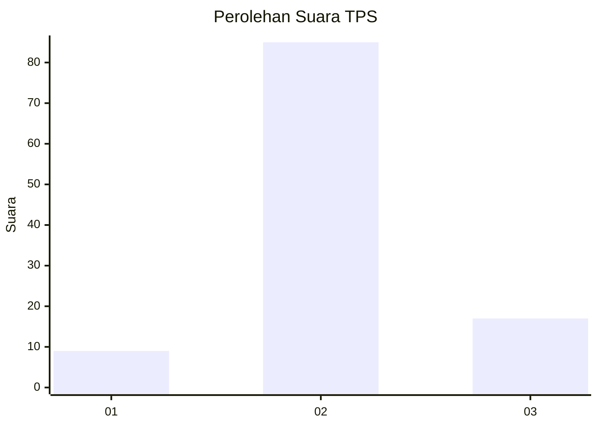

# Hasil

## Grafik

## Tabel

| No. | Nama Paslon    | Suara | Suara (raw) | Persentase |
|:--- |:-------------- | -----:| -----------:| ----------:|
| 1   | ANIES MUHAIMIN | 9     | [9][p-1]    | 8,11       |
| 2   | PRABOWO GIBRAN | 85    | [85][p-2]   | 76,58      |
| 3   | GANJAR MAHFUD  | 17    | [17][p-3]   | 15,32      |

[p-1]: https://github.com/gigit-pemilu/pemilu-2024/blob/main/pilpres/hitung-suara/sub/35-jawa-timur/sub/09-jember/sub/27-kalisat/sub/2008-ajung/sub/020-tps/sub/paslon-1.txt
[p-2]: https://github.com/gigit-pemilu/pemilu-2024/blob/main/pilpres/hitung-suara/sub/35-jawa-timur/sub/09-jember/sub/27-kalisat/sub/2008-ajung/sub/020-tps/sub/paslon-2.txt
[p-3]: https://github.com/gigit-pemilu/pemilu-2024/blob/main/pilpres/hitung-suara/sub/35-jawa-timur/sub/09-jember/sub/27-kalisat/sub/2008-ajung/sub/020-tps/sub/paslon-3.txt

## Foto C Plano

https://sirekap-obj-formc.kpu.go.id/54e2/pemilu/ppwp/35/09/27/20/08/3509272008020-20240214-194848--8e638eda-33e9-47b3-8868-5992c7e0e759.jpg

https://sirekap-obj-formc.kpu.go.id/54e2/pemilu/ppwp/35/09/27/20/08/3509272008020-20240214-195013--1c05313a-57cc-4518-8fc5-a3d99e99c20e.jpg

https://sirekap-obj-formc.kpu.go.id/54e2/pemilu/ppwp/35/09/27/20/08/3509272008020-20240214-195254--ad18c7a1-13f4-40b7-ba9f-78d8a9389c22.jpg

## Metadata

| Key        | Value               |
| ---------- | ------------------- |
| Time Stamp | 2024-02-15 15:00:29 |

