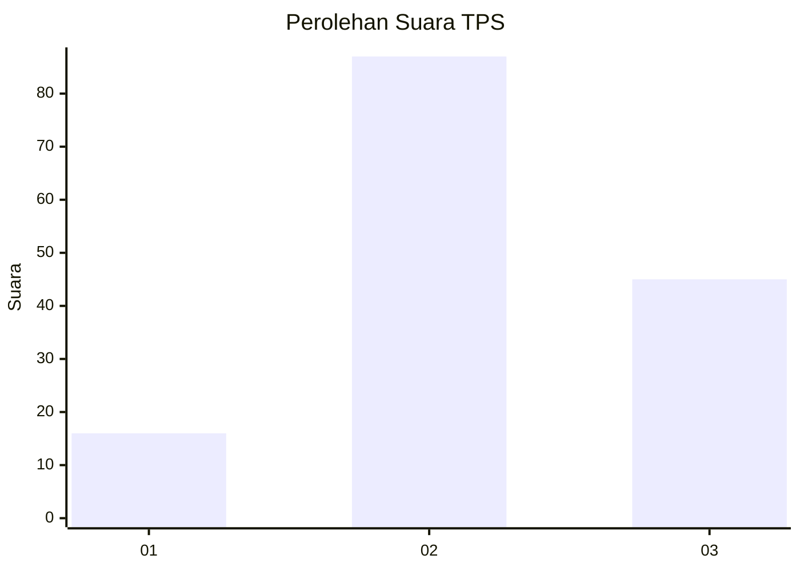
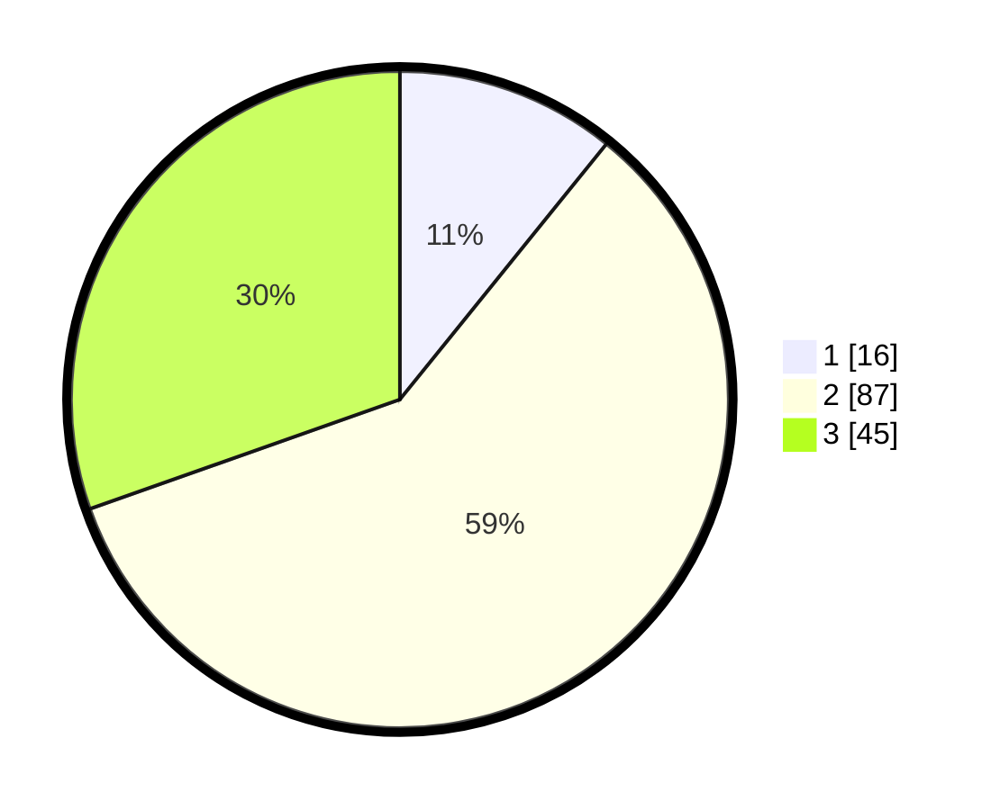

# Hasil

## Grafik

## Tabel

| No. | Nama Paslon    | Suara | Suara (raw) | Persentase |
|:--- |:-------------- | -----:| -----------:| ----------:|
| 1   | ANIES MUHAIMIN | 16    | [16][p-1]   | 10,81      |
| 2   | PRABOWO GIBRAN | 87    | [87][p-2]   | 58,78      |
| 3   | GANJAR MAHFUD  | 45    | [45][p-3]   | 30,41      |

[p-1]: https://github.com/gigit-pemilu/pemilu-2024/blob/main/pilpres/hitung-suara/sub/35-jawa-timur/sub/09-jember/sub/27-kalisat/sub/2008-ajung/sub/028-tps/sub/paslon-1.txt
[p-2]: https://github.com/gigit-pemilu/pemilu-2024/blob/main/pilpres/hitung-suara/sub/35-jawa-timur/sub/09-jember/sub/27-kalisat/sub/2008-ajung/sub/028-tps/sub/paslon-2.txt
[p-3]: https://github.com/gigit-pemilu/pemilu-2024/blob/main/pilpres/hitung-suara/sub/35-jawa-timur/sub/09-jember/sub/27-kalisat/sub/2008-ajung/sub/028-tps/sub/paslon-3.txt

## Foto C Plano

https://sirekap-obj-formc.kpu.go.id/6a3b/pemilu/ppwp/35/09/27/20/08/3509272008028-20240220-205928--9ce86200-f29f-4efc-9f78-6dedfc686b54.jpg

https://sirekap-obj-formc.kpu.go.id/6a3b/pemilu/ppwp/35/09/27/20/08/3509272008028-20240215-033554--34cd8e6c-878c-4c0e-a19d-8fe4d010a6ca.jpg

https://sirekap-obj-formc.kpu.go.id/6a3b/pemilu/ppwp/35/09/27/20/08/3509272008028-20240215-033709--56158103-55f8-470f-88c0-7ffe1cacd733.jpg

## Metadata

| Key        | Value               |
| ---------- | ------------------- |
| Time Stamp | 2024-02-20 21:00:00 |

