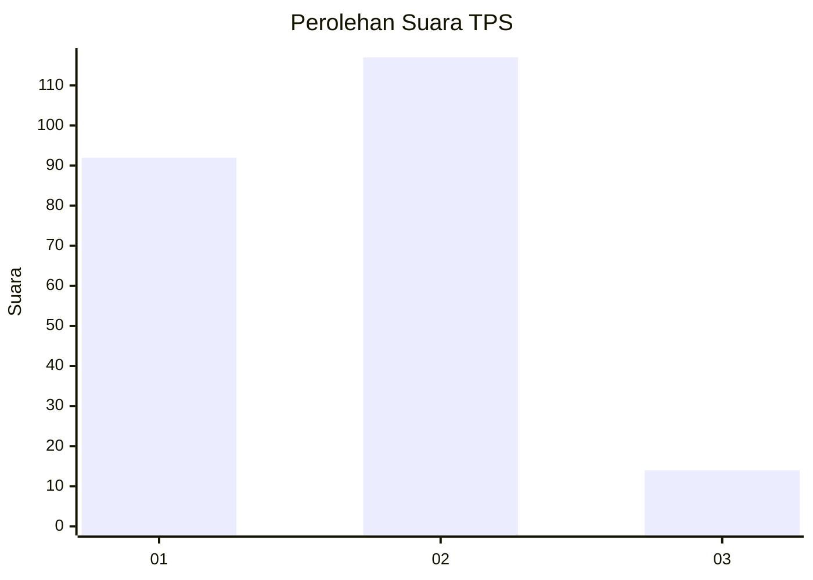

# Hasil

## Grafik

## Tabel

| No. | Nama Paslon    | Suara | Suara (raw) | Persentase |
|:--- |:-------------- | -----:| -----------:| ----------:|
| 1   | ANIES MUHAIMIN | 92    | [92][p-1]   | 41,26      |
| 2   | PRABOWO GIBRAN | 117   | [117][p-2]  | 52,47      |
| 3   | GANJAR MAHFUD  | 14    | [14][p-3]   | 6,28       |

[p-1]: https://github.com/gigit-pemilu/pemilu-2024-35-jawa-timur/blob/main/pilpres/hitung-suara/sub/35-jawa-timur/sub/09-jember/sub/27-kalisat/sub/2009-plalangan/sub/003-tps/sub/paslon-1.txt
[p-2]: https://github.com/gigit-pemilu/pemilu-2024-35-jawa-timur/blob/main/pilpres/hitung-suara/sub/35-jawa-timur/sub/09-jember/sub/27-kalisat/sub/2009-plalangan/sub/003-tps/sub/paslon-2.txt
[p-3]: https://github.com/gigit-pemilu/pemilu-2024-35-jawa-timur/blob/main/pilpres/hitung-suara/sub/35-jawa-timur/sub/09-jember/sub/27-kalisat/sub/2009-plalangan/sub/003-tps/sub/paslon-3.txt

## Foto C Plano

https://sirekap-obj-formc.kpu.go.id/542b/pemilu/ppwp/35/09/27/20/09/3509272009003-20240215-022524--e0d29998-ab50-4e30-bdf1-3cd13f39229a.jpg

https://sirekap-obj-formc.kpu.go.id/542b/pemilu/ppwp/35/09/27/20/09/3509272009003-20240215-023336--7078ea0f-96a9-441e-b2b2-0e50350d74f9.jpg

https://sirekap-obj-formc.kpu.go.id/542b/pemilu/ppwp/35/09/27/20/09/3509272009003-20240215-023447--5496989f-2c7a-423a-aab6-53dda2e6e31e.jpg

## Metadata

| Key        | Value               |
| ---------- | ------------------- |
| Time Stamp | 2024-02-15 15:00:29 |

