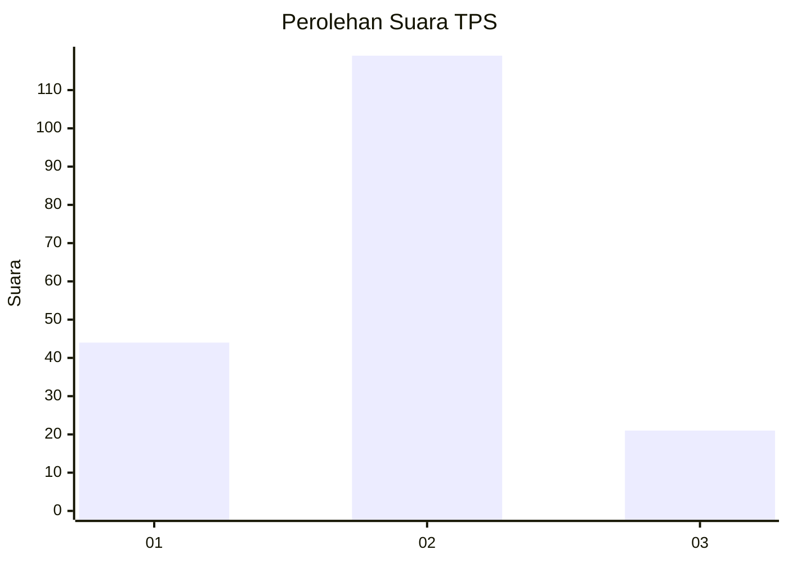
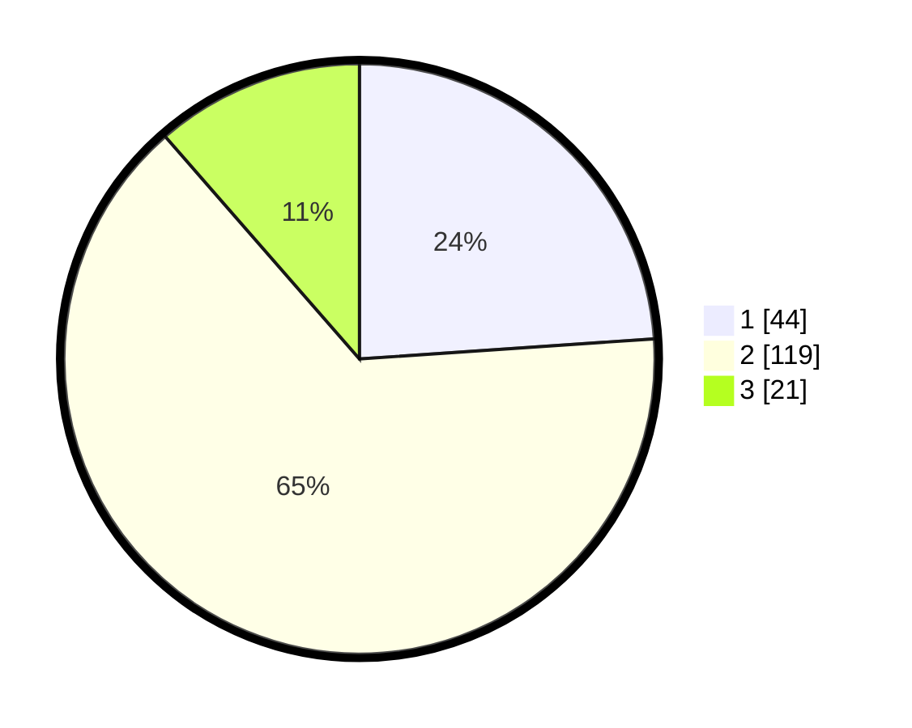

# Hasil

## Grafik

## Tabel

| No. | Nama Paslon    | Suara | Suara (raw) | Persentase |
|:--- |:-------------- | -----:| -----------:| ----------:|
| 1   | ANIES MUHAIMIN | 44    | [44][p-1]   | 23,91      |
| 2   | PRABOWO GIBRAN | 119   | [119][p-2]  | 64,67      |
| 3   | GANJAR MAHFUD  | 21    | [21][p-3]   | 11,41      |

[p-1]: https://github.com/gigit-pemilu/pemilu-2024-35-jawa-timur/blob/main/pilpres/hitung-suara/sub/35-jawa-timur/sub/09-jember/sub/27-kalisat/sub/2009-plalangan/sub/006-tps/sub/paslon-1.txt
[p-2]: https://github.com/gigit-pemilu/pemilu-2024-35-jawa-timur/blob/main/pilpres/hitung-suara/sub/35-jawa-timur/sub/09-jember/sub/27-kalisat/sub/2009-plalangan/sub/006-tps/sub/paslon-2.txt
[p-3]: https://github.com/gigit-pemilu/pemilu-2024-35-jawa-timur/blob/main/pilpres/hitung-suara/sub/35-jawa-timur/sub/09-jember/sub/27-kalisat/sub/2009-plalangan/sub/006-tps/sub/paslon-3.txt

## Foto C Plano

https://sirekap-obj-formc.kpu.go.id/2ab4/pemilu/ppwp/35/09/27/20/09/3509272009006-20240214-230747--38c87f93-b102-4919-91a3-77dad7bb3294.jpg

https://sirekap-obj-formc.kpu.go.id/2ab4/pemilu/ppwp/35/09/27/20/09/3509272009006-20240214-230951--8b5fe9d5-5284-44da-b9c7-9ce3db51b4d5.jpg

https://sirekap-obj-formc.kpu.go.id/2ab4/pemilu/ppwp/35/09/27/20/09/3509272009006-20240214-231122--8c85dc9f-4329-460d-a7a9-3dc9e9e717ac.jpg

## Metadata

| Key        | Value               |
| ---------- | ------------------- |
| Time Stamp | 2024-02-15 15:00:29 |

