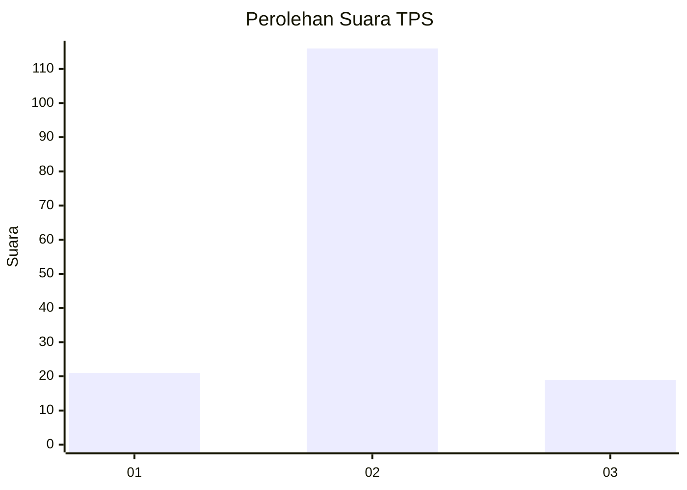
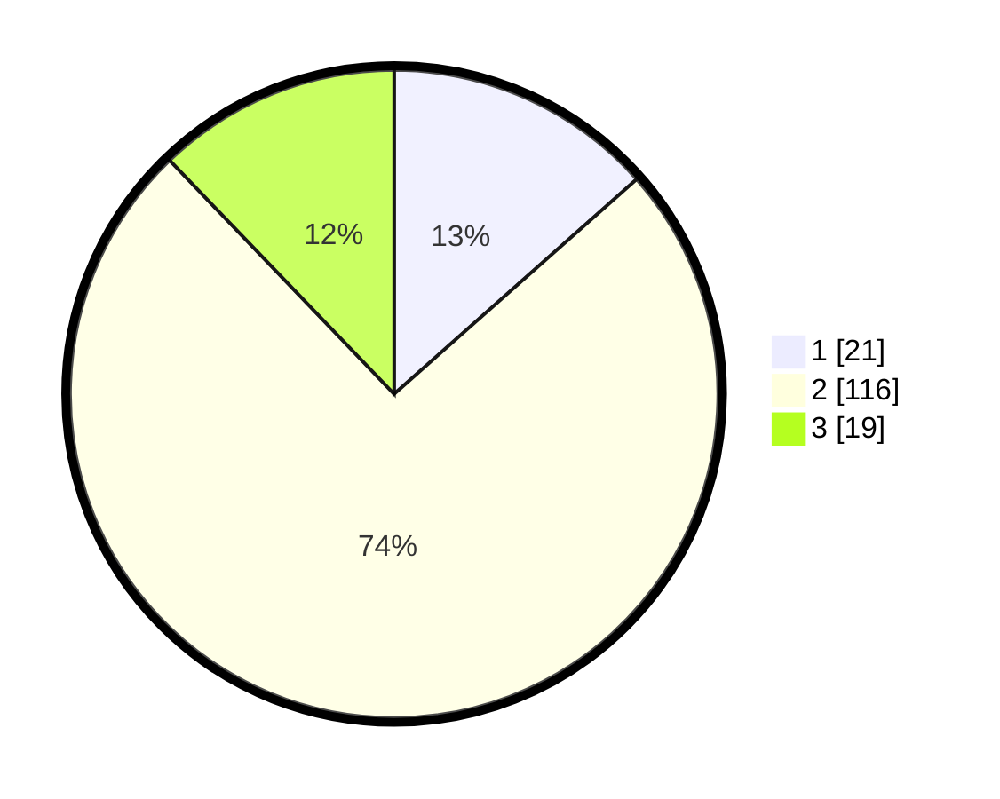

# Hasil

## Grafik

## Tabel

| No. | Nama Paslon    | Suara | Suara (raw) | Persentase |
|:--- |:-------------- | -----:| -----------:| ----------:|
| 1   | ANIES MUHAIMIN | 21    | [21][p-1]   | 13,46      |
| 2   | PRABOWO GIBRAN | 116   | [116][p-2]  | 74,36      |
| 3   | GANJAR MAHFUD  | 19    | [19][p-3]   | 12,18      |

[p-1]: https://github.com/gigit-pemilu/pemilu-2024-35-jawa-timur/blob/main/pilpres/hitung-suara/sub/35-jawa-timur/sub/09-jember/sub/27-kalisat/sub/2009-plalangan/sub/020-tps/sub/paslon-1.txt
[p-2]: https://github.com/gigit-pemilu/pemilu-2024-35-jawa-timur/blob/main/pilpres/hitung-suara/sub/35-jawa-timur/sub/09-jember/sub/27-kalisat/sub/2009-plalangan/sub/020-tps/sub/paslon-2.txt
[p-3]: https://github.com/gigit-pemilu/pemilu-2024-35-jawa-timur/blob/main/pilpres/hitung-suara/sub/35-jawa-timur/sub/09-jember/sub/27-kalisat/sub/2009-plalangan/sub/020-tps/sub/paslon-3.txt

## Foto C Plano

https://sirekap-obj-formc.kpu.go.id/7e10/pemilu/ppwp/35/09/27/20/09/3509272009020-20240214-195545--f9d89ea7-2055-4429-91a3-be9c95638a63.jpg

https://sirekap-obj-formc.kpu.go.id/7e10/pemilu/ppwp/35/09/27/20/09/3509272009020-20240214-195706--2113d448-d5ca-49cb-93ce-3136b4cc1cda.jpg

https://sirekap-obj-formc.kpu.go.id/7e10/pemilu/ppwp/35/09/27/20/09/3509272009020-20240214-195858--20d6ad09-25ba-40f8-bf9c-495651b60fc6.jpg

## Metadata

| Key        | Value               |
| ---------- | ------------------- |
| Time Stamp | 2024-02-24 22:31:28 |

