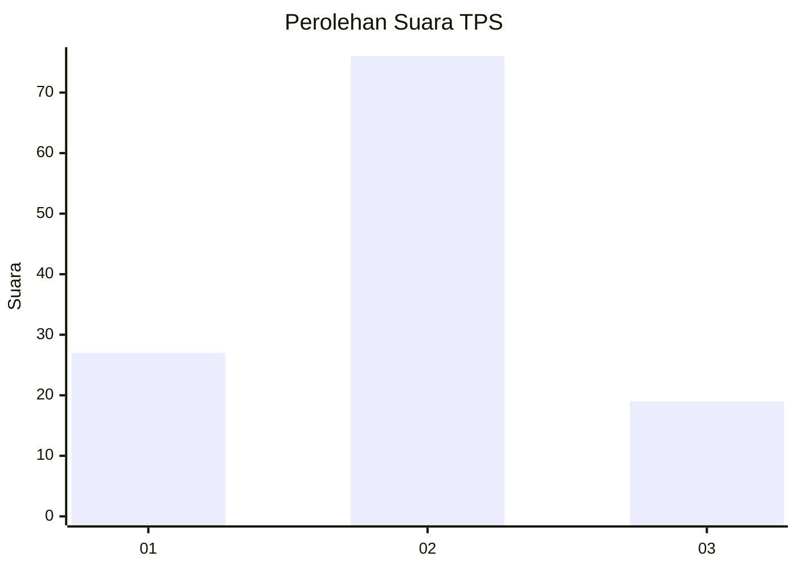
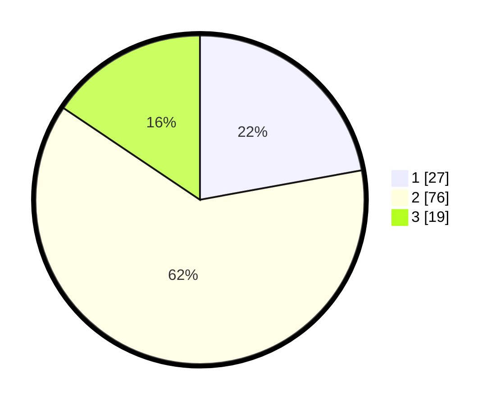

# Hasil

## Grafik

## Tabel

| No. | Nama Paslon    | Suara | Suara (raw) | Persentase |
|:--- |:-------------- | -----:| -----------:| ----------:|
| 1   | ANIES MUHAIMIN | 27    | [27][p-1]   | 22,13      |
| 2   | PRABOWO GIBRAN | 76    | [76][p-2]   | 62,30      |
| 3   | GANJAR MAHFUD  | 19    | [19][p-3]   | 15,57      |

[p-1]: https://github.com/gigit-pemilu/pemilu-2024-35-jawa-timur/blob/main/pilpres/hitung-suara/sub/35-jawa-timur/sub/09-jember/sub/27-kalisat/sub/2009-plalangan/sub/021-tps/sub/paslon-1.txt
[p-2]: https://github.com/gigit-pemilu/pemilu-2024-35-jawa-timur/blob/main/pilpres/hitung-suara/sub/35-jawa-timur/sub/09-jember/sub/27-kalisat/sub/2009-plalangan/sub/021-tps/sub/paslon-2.txt
[p-3]: https://github.com/gigit-pemilu/pemilu-2024-35-jawa-timur/blob/main/pilpres/hitung-suara/sub/35-jawa-timur/sub/09-jember/sub/27-kalisat/sub/2009-plalangan/sub/021-tps/sub/paslon-3.txt

## Foto C Plano

https://sirekap-obj-formc.kpu.go.id/b254/pemilu/ppwp/35/09/27/20/09/3509272009021-20240214-223337--196fd02f-b343-431e-9a04-8c1a576ff260.jpg

https://sirekap-obj-formc.kpu.go.id/b254/pemilu/ppwp/35/09/27/20/09/3509272009021-20240214-223542--88215404-4a01-44dc-bee8-68c0460d3084.jpg

https://sirekap-obj-formc.kpu.go.id/b254/pemilu/ppwp/35/09/27/20/09/3509272009021-20240214-223710--cdfaae4b-ccc2-45d4-972f-1dfce2b7ac0f.jpg

## Metadata

| Key        | Value               |
| ---------- | ------------------- |
| Time Stamp | 2024-02-15 15:00:29 |

