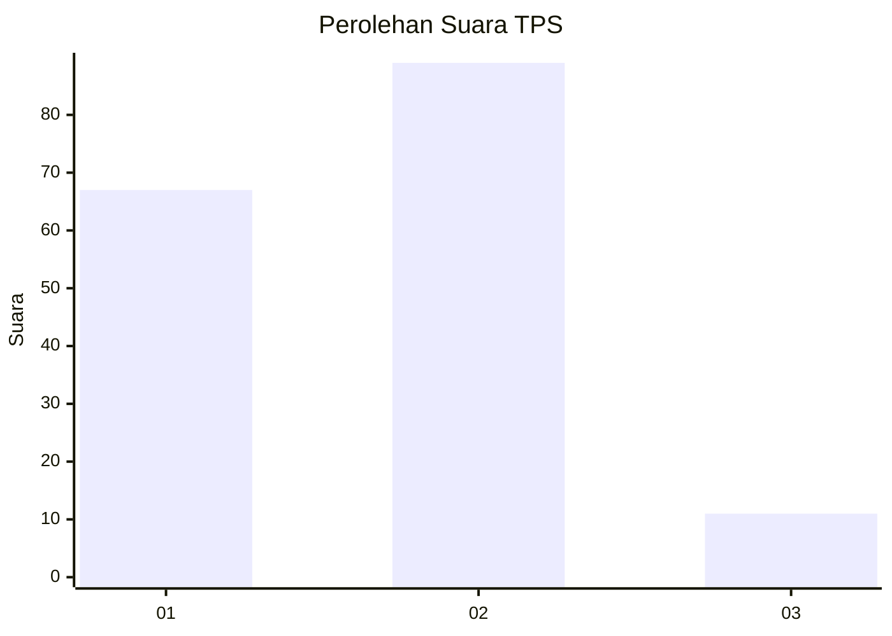
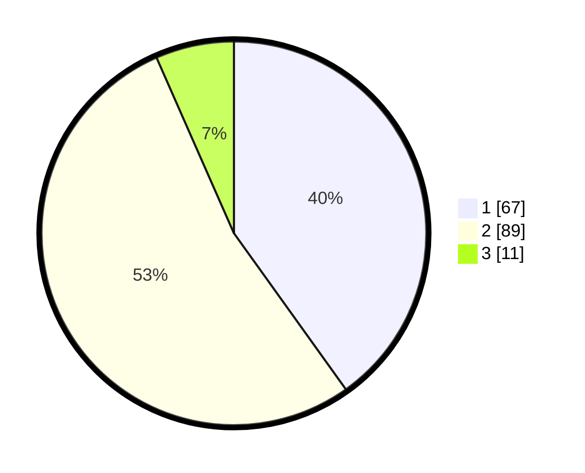

# Hasil

## Grafik

## Tabel

| No. | Nama Paslon    | Suara | Suara (raw) | Persentase |
|:--- |:-------------- | -----:| -----------:| ----------:|
| 1   | ANIES MUHAIMIN | 67    | [67][p-1]   | 40,12      |
| 2   | PRABOWO GIBRAN | 89    | [89][p-2]   | 53,29      |
| 3   | GANJAR MAHFUD  | 11    | [11][p-3]   | 6,59       |

[p-1]: https://github.com/gigit-pemilu/pemilu-2024-35-jawa-timur/blob/main/pilpres/hitung-suara/sub/35-jawa-timur/sub/09-jember/sub/27-kalisat/sub/2009-plalangan/sub/023-tps/sub/paslon-1.txt
[p-2]: https://github.com/gigit-pemilu/pemilu-2024-35-jawa-timur/blob/main/pilpres/hitung-suara/sub/35-jawa-timur/sub/09-jember/sub/27-kalisat/sub/2009-plalangan/sub/023-tps/sub/paslon-2.txt
[p-3]: https://github.com/gigit-pemilu/pemilu-2024-35-jawa-timur/blob/main/pilpres/hitung-suara/sub/35-jawa-timur/sub/09-jember/sub/27-kalisat/sub/2009-plalangan/sub/023-tps/sub/paslon-3.txt

## Foto C Plano

https://sirekap-obj-formc.kpu.go.id/662a/pemilu/ppwp/35/09/27/20/09/3509272009023-20240215-021758--e7f6882c-f9c3-4848-9188-c9f4eb3d1f22.jpg

https://sirekap-obj-formc.kpu.go.id/662a/pemilu/ppwp/35/09/27/20/09/3509272009023-20240215-021855--c0277f8d-dc45-4497-9c50-72bdd68b6157.jpg

https://sirekap-obj-formc.kpu.go.id/662a/pemilu/ppwp/35/09/27/20/09/3509272009023-20240215-091653--7792231d-67af-458b-b291-c12933f164a1.jpg

## Metadata

| Key        | Value               |
| ---------- | ------------------- |
| Time Stamp | 2024-02-15 15:00:29 |

