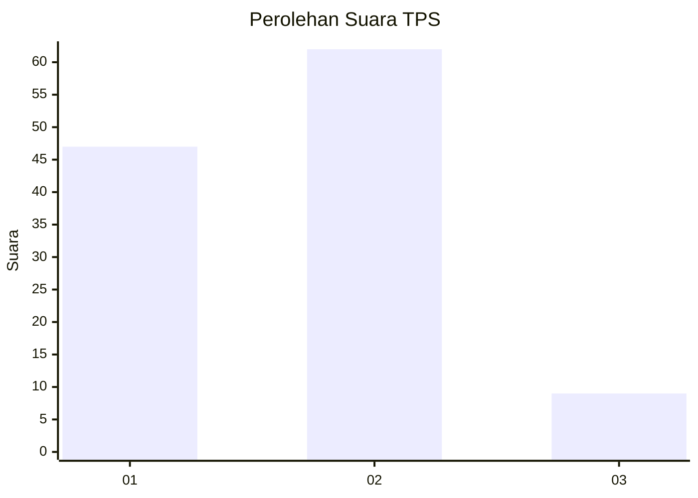

# Hasil

## Grafik

## Tabel

| No. | Nama Paslon    | Suara | Suara (raw) | Persentase |
|:--- |:-------------- | -----:| -----------:| ----------:|
| 1   | ANIES MUHAIMIN | 47    | [47][p-1]   | 39,83      |
| 2   | PRABOWO GIBRAN | 62    | [62][p-2]   | 52,54      |
| 3   | GANJAR MAHFUD  | 9     | [9][p-3]    | 7,63       |

[p-1]: https://github.com/gigit-pemilu/pemilu-2024-35-jawa-timur/blob/main/pilpres/hitung-suara/sub/35-jawa-timur/sub/09-jember/sub/27-kalisat/sub/2010-gambiran/sub/004-tps/sub/paslon-1.txt
[p-2]: https://github.com/gigit-pemilu/pemilu-2024-35-jawa-timur/blob/main/pilpres/hitung-suara/sub/35-jawa-timur/sub/09-jember/sub/27-kalisat/sub/2010-gambiran/sub/004-tps/sub/paslon-2.txt
[p-3]: https://github.com/gigit-pemilu/pemilu-2024-35-jawa-timur/blob/main/pilpres/hitung-suara/sub/35-jawa-timur/sub/09-jember/sub/27-kalisat/sub/2010-gambiran/sub/004-tps/sub/paslon-3.txt

## Foto C Plano

https://sirekap-obj-formc.kpu.go.id/a869/pemilu/ppwp/35/09/27/20/10/3509272010004-20240214-211451--ecc6f75e-b8aa-438c-b6ca-f86eae7c654b.jpg

https://sirekap-obj-formc.kpu.go.id/a869/pemilu/ppwp/35/09/27/20/10/3509272010004-20240214-211534--1940bbce-a5c0-45b0-9590-7181f2efaf43.jpg

https://sirekap-obj-formc.kpu.go.id/a869/pemilu/ppwp/35/09/27/20/10/3509272010004-20240214-211609--fcb4e50f-9cd2-4e5c-9649-69f9f0ebb978.jpg

## Metadata

| Key        | Value               |
| ---------- | ------------------- |
| Time Stamp | 2024-02-15 15:00:29 |

