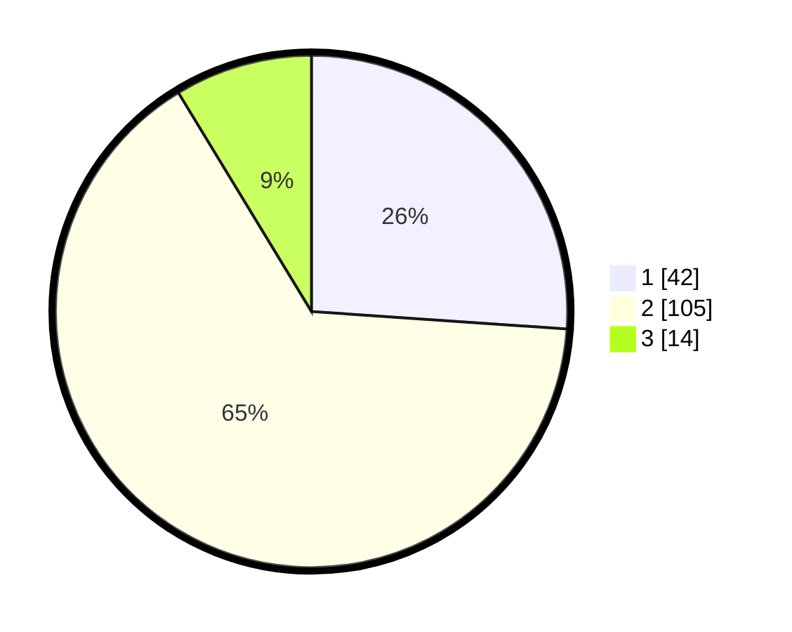

# Hasil

## Grafik

## Tabel

| No. | Nama Paslon    | Suara | Suara (raw) | Persentase |
|:--- |:-------------- | -----:| -----------:| ----------:|
| 1   | ANIES MUHAIMIN | 42    | [42][p-1]   | 26,09      |
| 2   | PRABOWO GIBRAN | 105   | [105][p-2]  | 65,22      |
| 3   | GANJAR MAHFUD  | 14    | [14][p-3]   | 8,70       |

[p-1]: https://github.com/gigit-pemilu/pemilu-2024-35-jawa-timur/blob/main/pilpres/hitung-suara/sub/35-jawa-timur/sub/09-jember/sub/27-kalisat/sub/2010-gambiran/sub/006-tps/sub/paslon-1.txt
[p-2]: https://github.com/gigit-pemilu/pemilu-2024-35-jawa-timur/blob/main/pilpres/hitung-suara/sub/35-jawa-timur/sub/09-jember/sub/27-kalisat/sub/2010-gambiran/sub/006-tps/sub/paslon-2.txt
[p-3]: https://github.com/gigit-pemilu/pemilu-2024-35-jawa-timur/blob/main/pilpres/hitung-suara/sub/35-jawa-timur/sub/09-jember/sub/27-kalisat/sub/2010-gambiran/sub/006-tps/sub/paslon-3.txt

## Foto C Plano

https://sirekap-obj-formc.kpu.go.id/04f7/pemilu/ppwp/35/09/27/20/10/3509272010006-20240214-223137--bc3b79b4-df84-43ed-bb65-f9eaee705eed.jpg

https://sirekap-obj-formc.kpu.go.id/04f7/pemilu/ppwp/35/09/27/20/10/3509272010006-20240214-223140--a863209a-27cb-45cf-8f5c-70f8bced6fe5.jpg

https://sirekap-obj-formc.kpu.go.id/04f7/pemilu/ppwp/35/09/27/20/10/3509272010006-20240214-223142--d81f2081-46b1-4285-8935-fe570349c10e.jpg

## Metadata

| Key        | Value               |
| ---------- | ------------------- |
| Time Stamp | 2024-02-24 22:31:28 |

