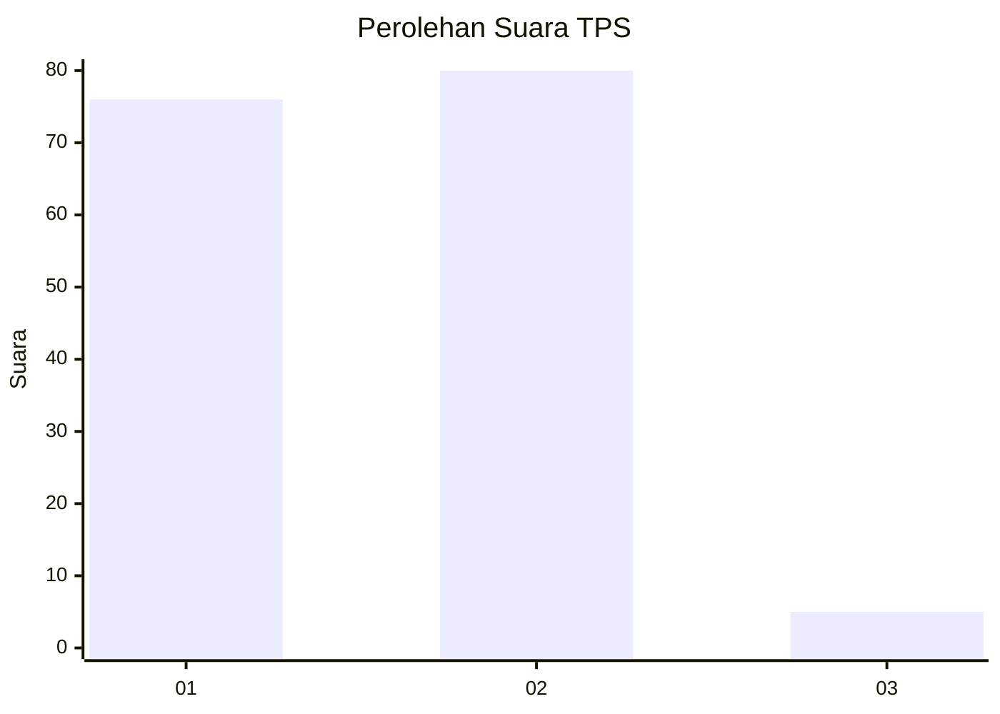
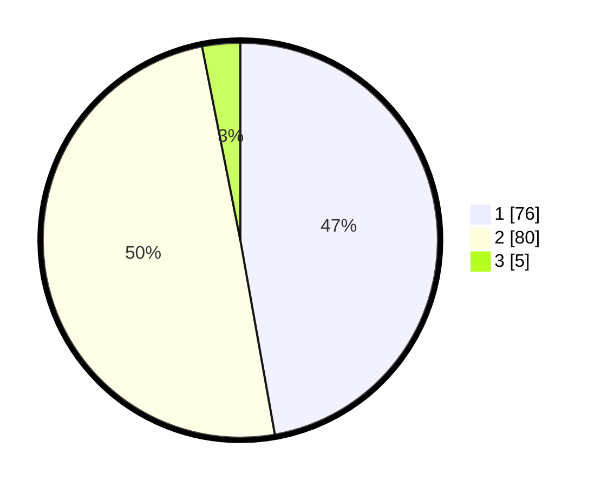

# Hasil

## Grafik

## Tabel

| No. | Nama Paslon    | Suara | Suara (raw) | Persentase |
|:--- |:-------------- | -----:| -----------:| ----------:|
| 1   | ANIES MUHAIMIN | 76    | [76][p-1]   | 47,20      |
| 2   | PRABOWO GIBRAN | 80    | [80][p-2]   | 49,69      |
| 3   | GANJAR MAHFUD  | 5     | [5][p-3]    | 3,11       |

[p-1]: https://github.com/gigit-pemilu/pemilu-2024-35-jawa-timur/blob/main/pilpres/hitung-suara/sub/35-jawa-timur/sub/09-jember/sub/27-kalisat/sub/2010-gambiran/sub/018-tps/sub/paslon-1.txt
[p-2]: https://github.com/gigit-pemilu/pemilu-2024-35-jawa-timur/blob/main/pilpres/hitung-suara/sub/35-jawa-timur/sub/09-jember/sub/27-kalisat/sub/2010-gambiran/sub/018-tps/sub/paslon-2.txt
[p-3]: https://github.com/gigit-pemilu/pemilu-2024-35-jawa-timur/blob/main/pilpres/hitung-suara/sub/35-jawa-timur/sub/09-jember/sub/27-kalisat/sub/2010-gambiran/sub/018-tps/sub/paslon-3.txt

## Foto C Plano

https://sirekap-obj-formc.kpu.go.id/4cd8/pemilu/ppwp/35/09/27/20/10/3509272010018-20240219-175717--816cb32b-804a-4afc-9e2a-4e7c87a94452.jpg

https://sirekap-obj-formc.kpu.go.id/4cd8/pemilu/ppwp/35/09/27/20/10/3509272010018-20240214-155542--730f547d-b51c-4bea-b649-6ef2e1470cd1.jpg

https://sirekap-obj-formc.kpu.go.id/4cd8/pemilu/ppwp/35/09/27/20/10/3509272010018-20240214-155922--5ca84e7e-b4e0-44d1-a360-4a5a5649fd14.jpg

## Metadata

| Key        | Value               |
| ---------- | ------------------- |
| Time Stamp | 2024-02-19 18:00:00 |

