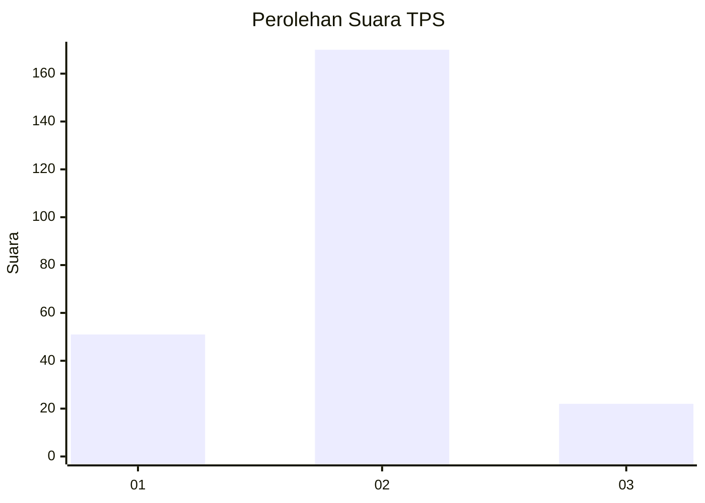

# Hasil

## Grafik

## Tabel

| No. | Nama Paslon    | Suara | Suara (raw) | Persentase |
|:--- |:-------------- | -----:| -----------:| ----------:|
| 1   | ANIES MUHAIMIN | 51    | [51][p-1]   | 20,99      |
| 2   | PRABOWO GIBRAN | 170   | [170][p-2]  | 69,96      |
| 3   | GANJAR MAHFUD  | 22    | [22][p-3]   | 9,05       |

[p-1]: https://github.com/gigit-pemilu/pemilu-2024/blob/main/pilpres/hitung-suara/sub/35-jawa-timur/sub/09-jember/sub/27-kalisat/sub/2011-sumberketempa/sub/001-tps/sub/paslon-1.txt
[p-2]: https://github.com/gigit-pemilu/pemilu-2024/blob/main/pilpres/hitung-suara/sub/35-jawa-timur/sub/09-jember/sub/27-kalisat/sub/2011-sumberketempa/sub/001-tps/sub/paslon-2.txt
[p-3]: https://github.com/gigit-pemilu/pemilu-2024/blob/main/pilpres/hitung-suara/sub/35-jawa-timur/sub/09-jember/sub/27-kalisat/sub/2011-sumberketempa/sub/001-tps/sub/paslon-3.txt

## Foto C Plano

https://sirekap-obj-formc.kpu.go.id/767c/pemilu/ppwp/35/09/27/20/11/3509272011001-20240214-224210--5f687c69-576c-4dc8-981e-cb8a51f1ff93.jpg

https://sirekap-obj-formc.kpu.go.id/767c/pemilu/ppwp/35/09/27/20/11/3509272011001-20240214-224236--2b0a9ab5-d7ae-4966-a09c-97b7b781af1f.jpg

https://sirekap-obj-formc.kpu.go.id/767c/pemilu/ppwp/35/09/27/20/11/3509272011001-20240214-224356--bd01637e-626e-476a-aafd-957f724c7e29.jpg

## Metadata

| Key        | Value               |
| ---------- | ------------------- |
| Time Stamp | 2024-02-15 15:00:29 |

