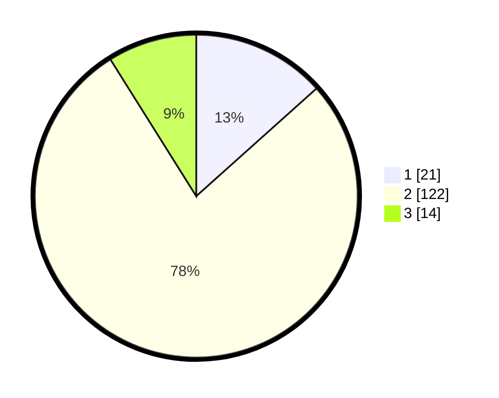

# Hasil

## Grafik

## Tabel

| No. | Nama Paslon    | Suara | Suara (raw) | Persentase |
|:--- |:-------------- | -----:| -----------:| ----------:|
| 1   | ANIES MUHAIMIN | 21    | [21][p-1]   | 13,38      |
| 2   | PRABOWO GIBRAN | 122   | [122][p-2]  | 77,71      |
| 3   | GANJAR MAHFUD  | 14    | [14][p-3]   | 8,92       |

[p-1]: https://github.com/gigit-pemilu/pemilu-2024/blob/main/pilpres/hitung-suara/sub/35-jawa-timur/sub/09-jember/sub/27-kalisat/sub/2011-sumberketempa/sub/004-tps/sub/paslon-1.txt
[p-2]: https://github.com/gigit-pemilu/pemilu-2024/blob/main/pilpres/hitung-suara/sub/35-jawa-timur/sub/09-jember/sub/27-kalisat/sub/2011-sumberketempa/sub/004-tps/sub/paslon-2.txt
[p-3]: https://github.com/gigit-pemilu/pemilu-2024/blob/main/pilpres/hitung-suara/sub/35-jawa-timur/sub/09-jember/sub/27-kalisat/sub/2011-sumberketempa/sub/004-tps/sub/paslon-3.txt

## Foto C Plano

https://sirekap-obj-formc.kpu.go.id/86b5/pemilu/ppwp/35/09/27/20/11/3509272011004-20240214-185005--03b9c810-142b-4106-9109-a560999666bc.jpg

https://sirekap-obj-formc.kpu.go.id/86b5/pemilu/ppwp/35/09/27/20/11/3509272011004-20240214-185028--99ccd17e-7d7b-4dc8-8e18-e917d66fe4df.jpg

## Metadata

| Key        | Value               |
| ---------- | ------------------- |
| Time Stamp | 2024-02-15 07:00:44 |

