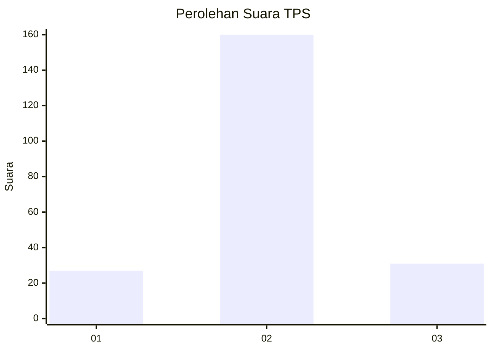
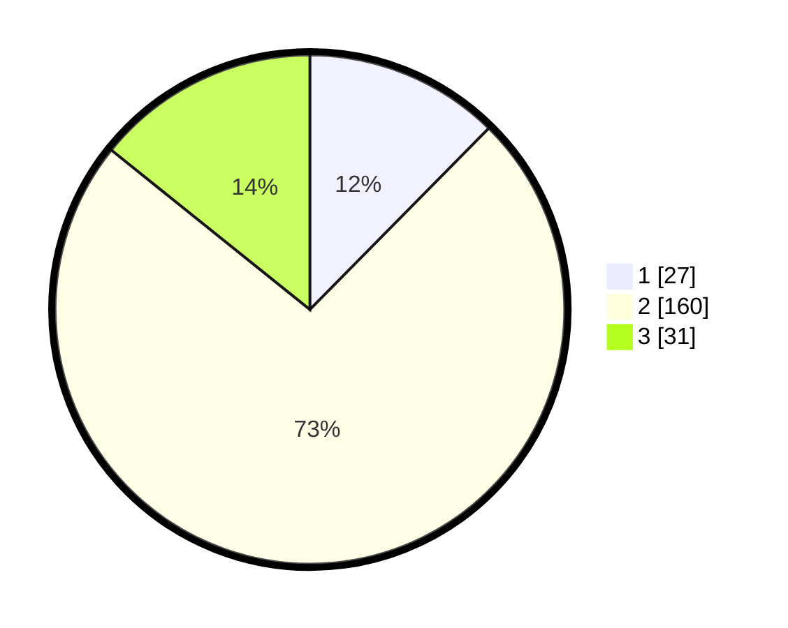

# Hasil

## Grafik

## Tabel

| No. | Nama Paslon    | Suara | Suara (raw) | Persentase |
|:--- |:-------------- | -----:| -----------:| ----------:|
| 1   | ANIES MUHAIMIN | 27    | [27][p-1]   | 12,39      |
| 2   | PRABOWO GIBRAN | 160   | [160][p-2]  | 73,39      |
| 3   | GANJAR MAHFUD  | 31    | [31][p-3]   | 14,22      |

[p-1]: https://github.com/gigit-pemilu/pemilu-2024/blob/main/pilpres/hitung-suara/sub/35-jawa-timur/sub/09-jember/sub/27-kalisat/sub/2011-sumberketempa/sub/005-tps/sub/paslon-1.txt
[p-2]: https://github.com/gigit-pemilu/pemilu-2024/blob/main/pilpres/hitung-suara/sub/35-jawa-timur/sub/09-jember/sub/27-kalisat/sub/2011-sumberketempa/sub/005-tps/sub/paslon-2.txt
[p-3]: https://github.com/gigit-pemilu/pemilu-2024/blob/main/pilpres/hitung-suara/sub/35-jawa-timur/sub/09-jember/sub/27-kalisat/sub/2011-sumberketempa/sub/005-tps/sub/paslon-3.txt

## Foto C Plano

https://sirekap-obj-formc.kpu.go.id/7188/pemilu/ppwp/35/09/27/20/11/3509272011005-20240215-015731--36e7ec49-163a-4ad6-a299-5e78fb70a608.jpg

https://sirekap-obj-formc.kpu.go.id/7188/pemilu/ppwp/35/09/27/20/11/3509272011005-20240215-015805--68959895-bff7-4297-9cbd-ae7eb91d30ee.jpg

https://sirekap-obj-formc.kpu.go.id/7188/pemilu/ppwp/35/09/27/20/11/3509272011005-20240215-015824--e0ec41f9-8435-4f4c-9d81-2644a65abdde.jpg

## Metadata

| Key        | Value               |
| ---------- | ------------------- |
| Time Stamp | 2024-02-15 15:00:29 |

