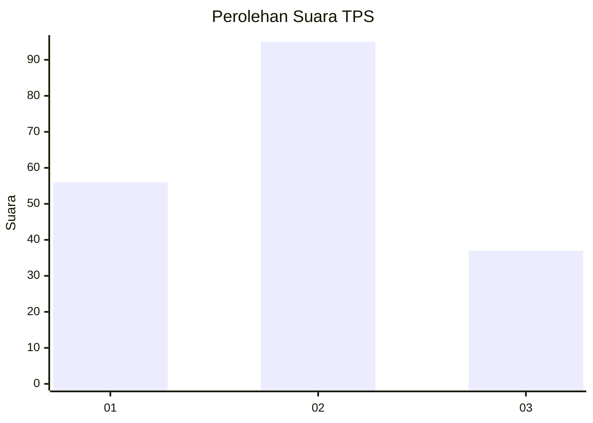
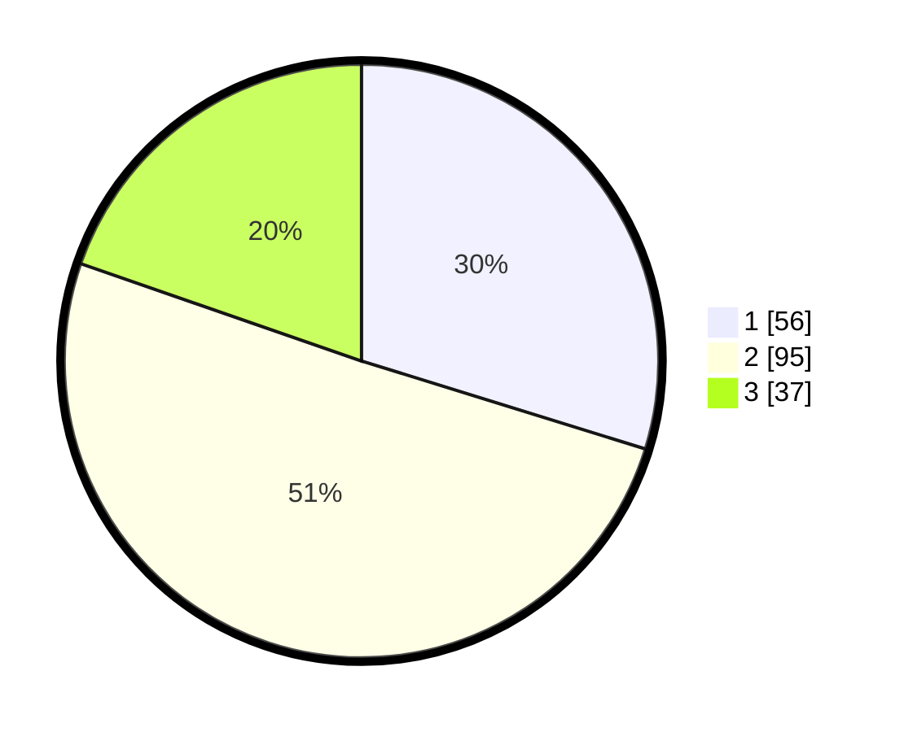

# Hasil

## Grafik

## Tabel

| No. | Nama Paslon    | Suara | Suara (raw) | Persentase |
|:--- |:-------------- | -----:| -----------:| ----------:|
| 1   | ANIES MUHAIMIN | 56    | [56][p-1]   | 29,79      |
| 2   | PRABOWO GIBRAN | 95    | [95][p-2]   | 50,53      |
| 3   | GANJAR MAHFUD  | 37    | [37][p-3]   | 19,68      |

[p-1]: https://github.com/gigit-pemilu/pemilu-2024-35-jawa-timur/blob/main/pilpres/hitung-suara/sub/35-jawa-timur/sub/09-jember/sub/27-kalisat/sub/2011-sumberketempa/sub/008-tps/sub/paslon-1.txt
[p-2]: https://github.com/gigit-pemilu/pemilu-2024-35-jawa-timur/blob/main/pilpres/hitung-suara/sub/35-jawa-timur/sub/09-jember/sub/27-kalisat/sub/2011-sumberketempa/sub/008-tps/sub/paslon-2.txt
[p-3]: https://github.com/gigit-pemilu/pemilu-2024-35-jawa-timur/blob/main/pilpres/hitung-suara/sub/35-jawa-timur/sub/09-jember/sub/27-kalisat/sub/2011-sumberketempa/sub/008-tps/sub/paslon-3.txt

## Foto C Plano

https://sirekap-obj-formc.kpu.go.id/e8be/pemilu/ppwp/35/09/27/20/11/3509272011008-20240214-225910--4753a144-21f7-4f78-a0a9-234fee23431f.jpg

https://sirekap-obj-formc.kpu.go.id/e8be/pemilu/ppwp/35/09/27/20/11/3509272011008-20240214-232226--8bf27449-3f8c-4c57-9a76-8b877c1f8f7b.jpg

https://sirekap-obj-formc.kpu.go.id/e8be/pemilu/ppwp/35/09/27/20/11/3509272011008-20240215-064232--1ecb8a8a-b62b-4757-bec8-354b18125739.jpg

## Metadata

| Key        | Value               |
| ---------- | ------------------- |
| Time Stamp | 2024-02-15 21:01:18 |

