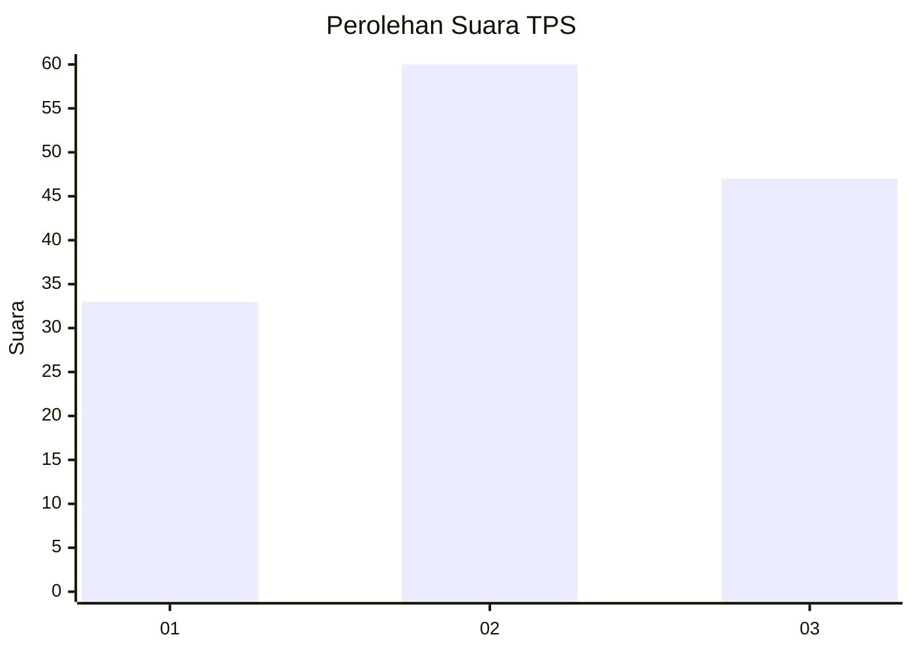
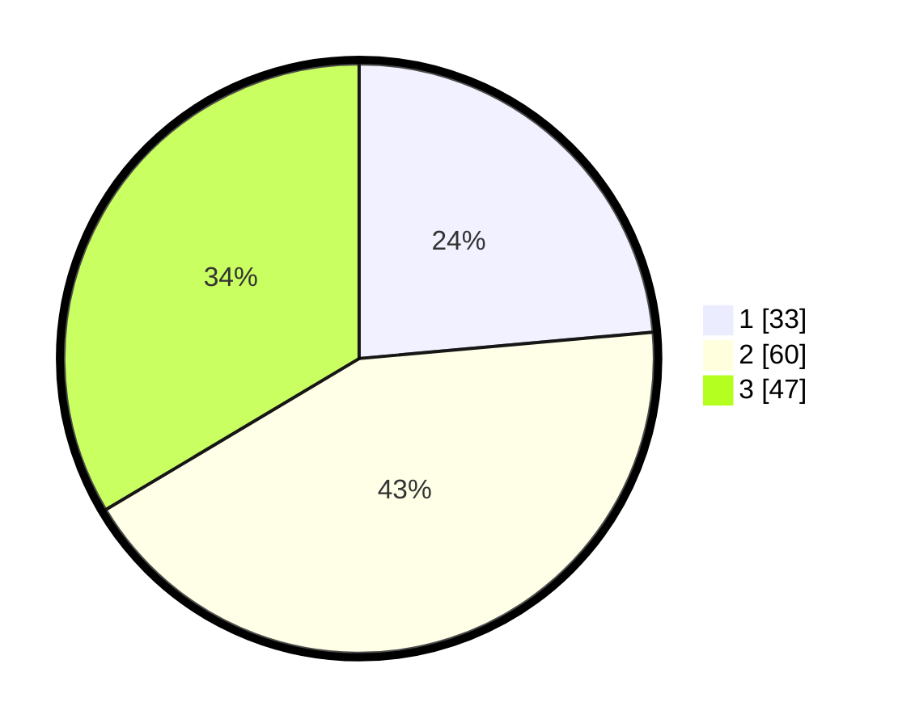

# Hasil

## Grafik

## Tabel

| No. | Nama Paslon    | Suara | Suara (raw) | Persentase |
|:--- |:-------------- | -----:| -----------:| ----------:|
| 1   | ANIES MUHAIMIN | 33    | [33][p-1]   | 23,57      |
| 2   | PRABOWO GIBRAN | 60    | [60][p-2]   | 42,86      |
| 3   | GANJAR MAHFUD  | 47    | [47][p-3]   | 33,57      |

[p-1]: https://github.com/gigit-pemilu/pemilu-2024/blob/main/pilpres/hitung-suara/sub/35-jawa-timur/sub/09-jember/sub/27-kalisat/sub/2012-sebanen/sub/001-tps/sub/paslon-1.txt
[p-2]: https://github.com/gigit-pemilu/pemilu-2024/blob/main/pilpres/hitung-suara/sub/35-jawa-timur/sub/09-jember/sub/27-kalisat/sub/2012-sebanen/sub/001-tps/sub/paslon-2.txt
[p-3]: https://github.com/gigit-pemilu/pemilu-2024/blob/main/pilpres/hitung-suara/sub/35-jawa-timur/sub/09-jember/sub/27-kalisat/sub/2012-sebanen/sub/001-tps/sub/paslon-3.txt

## Foto C Plano

https://sirekap-obj-formc.kpu.go.id/48b2/pemilu/ppwp/35/09/27/20/12/3509272012001-20240214-223600--0a80dd39-1409-4706-a66f-a0312752c053.jpg

https://sirekap-obj-formc.kpu.go.id/48b2/pemilu/ppwp/35/09/27/20/12/3509272012001-20240214-192849--f35aed30-e680-4d13-be22-b6ef065fc09c.jpg

https://sirekap-obj-formc.kpu.go.id/48b2/pemilu/ppwp/35/09/27/20/12/3509272012001-20240214-193127--0b16ea45-ff52-42ae-b9ed-b7ff006044c2.jpg

## Metadata

| Key        | Value               |
| ---------- | ------------------- |
| Time Stamp | 2024-02-15 18:00:26 |

