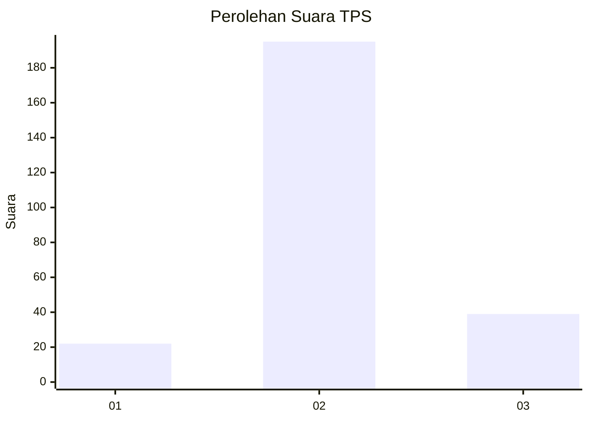

# Hasil

## Grafik

## Tabel

| No. | Nama Paslon    | Suara | Suara (raw) | Persentase |
|:--- |:-------------- | -----:| -----------:| ----------:|
| 1   | ANIES MUHAIMIN | 22    | [22][p-1]   | 8,59       |
| 2   | PRABOWO GIBRAN | 195   | [195][p-2]  | 76,17      |
| 3   | GANJAR MAHFUD  | 39    | [39][p-3]   | 15,23      |

[p-1]: https://github.com/gigit-pemilu/pemilu-2024/blob/main/pilpres/hitung-suara/sub/35-jawa-timur/sub/09-jember/sub/27-kalisat/sub/2012-sebanen/sub/003-tps/sub/paslon-1.txt
[p-2]: https://github.com/gigit-pemilu/pemilu-2024/blob/main/pilpres/hitung-suara/sub/35-jawa-timur/sub/09-jember/sub/27-kalisat/sub/2012-sebanen/sub/003-tps/sub/paslon-2.txt
[p-3]: https://github.com/gigit-pemilu/pemilu-2024/blob/main/pilpres/hitung-suara/sub/35-jawa-timur/sub/09-jember/sub/27-kalisat/sub/2012-sebanen/sub/003-tps/sub/paslon-3.txt

## Foto C Plano

https://sirekap-obj-formc.kpu.go.id/e0fc/pemilu/ppwp/35/09/27/20/12/3509272012003-20240214-230140--b91eb9ef-97f8-42aa-8918-982d5f4df9b9.jpg

https://sirekap-obj-formc.kpu.go.id/e0fc/pemilu/ppwp/35/09/27/20/12/3509272012003-20240214-230427--a7497f8a-0600-4c4d-8ec0-bc35205880f7.jpg

https://sirekap-obj-formc.kpu.go.id/e0fc/pemilu/ppwp/35/09/27/20/12/3509272012003-20240214-230746--4df20155-1f39-4785-bc0a-ae5647769442.jpg

## Metadata

| Key        | Value               |
| ---------- | ------------------- |
| Time Stamp | 2024-02-15 15:00:29 |

