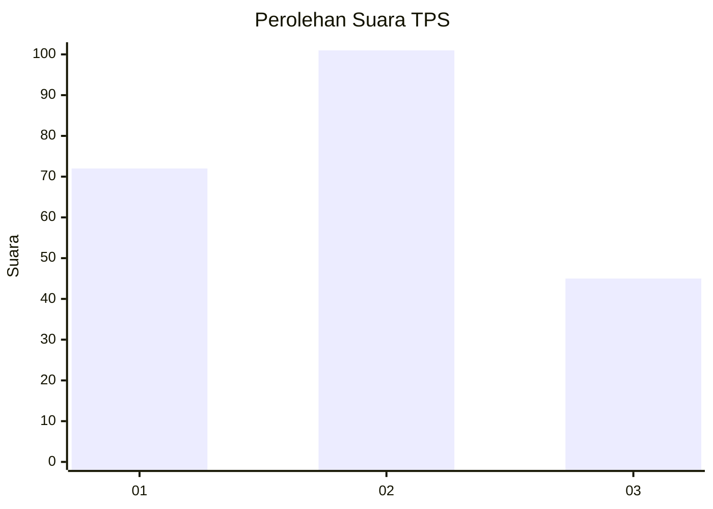
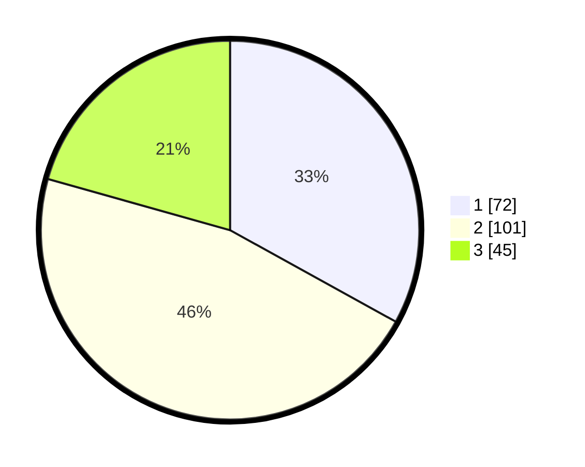

# Hasil

## Grafik

## Tabel

| No. | Nama Paslon    | Suara | Suara (raw) | Persentase |
|:--- |:-------------- | -----:| -----------:| ----------:|
| 1   | ANIES MUHAIMIN | 72    | [72][p-1]   | 33,03      |
| 2   | PRABOWO GIBRAN | 101   | [101][p-2]  | 46,33      |
| 3   | GANJAR MAHFUD  | 45    | [45][p-3]   | 20,64      |

[p-1]: https://github.com/gigit-pemilu/pemilu-2024/blob/main/pilpres/hitung-suara/sub/35-jawa-timur/sub/09-jember/sub/27-kalisat/sub/2012-sebanen/sub/005-tps/sub/paslon-1.txt
[p-2]: https://github.com/gigit-pemilu/pemilu-2024/blob/main/pilpres/hitung-suara/sub/35-jawa-timur/sub/09-jember/sub/27-kalisat/sub/2012-sebanen/sub/005-tps/sub/paslon-2.txt
[p-3]: https://github.com/gigit-pemilu/pemilu-2024/blob/main/pilpres/hitung-suara/sub/35-jawa-timur/sub/09-jember/sub/27-kalisat/sub/2012-sebanen/sub/005-tps/sub/paslon-3.txt

## Foto C Plano

https://sirekap-obj-formc.kpu.go.id/a11d/pemilu/ppwp/35/09/27/20/12/3509272012005-20240215-034404--12daa111-03fc-4f26-9e7e-4de9d8eaf72a.jpg

https://sirekap-obj-formc.kpu.go.id/a11d/pemilu/ppwp/35/09/27/20/12/3509272012005-20240215-034441--4b1688ff-ce47-4bb7-b43f-c2b65f065105.jpg

https://sirekap-obj-formc.kpu.go.id/a11d/pemilu/ppwp/35/09/27/20/12/3509272012005-20240215-034512--daee79a7-39f9-4040-ac46-4e9961dc7ff3.jpg

## Metadata

| Key        | Value               |
| ---------- | ------------------- |
| Time Stamp | 2024-02-15 15:00:29 |

