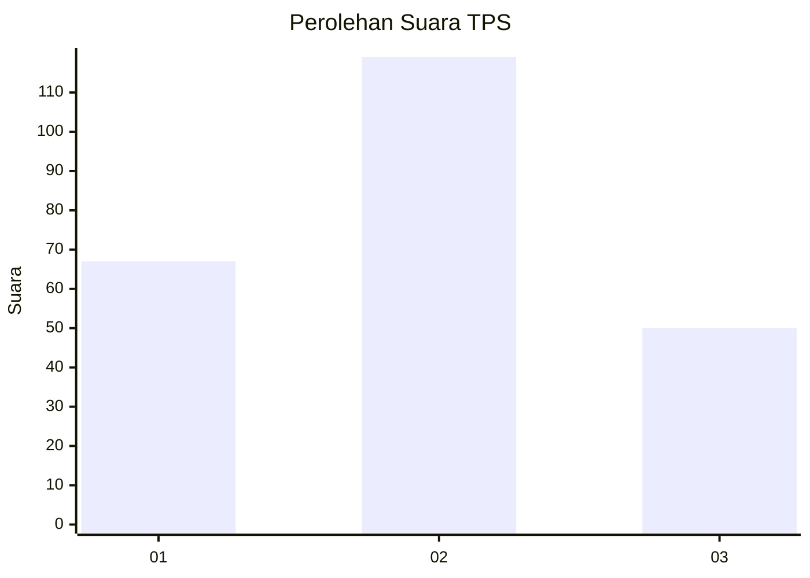
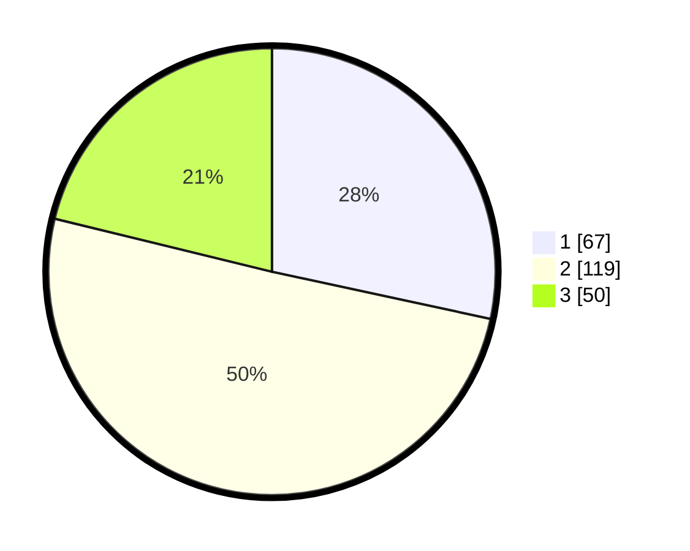

# Hasil

## Grafik

## Tabel

| No. | Nama Paslon    | Suara | Suara (raw) | Persentase |
|:--- |:-------------- | -----:| -----------:| ----------:|
| 1   | ANIES MUHAIMIN | 67    | [67][p-1]   | 28,39      |
| 2   | PRABOWO GIBRAN | 119   | [119][p-2]  | 50,42      |
| 3   | GANJAR MAHFUD  | 50    | [50][p-3]   | 21,19      |

[p-1]: https://github.com/gigit-pemilu/pemilu-2024/blob/main/pilpres/hitung-suara/sub/35-jawa-timur/sub/09-jember/sub/27-kalisat/sub/2012-sebanen/sub/006-tps/sub/paslon-1.txt
[p-2]: https://github.com/gigit-pemilu/pemilu-2024/blob/main/pilpres/hitung-suara/sub/35-jawa-timur/sub/09-jember/sub/27-kalisat/sub/2012-sebanen/sub/006-tps/sub/paslon-2.txt
[p-3]: https://github.com/gigit-pemilu/pemilu-2024/blob/main/pilpres/hitung-suara/sub/35-jawa-timur/sub/09-jember/sub/27-kalisat/sub/2012-sebanen/sub/006-tps/sub/paslon-3.txt

## Foto C Plano

https://sirekap-obj-formc.kpu.go.id/ce37/pemilu/ppwp/35/09/27/20/12/3509272012006-20240215-002409--7421309f-1548-499d-a183-ad35b8db432e.jpg

https://sirekap-obj-formc.kpu.go.id/ce37/pemilu/ppwp/35/09/27/20/12/3509272012006-20240215-002558--744cbf76-6585-45bd-b15a-f0810eb76113.jpg

https://sirekap-obj-formc.kpu.go.id/ce37/pemilu/ppwp/35/09/27/20/12/3509272012006-20240215-002716--7ba7cbc4-f264-4fa9-9aae-9d29931bbc76.jpg

## Metadata

| Key        | Value               |
| ---------- | ------------------- |
| Time Stamp | 2024-02-15 15:00:29 |

