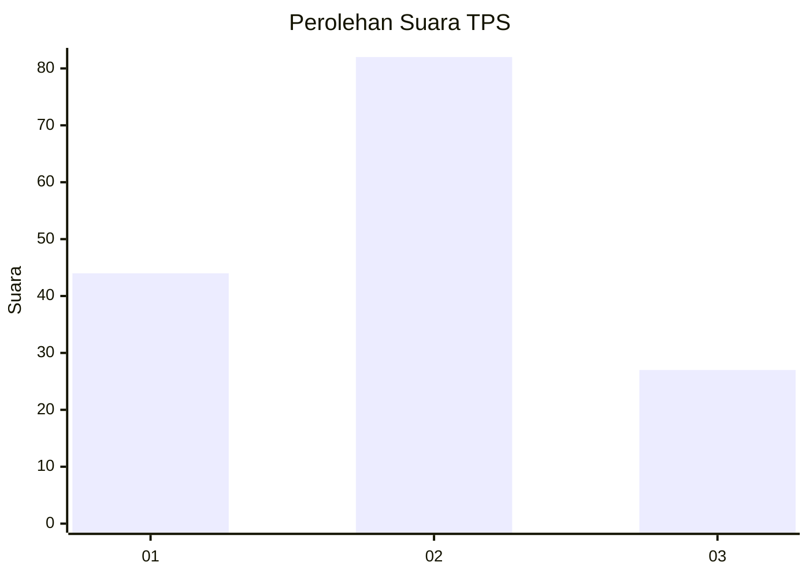
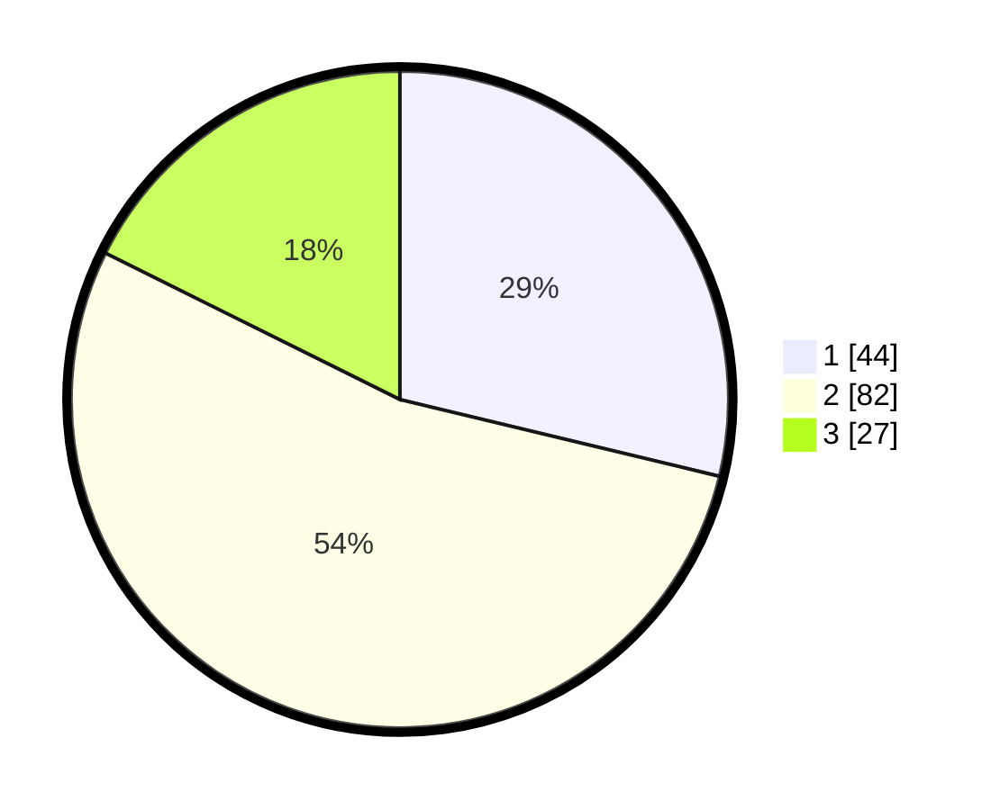

# Hasil

## Grafik

## Tabel

| No. | Nama Paslon    | Suara | Suara (raw) | Persentase |
|:--- |:-------------- | -----:| -----------:| ----------:|
| 1   | ANIES MUHAIMIN | 44    | [44][p-1]   | 28,76      |
| 2   | PRABOWO GIBRAN | 82    | [82][p-2]   | 53,59      |
| 3   | GANJAR MAHFUD  | 27    | [27][p-3]   | 17,65      |

[p-1]: https://github.com/gigit-pemilu/pemilu-2024/blob/main/pilpres/hitung-suara/sub/35-jawa-timur/sub/09-jember/sub/27-kalisat/sub/2012-sebanen/sub/009-tps/sub/paslon-1.txt
[p-2]: https://github.com/gigit-pemilu/pemilu-2024/blob/main/pilpres/hitung-suara/sub/35-jawa-timur/sub/09-jember/sub/27-kalisat/sub/2012-sebanen/sub/009-tps/sub/paslon-2.txt
[p-3]: https://github.com/gigit-pemilu/pemilu-2024/blob/main/pilpres/hitung-suara/sub/35-jawa-timur/sub/09-jember/sub/27-kalisat/sub/2012-sebanen/sub/009-tps/sub/paslon-3.txt

## Foto C Plano

https://sirekap-obj-formc.kpu.go.id/f4f8/pemilu/ppwp/35/09/27/20/12/3509272012009-20240215-042216--802f2ce3-3a99-44dc-83ac-fe4682fda111.jpg

https://sirekap-obj-formc.kpu.go.id/f4f8/pemilu/ppwp/35/09/27/20/12/3509272012009-20240215-042423--9e530d5b-6540-4417-b271-c22f651f81f4.jpg

https://sirekap-obj-formc.kpu.go.id/f4f8/pemilu/ppwp/35/09/27/20/12/3509272012009-20240215-042514--9cee2eb0-fd76-4664-95ad-3b5028371094.jpg

## Metadata

| Key        | Value               |
| ---------- | ------------------- |
| Time Stamp | 2024-02-15 20:00:44 |

