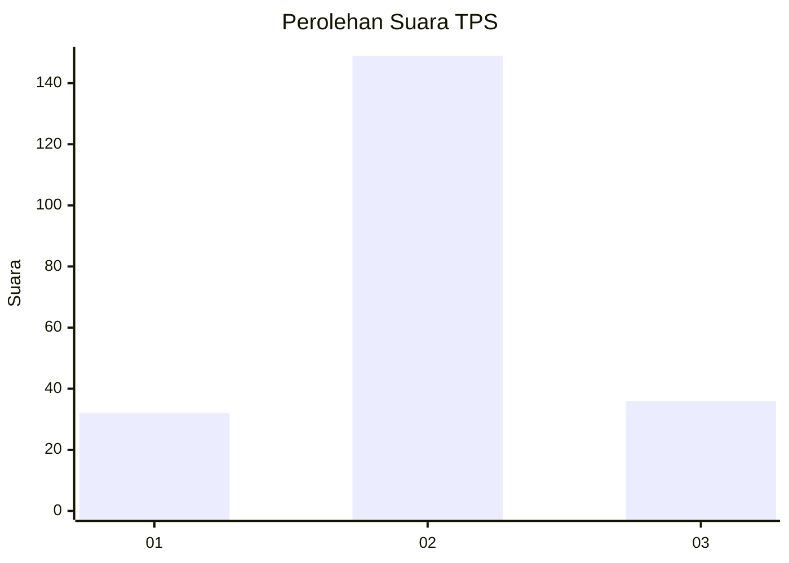
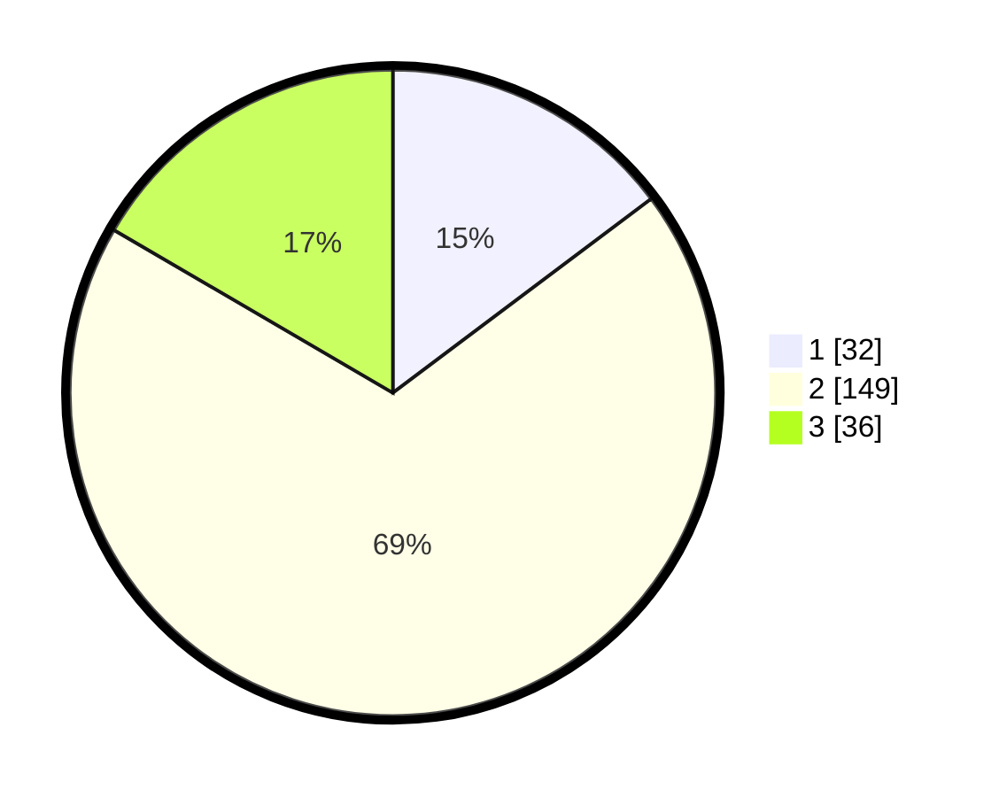

# Hasil

## Grafik

## Tabel

| No. | Nama Paslon    | Suara | Suara (raw) | Persentase |
|:--- |:-------------- | -----:| -----------:| ----------:|
| 1   | ANIES MUHAIMIN | 32    | [32][p-1]   | 14,75      |
| 2   | PRABOWO GIBRAN | 149   | [149][p-2]  | 68,66      |
| 3   | GANJAR MAHFUD  | 36    | [36][p-3]   | 16,59      |

[p-1]: https://github.com/gigit-pemilu/pemilu-2024-35-jawa-timur/blob/main/pilpres/hitung-suara/sub/35-jawa-timur/sub/09-jember/sub/28-ledokombo/sub/2001-lembengan/sub/001-tps/sub/paslon-1.txt
[p-2]: https://github.com/gigit-pemilu/pemilu-2024-35-jawa-timur/blob/main/pilpres/hitung-suara/sub/35-jawa-timur/sub/09-jember/sub/28-ledokombo/sub/2001-lembengan/sub/001-tps/sub/paslon-2.txt
[p-3]: https://github.com/gigit-pemilu/pemilu-2024-35-jawa-timur/blob/main/pilpres/hitung-suara/sub/35-jawa-timur/sub/09-jember/sub/28-ledokombo/sub/2001-lembengan/sub/001-tps/sub/paslon-3.txt

## Foto C Plano

https://sirekap-obj-formc.kpu.go.id/8168/pemilu/ppwp/35/09/28/20/01/3509282001001-20240218-104849--ba96f5be-c8de-4287-a0b1-766795b5d62c.jpg

https://sirekap-obj-formc.kpu.go.id/8168/pemilu/ppwp/35/09/28/20/01/3509282001001-20240218-105435--94816ee3-7429-4f08-87ac-ee8f5e7315b4.jpg

https://sirekap-obj-formc.kpu.go.id/8168/pemilu/ppwp/35/09/28/20/01/3509282001001-20240218-105109--d7fad258-3cb3-4387-b60c-9b53ec97f2ee.jpg

## Metadata

| Key        | Value               |
| ---------- | ------------------- |
| Time Stamp | 2024-02-25 15:00:00 |

