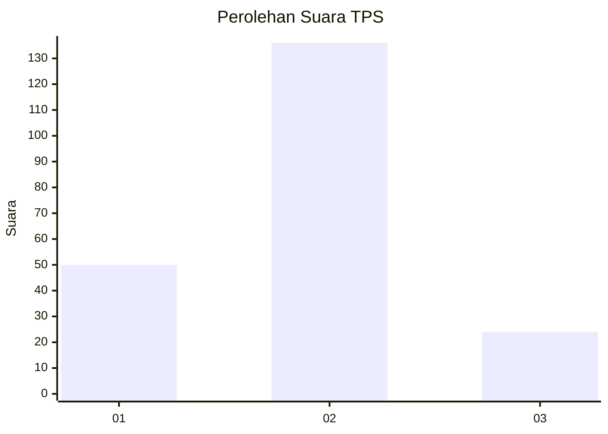
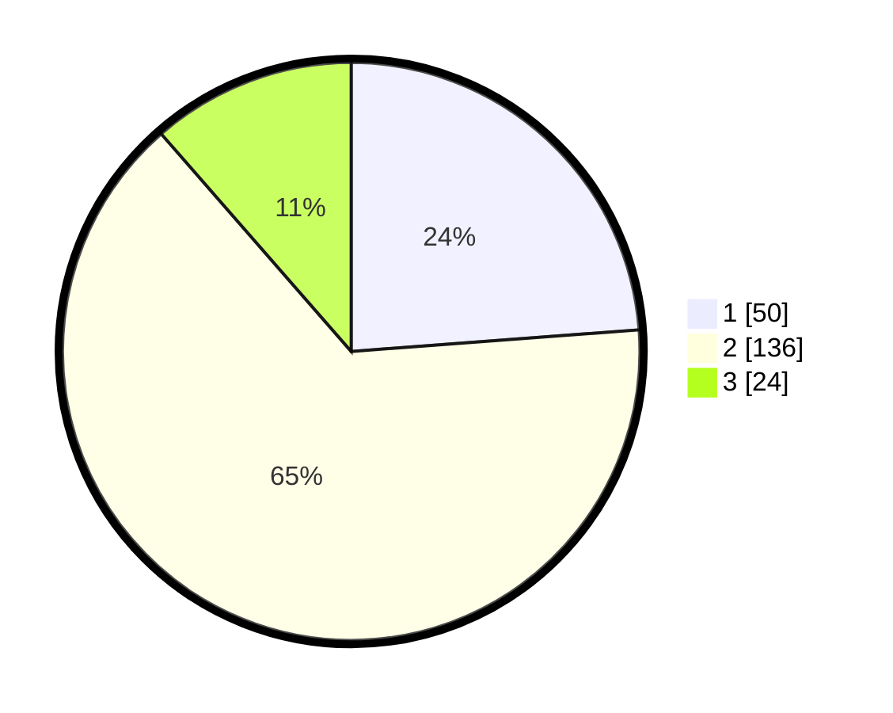

# Hasil

## Grafik

## Tabel

| No. | Nama Paslon    | Suara | Suara (raw) | Persentase |
|:--- |:-------------- | -----:| -----------:| ----------:|
| 1   | ANIES MUHAIMIN | 50    | [50][p-1]   | 23,81      |
| 2   | PRABOWO GIBRAN | 136   | [136][p-2]  | 64,76      |
| 3   | GANJAR MAHFUD  | 24    | [24][p-3]   | 11,43      |

[p-1]: https://github.com/gigit-pemilu/pemilu-2024-35-jawa-timur/blob/main/pilpres/hitung-suara/sub/35-jawa-timur/sub/09-jember/sub/28-ledokombo/sub/2001-lembengan/sub/003-tps/sub/paslon-1.txt
[p-2]: https://github.com/gigit-pemilu/pemilu-2024-35-jawa-timur/blob/main/pilpres/hitung-suara/sub/35-jawa-timur/sub/09-jember/sub/28-ledokombo/sub/2001-lembengan/sub/003-tps/sub/paslon-2.txt
[p-3]: https://github.com/gigit-pemilu/pemilu-2024-35-jawa-timur/blob/main/pilpres/hitung-suara/sub/35-jawa-timur/sub/09-jember/sub/28-ledokombo/sub/2001-lembengan/sub/003-tps/sub/paslon-3.txt

## Foto C Plano

https://sirekap-obj-formc.kpu.go.id/6ed6/pemilu/ppwp/35/09/28/20/01/3509282001003-20240218-111005--bb3d5814-70f9-4cd4-8740-0a4baac99651.jpg

https://sirekap-obj-formc.kpu.go.id/6ed6/pemilu/ppwp/35/09/28/20/01/3509282001003-20240218-111104--52888e7d-a0e5-4d3e-a7b4-3ad7567f1110.jpg

https://sirekap-obj-formc.kpu.go.id/6ed6/pemilu/ppwp/35/09/28/20/01/3509282001003-20240218-111159--b79198a8-990d-43d6-9b5a-eb4b16670b70.jpg

## Metadata

| Key        | Value               |
| ---------- | ------------------- |
| Time Stamp | 2024-02-25 15:00:00 |

