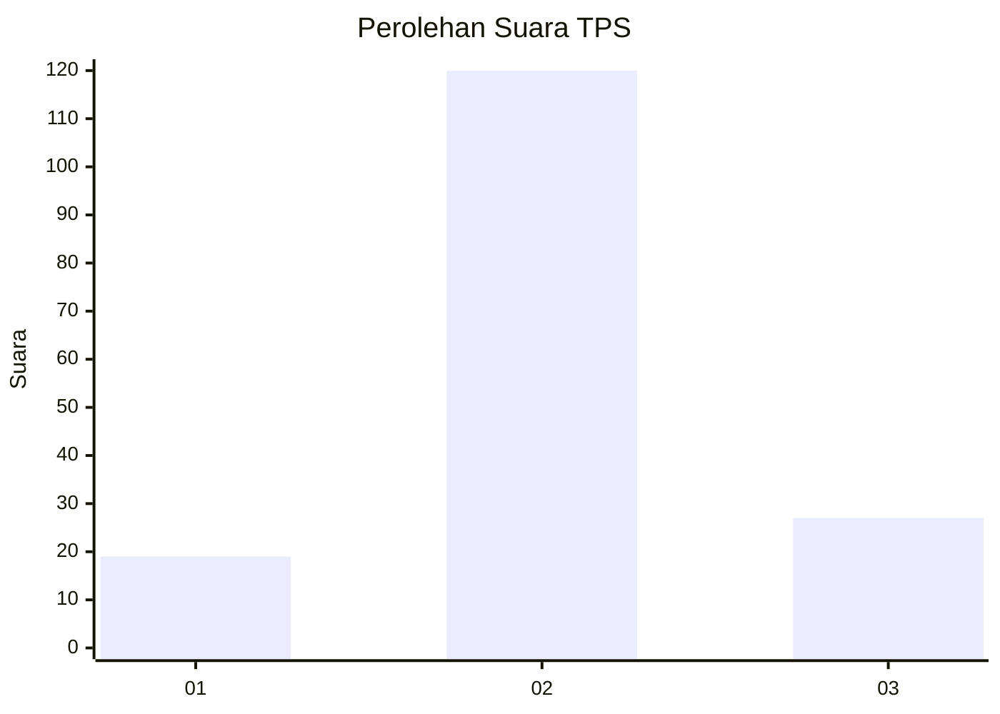
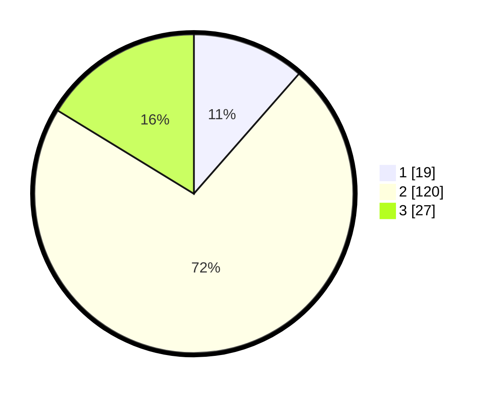

# Hasil

## Grafik

## Tabel

| No. | Nama Paslon    | Suara | Suara (raw) | Persentase |
|:--- |:-------------- | -----:| -----------:| ----------:|
| 1   | ANIES MUHAIMIN | 19    | [19][p-1]   | 11,45      |
| 2   | PRABOWO GIBRAN | 120   | [120][p-2]  | 72,29      |
| 3   | GANJAR MAHFUD  | 27    | [27][p-3]   | 16,27      |

[p-1]: https://github.com/gigit-pemilu/pemilu-2024-35-jawa-timur/blob/main/pilpres/hitung-suara/sub/35-jawa-timur/sub/09-jember/sub/28-ledokombo/sub/2001-lembengan/sub/004-tps/sub/paslon-1.txt
[p-2]: https://github.com/gigit-pemilu/pemilu-2024-35-jawa-timur/blob/main/pilpres/hitung-suara/sub/35-jawa-timur/sub/09-jember/sub/28-ledokombo/sub/2001-lembengan/sub/004-tps/sub/paslon-2.txt
[p-3]: https://github.com/gigit-pemilu/pemilu-2024-35-jawa-timur/blob/main/pilpres/hitung-suara/sub/35-jawa-timur/sub/09-jember/sub/28-ledokombo/sub/2001-lembengan/sub/004-tps/sub/paslon-3.txt

## Foto C Plano

https://sirekap-obj-formc.kpu.go.id/c41d/pemilu/ppwp/35/09/28/20/01/3509282001004-20240216-182242--b12b83ff-f71e-4729-b006-ba91eeb0bf77.jpg

https://sirekap-obj-formc.kpu.go.id/c41d/pemilu/ppwp/35/09/28/20/01/3509282001004-20240216-182428--77322ec9-d521-410c-9419-ad5480767a11.jpg

https://sirekap-obj-formc.kpu.go.id/c41d/pemilu/ppwp/35/09/28/20/01/3509282001004-20240215-190511--f2b5fddd-9589-4c64-9f14-4d0ddc4a4ae8.jpg

## Metadata

| Key        | Value               |
| ---------- | ------------------- |
| Time Stamp | 2024-02-25 17:00:00 |

