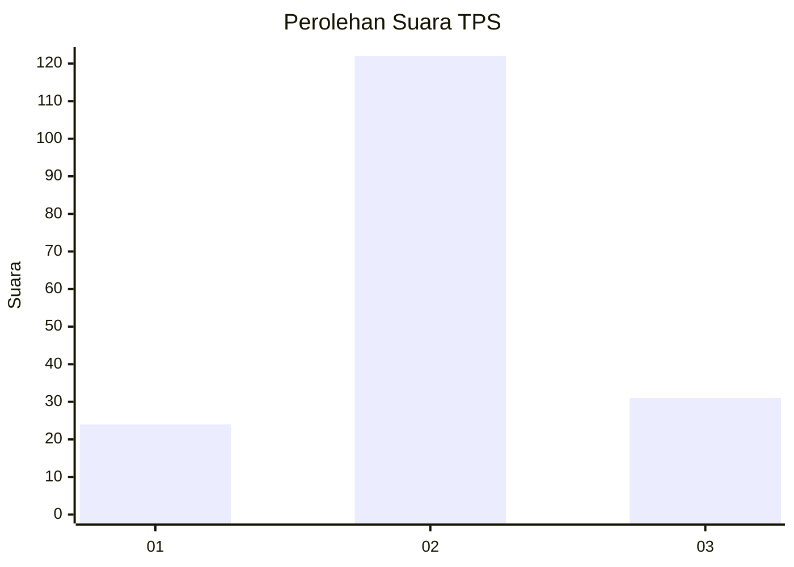
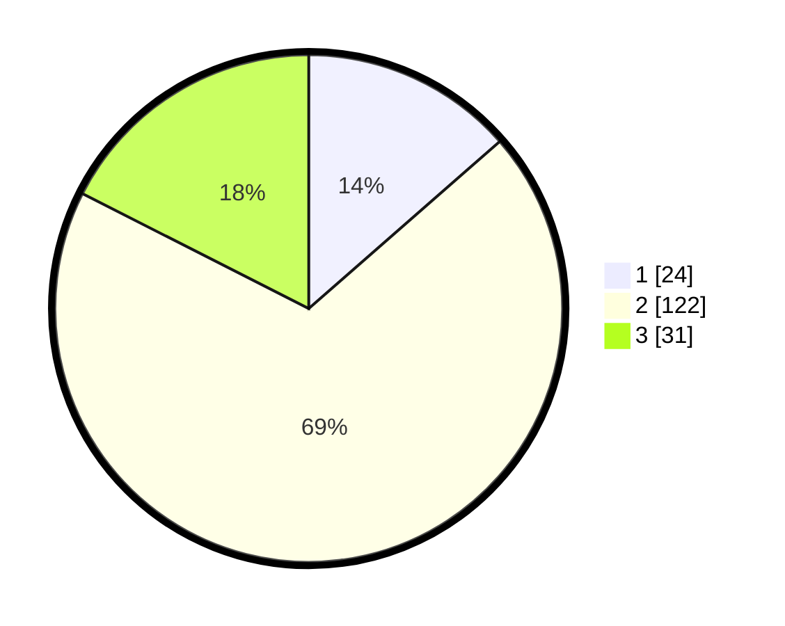

# Hasil

## Grafik

## Tabel

| No. | Nama Paslon    | Suara | Suara (raw) | Persentase |
|:--- |:-------------- | -----:| -----------:| ----------:|
| 1   | ANIES MUHAIMIN | 24    | [24][p-1]   | 13,56      |
| 2   | PRABOWO GIBRAN | 122   | [122][p-2]  | 68,93      |
| 3   | GANJAR MAHFUD  | 31    | [31][p-3]   | 17,51      |

[p-1]: https://github.com/gigit-pemilu/pemilu-2024-35-jawa-timur/blob/main/pilpres/hitung-suara/sub/35-jawa-timur/sub/09-jember/sub/28-ledokombo/sub/2001-lembengan/sub/005-tps/sub/paslon-1.txt
[p-2]: https://github.com/gigit-pemilu/pemilu-2024-35-jawa-timur/blob/main/pilpres/hitung-suara/sub/35-jawa-timur/sub/09-jember/sub/28-ledokombo/sub/2001-lembengan/sub/005-tps/sub/paslon-2.txt
[p-3]: https://github.com/gigit-pemilu/pemilu-2024-35-jawa-timur/blob/main/pilpres/hitung-suara/sub/35-jawa-timur/sub/09-jember/sub/28-ledokombo/sub/2001-lembengan/sub/005-tps/sub/paslon-3.txt

## Foto C Plano

https://sirekap-obj-formc.kpu.go.id/4c2e/pemilu/ppwp/35/09/28/20/01/3509282001005-20240215-110008--a25ef096-a8d5-436a-8399-2b8e0f44acad.jpg

https://sirekap-obj-formc.kpu.go.id/4c2e/pemilu/ppwp/35/09/28/20/01/3509282001005-20240215-110101--8defd88e-bd42-4242-a4da-ae01352ee47e.jpg

https://sirekap-obj-formc.kpu.go.id/4c2e/pemilu/ppwp/35/09/28/20/01/3509282001005-20240215-110134--d6299dff-dfa0-455f-9186-557b9b69f62f.jpg

## Metadata

| Key        | Value               |
| ---------- | ------------------- |
| Time Stamp | 2024-02-15 20:30:46 |

