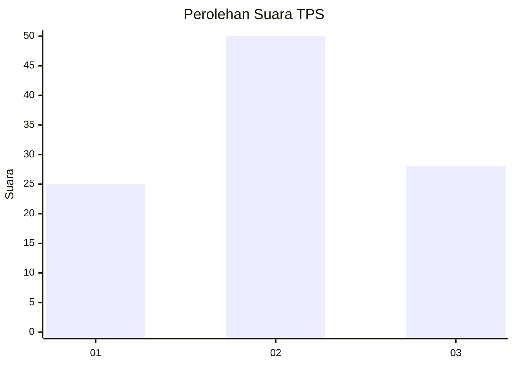
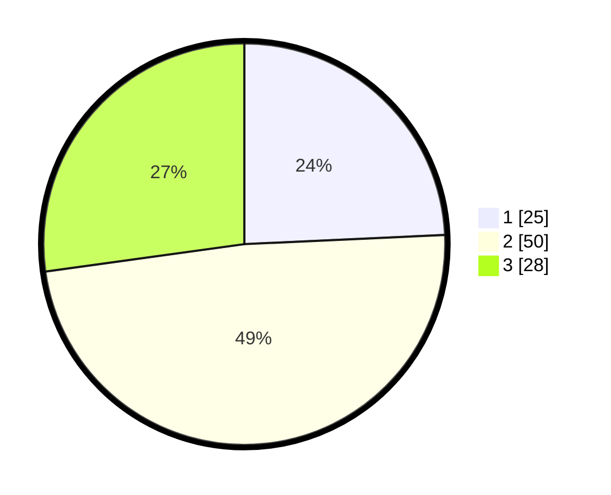

# Hasil

## Grafik

## Tabel

| No. | Nama Paslon    | Suara | Suara (raw) | Persentase |
|:--- |:-------------- | -----:| -----------:| ----------:|
| 1   | ANIES MUHAIMIN | 25    | [25][p-1]   | 24,27      |
| 2   | PRABOWO GIBRAN | 50    | [50][p-2]   | 48,54      |
| 3   | GANJAR MAHFUD  | 28    | [28][p-3]   | 27,18      |

[p-1]: https://github.com/gigit-pemilu/pemilu-2024/blob/main/pilpres/hitung-suara/sub/35-jawa-timur/sub/09-jember/sub/28-ledokombo/sub/2002-suren/sub/001-tps/sub/paslon-1.txt
[p-2]: https://github.com/gigit-pemilu/pemilu-2024/blob/main/pilpres/hitung-suara/sub/35-jawa-timur/sub/09-jember/sub/28-ledokombo/sub/2002-suren/sub/001-tps/sub/paslon-2.txt
[p-3]: https://github.com/gigit-pemilu/pemilu-2024/blob/main/pilpres/hitung-suara/sub/35-jawa-timur/sub/09-jember/sub/28-ledokombo/sub/2002-suren/sub/001-tps/sub/paslon-3.txt

## Foto C Plano

https://sirekap-obj-formc.kpu.go.id/ef01/pemilu/ppwp/35/09/28/20/02/3509282002001-20240220-104341--8dddd465-0c5f-4894-8705-4b84d2175f0d.jpg

https://sirekap-obj-formc.kpu.go.id/ef01/pemilu/ppwp/35/09/28/20/02/3509282002001-20240220-104054--59f67844-a1dc-4e8b-a486-b53625bf705d.jpg

https://sirekap-obj-formc.kpu.go.id/ef01/pemilu/ppwp/35/09/28/20/02/3509282002001-20240220-104135--b2d4d360-8142-4a21-a428-70613aaa0911.jpg

## Metadata

| Key        | Value               |
| ---------- | ------------------- |
| Time Stamp | 2024-02-20 11:00:00 |

## DATA PEMILIH TETAP

Jumlah pemilih dalam DPT: **298**.
 * L: **149**.
 * P: **149**.

## DATA PENGGUNA HAK PILIH

Jumlah pengguna hak pilih dalam DPT: **219**.
 * L: **106**.
 * P: **113**.

Jumlah pengguna hak pilih dalam DPTb: **219**.
 * L: **106**.
 * P: **113**.

Jumlah pengguna hak pilih dalam DPK: **219**.
 * L: **106**.
 * P: **113**.

Jumlah pengguna hak pilih: **219**.
 * L: **106**.
 * P: **113**.

## JUMLAH SUARA SAH DAN TIDAK SAH

JUMLAH SELURUH SUARA SAH: **213**.

JUMLAH SUARA TIDAK SAH: **5**.

JUMLAH SELURUH SUARA SAH DAN SUARA TIDAK SAH: **218**.

