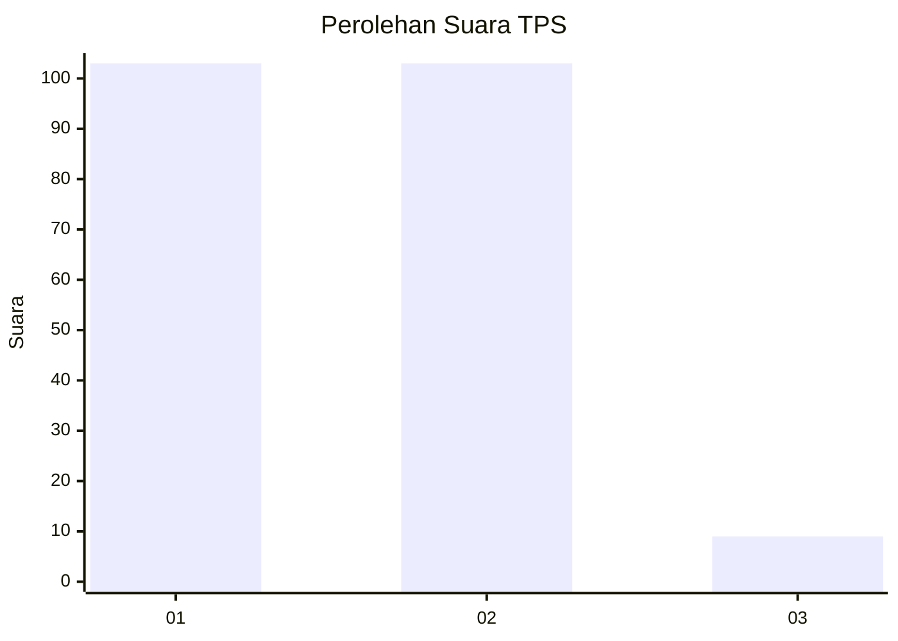
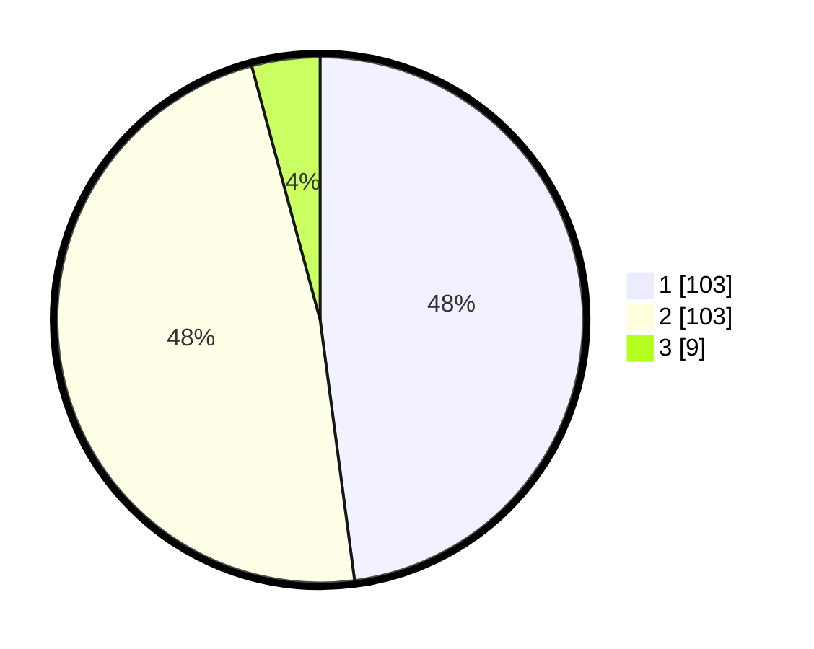

# Hasil

## Grafik

## Tabel

| No. | Nama Paslon    | Suara | Suara (raw) | Persentase |
|:--- |:-------------- | -----:| -----------:| ----------:|
| 1   | ANIES MUHAIMIN | 103   | [103][p-1]  | 47,91      |
| 2   | PRABOWO GIBRAN | 103   | [103][p-2]  | 47,91      |
| 3   | GANJAR MAHFUD  | 9     | [9][p-3]    | 4,19       |

[p-1]: https://github.com/gigit-pemilu/pemilu-2024-35-jawa-timur/blob/main/pilpres/hitung-suara/sub/35-jawa-timur/sub/09-jember/sub/28-ledokombo/sub/2002-suren/sub/009-tps/sub/paslon-1.txt
[p-2]: https://github.com/gigit-pemilu/pemilu-2024-35-jawa-timur/blob/main/pilpres/hitung-suara/sub/35-jawa-timur/sub/09-jember/sub/28-ledokombo/sub/2002-suren/sub/009-tps/sub/paslon-2.txt
[p-3]: https://github.com/gigit-pemilu/pemilu-2024-35-jawa-timur/blob/main/pilpres/hitung-suara/sub/35-jawa-timur/sub/09-jember/sub/28-ledokombo/sub/2002-suren/sub/009-tps/sub/paslon-3.txt

## Foto C Plano

https://sirekap-obj-formc.kpu.go.id/627f/pemilu/ppwp/35/09/28/20/02/3509282002009-20240214-201120--c5b26c64-a2fa-4884-ab53-287e7c2cc3ac.jpg

https://sirekap-obj-formc.kpu.go.id/627f/pemilu/ppwp/35/09/28/20/02/3509282002009-20240214-201200--19bb86a4-318e-4505-9e27-02ef6c0dfeef.jpg

https://sirekap-obj-formc.kpu.go.id/627f/pemilu/ppwp/35/09/28/20/02/3509282002009-20240214-201217--5d0fc76f-df30-4f53-85c0-610c0275eadb.jpg

## Metadata

| Key        | Value               |
| ---------- | ------------------- |
| Time Stamp | 2024-02-15 17:00:25 |

