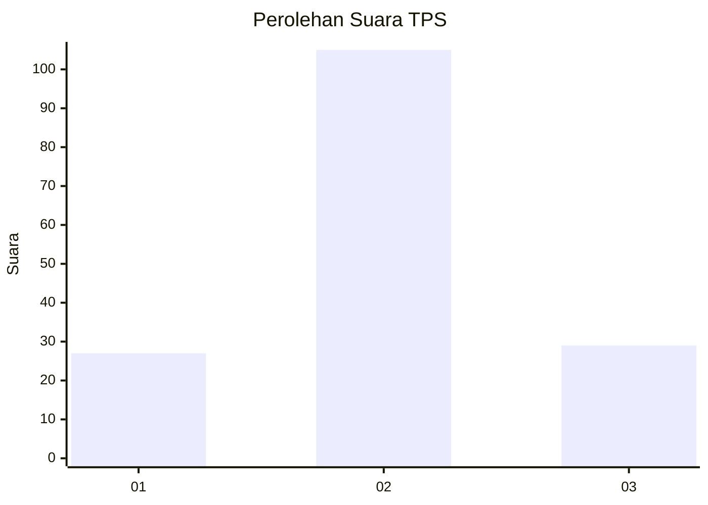
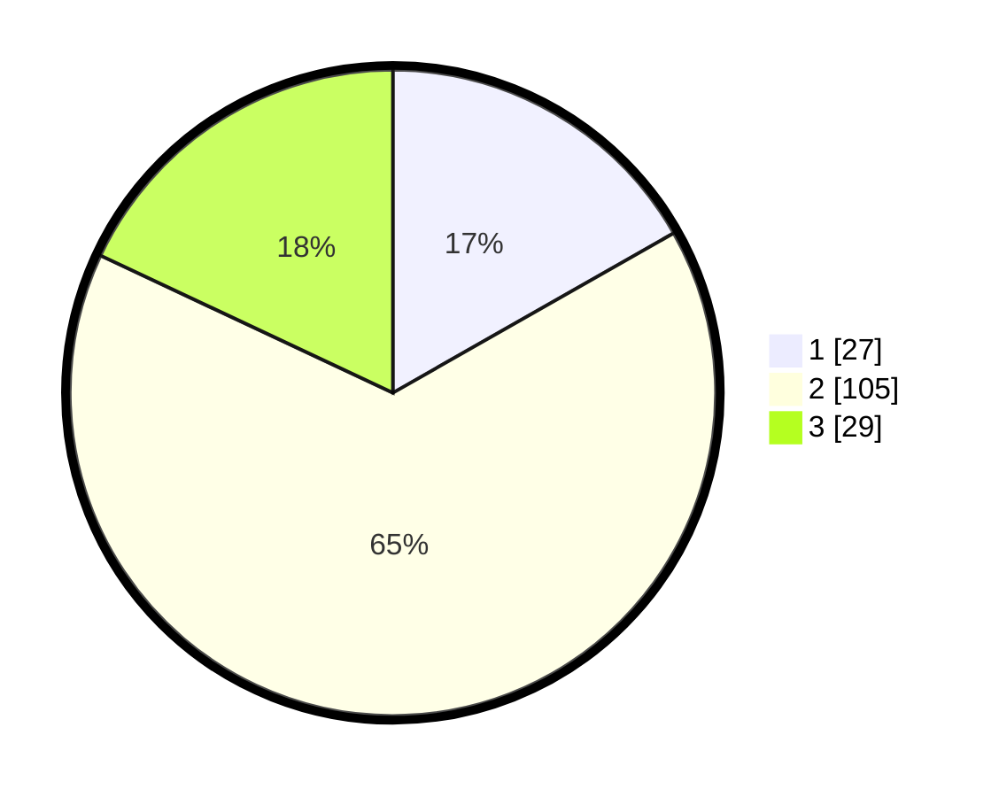

# Hasil

## Grafik

## Tabel

| No. | Nama Paslon    | Suara | Suara (raw) | Persentase |
|:--- |:-------------- | -----:| -----------:| ----------:|
| 1   | ANIES MUHAIMIN | 27    | [27][p-1]   | 16,77      |
| 2   | PRABOWO GIBRAN | 105   | [105][p-2]  | 65,22      |
| 3   | GANJAR MAHFUD  | 29    | [29][p-3]   | 18,01      |

[p-1]: https://github.com/gigit-pemilu/pemilu-2024/blob/main/pilpres/hitung-suara/sub/35-jawa-timur/sub/09-jember/sub/28-ledokombo/sub/2002-suren/sub/014-tps/sub/paslon-1.txt
[p-2]: https://github.com/gigit-pemilu/pemilu-2024/blob/main/pilpres/hitung-suara/sub/35-jawa-timur/sub/09-jember/sub/28-ledokombo/sub/2002-suren/sub/014-tps/sub/paslon-2.txt
[p-3]: https://github.com/gigit-pemilu/pemilu-2024/blob/main/pilpres/hitung-suara/sub/35-jawa-timur/sub/09-jember/sub/28-ledokombo/sub/2002-suren/sub/014-tps/sub/paslon-3.txt

## Foto C Plano

https://sirekap-obj-formc.kpu.go.id/6c12/pemilu/ppwp/35/09/28/20/02/3509282002014-20240214-204405--d537066c-7820-4c77-a4d2-2bf792df87e2.jpg

https://sirekap-obj-formc.kpu.go.id/6c12/pemilu/ppwp/35/09/28/20/02/3509282002014-20240214-205131--8d4100c9-d6cb-4faf-a12a-deca53c48a52.jpg

https://sirekap-obj-formc.kpu.go.id/6c12/pemilu/ppwp/35/09/28/20/02/3509282002014-20240214-205640--b1cc5f38-7f53-4780-88c2-7d5c191f139d.jpg

## Metadata

| Key        | Value               |
| ---------- | ------------------- |
| Time Stamp | 2024-02-15 17:30:25 |

