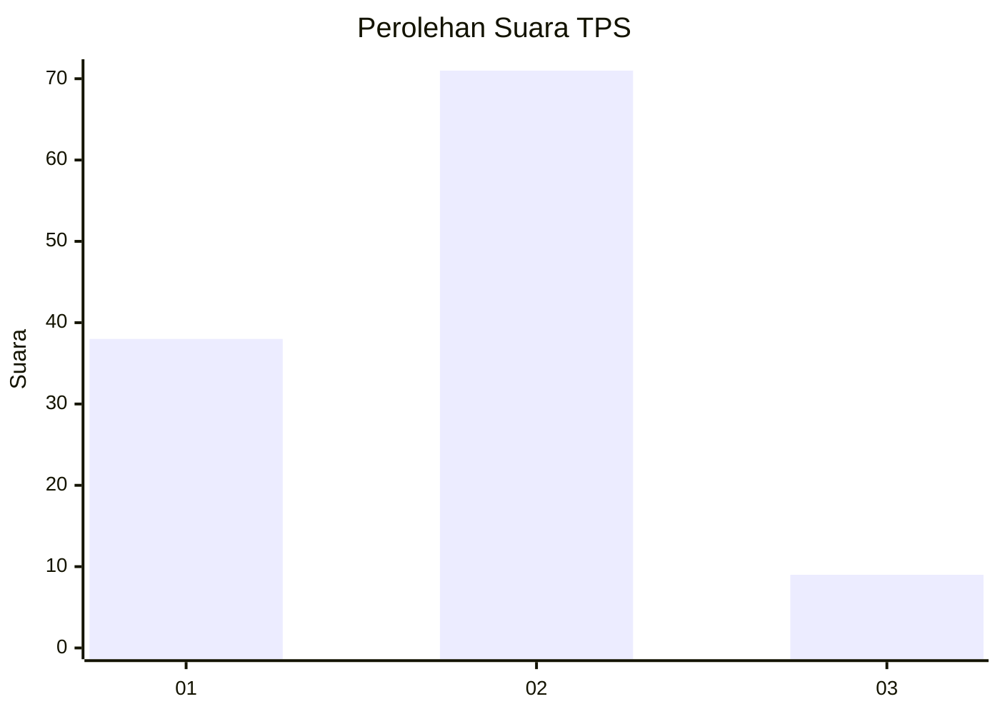
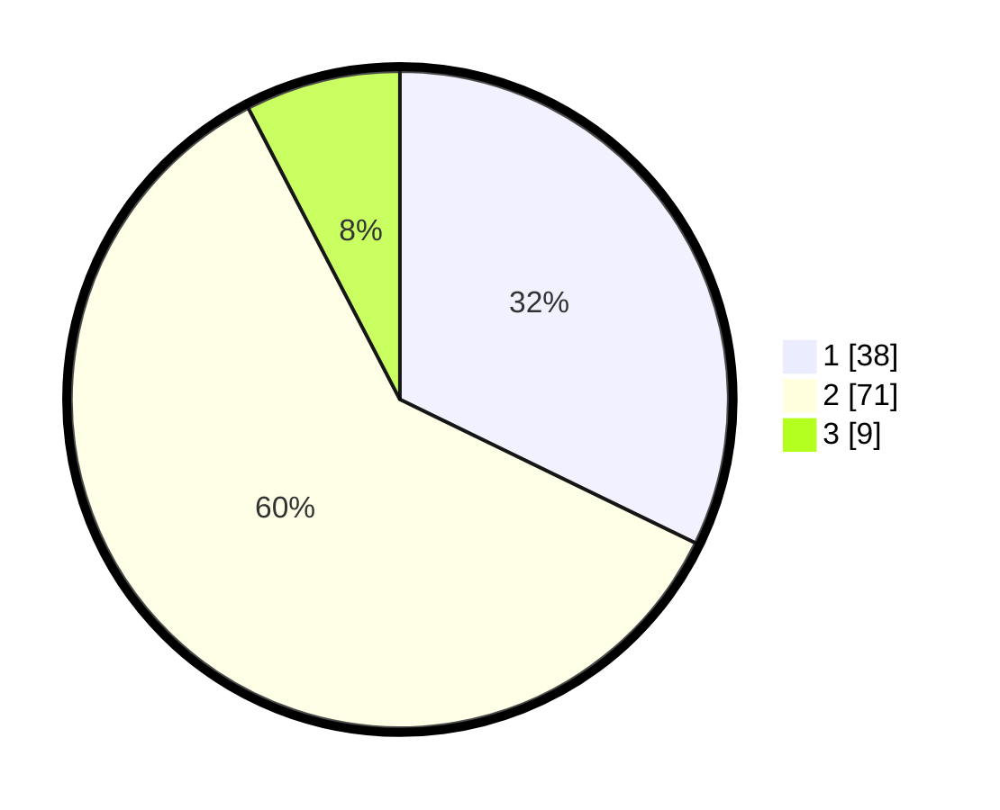

# Hasil

## Grafik

## Tabel

| No. | Nama Paslon    | Suara | Suara (raw) | Persentase |
|:--- |:-------------- | -----:| -----------:| ----------:|
| 1   | ANIES MUHAIMIN | 38    | [38][p-1]   | 32,20      |
| 2   | PRABOWO GIBRAN | 71    | [71][p-2]   | 60,17      |
| 3   | GANJAR MAHFUD  | 9     | [9][p-3]    | 7,63       |

[p-1]: https://github.com/gigit-pemilu/pemilu-2024-35-jawa-timur/blob/main/pilpres/hitung-suara/sub/35-jawa-timur/sub/09-jember/sub/28-ledokombo/sub/2002-suren/sub/016-tps/sub/paslon-1.txt
[p-2]: https://github.com/gigit-pemilu/pemilu-2024-35-jawa-timur/blob/main/pilpres/hitung-suara/sub/35-jawa-timur/sub/09-jember/sub/28-ledokombo/sub/2002-suren/sub/016-tps/sub/paslon-2.txt
[p-3]: https://github.com/gigit-pemilu/pemilu-2024-35-jawa-timur/blob/main/pilpres/hitung-suara/sub/35-jawa-timur/sub/09-jember/sub/28-ledokombo/sub/2002-suren/sub/016-tps/sub/paslon-3.txt

## Foto C Plano

https://sirekap-obj-formc.kpu.go.id/0028/pemilu/ppwp/35/09/28/20/02/3509282002016-20240219-212936--3d555e7f-ba61-4000-8d08-ec4fe23dbcc4.jpg

https://sirekap-obj-formc.kpu.go.id/0028/pemilu/ppwp/35/09/28/20/02/3509282002016-20240214-233807--8018dc18-9fad-4e34-b808-eaecde65a59b.jpg

https://sirekap-obj-formc.kpu.go.id/0028/pemilu/ppwp/35/09/28/20/02/3509282002016-20240214-233904--2a3624ad-0465-44f5-8b41-a66525ee75ca.jpg

## Metadata

| Key        | Value               |
| ---------- | ------------------- |
| Time Stamp | 2024-02-19 22:00:00 |

