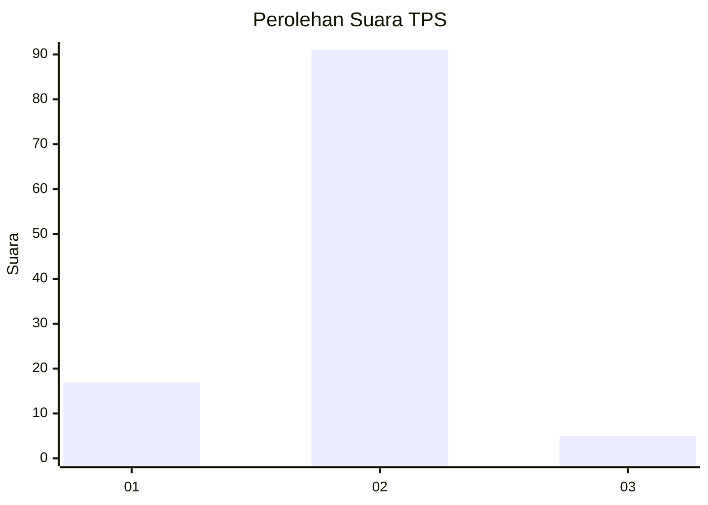
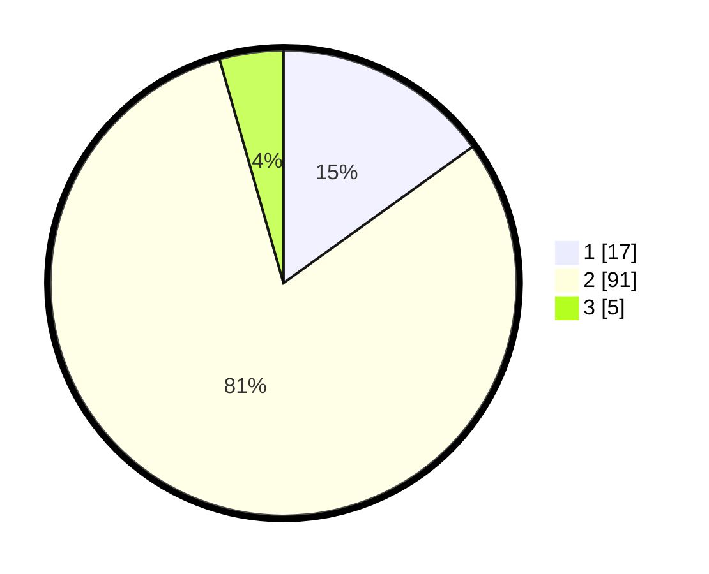

# Hasil

## Grafik

## Tabel

| No. | Nama Paslon    | Suara | Suara (raw) | Persentase |
|:--- |:-------------- | -----:| -----------:| ----------:|
| 1   | ANIES MUHAIMIN | 17    | [17][p-1]   | 15,04      |
| 2   | PRABOWO GIBRAN | 91    | [91][p-2]   | 80,53      |
| 3   | GANJAR MAHFUD  | 5     | [5][p-3]    | 4,42       |

[p-1]: https://github.com/gigit-pemilu/pemilu-2024-35-jawa-timur/blob/main/pilpres/hitung-suara/sub/35-jawa-timur/sub/09-jember/sub/28-ledokombo/sub/2002-suren/sub/019-tps/sub/paslon-1.txt
[p-2]: https://github.com/gigit-pemilu/pemilu-2024-35-jawa-timur/blob/main/pilpres/hitung-suara/sub/35-jawa-timur/sub/09-jember/sub/28-ledokombo/sub/2002-suren/sub/019-tps/sub/paslon-2.txt
[p-3]: https://github.com/gigit-pemilu/pemilu-2024-35-jawa-timur/blob/main/pilpres/hitung-suara/sub/35-jawa-timur/sub/09-jember/sub/28-ledokombo/sub/2002-suren/sub/019-tps/sub/paslon-3.txt

## Foto C Plano

https://sirekap-obj-formc.kpu.go.id/298b/pemilu/ppwp/35/09/28/20/02/3509282002019-20240214-224533--fb59e2bf-8ffb-4cc9-a0ab-c2f3148c1282.jpg

https://sirekap-obj-formc.kpu.go.id/298b/pemilu/ppwp/35/09/28/20/02/3509282002019-20240214-224713--194fd3db-9b94-4350-9165-fb5d579bb3aa.jpg

https://sirekap-obj-formc.kpu.go.id/298b/pemilu/ppwp/35/09/28/20/02/3509282002019-20240214-224845--c0b72858-9be9-4be3-bcb8-c5931bfb1b50.jpg

## Metadata

| Key        | Value               |
| ---------- | ------------------- |
| Time Stamp | 2024-02-15 17:00:25 |

