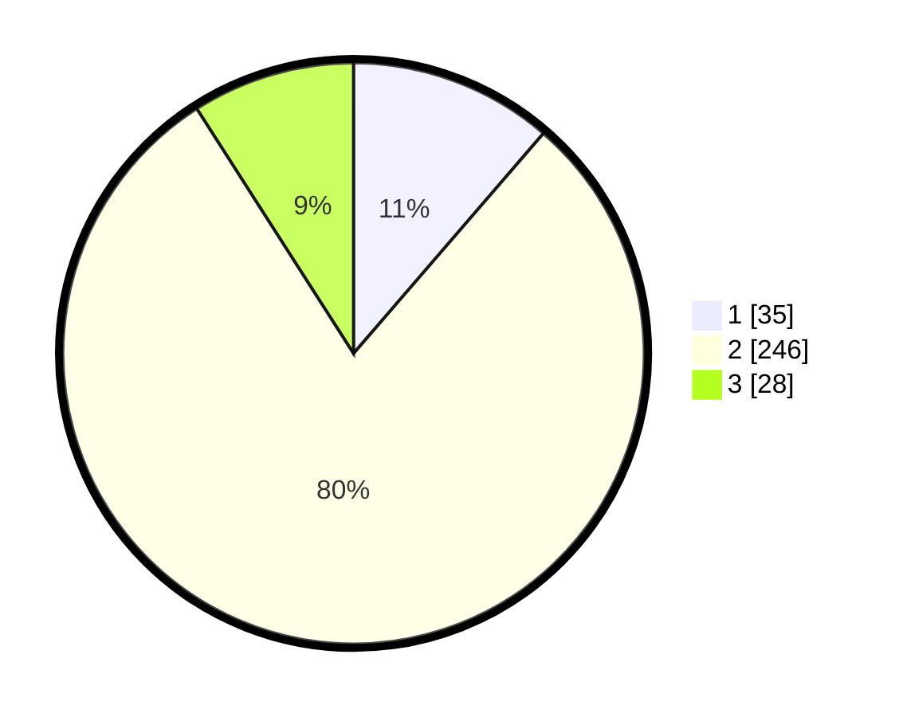

# Hasil

## Grafik

## Tabel

| No. | Nama Paslon    | Suara | Suara (raw) | Persentase |
|:--- |:-------------- | -----:| -----------:| ----------:|
| 1   | ANIES MUHAIMIN | 35    | [35][p-1]   | 11,33      |
| 2   | PRABOWO GIBRAN | 246   | [246][p-2]  | 79,61      |
| 3   | GANJAR MAHFUD  | 28    | [28][p-3]   | 9,06       |

[p-1]: https://github.com/gigit-pemilu/pemilu-2024/blob/main/pilpres/hitung-suara/sub/35-jawa-timur/sub/09-jember/sub/28-ledokombo/sub/2002-suren/sub/023-tps/sub/paslon-1.txt
[p-2]: https://github.com/gigit-pemilu/pemilu-2024/blob/main/pilpres/hitung-suara/sub/35-jawa-timur/sub/09-jember/sub/28-ledokombo/sub/2002-suren/sub/023-tps/sub/paslon-2.txt
[p-3]: https://github.com/gigit-pemilu/pemilu-2024/blob/main/pilpres/hitung-suara/sub/35-jawa-timur/sub/09-jember/sub/28-ledokombo/sub/2002-suren/sub/023-tps/sub/paslon-3.txt

## Foto C Plano

https://sirekap-obj-formc.kpu.go.id/e39e/pemilu/ppwp/35/09/28/20/02/3509282002023-20240215-000722--d0d71fa2-c897-4c5b-adfe-74e8a482d63d.jpg

https://sirekap-obj-formc.kpu.go.id/e39e/pemilu/ppwp/35/09/28/20/02/3509282002023-20240220-123410--c172bdbb-5c93-45f2-8261-857707671e4a.jpg

https://sirekap-obj-formc.kpu.go.id/e39e/pemilu/ppwp/35/09/28/20/02/3509282002023-20240220-123509--cf37027d-740d-4696-8433-90d251d53080.jpg

## Metadata

| Key        | Value               |
| ---------- | ------------------- |
| Time Stamp | 2024-02-20 13:00:00 |

