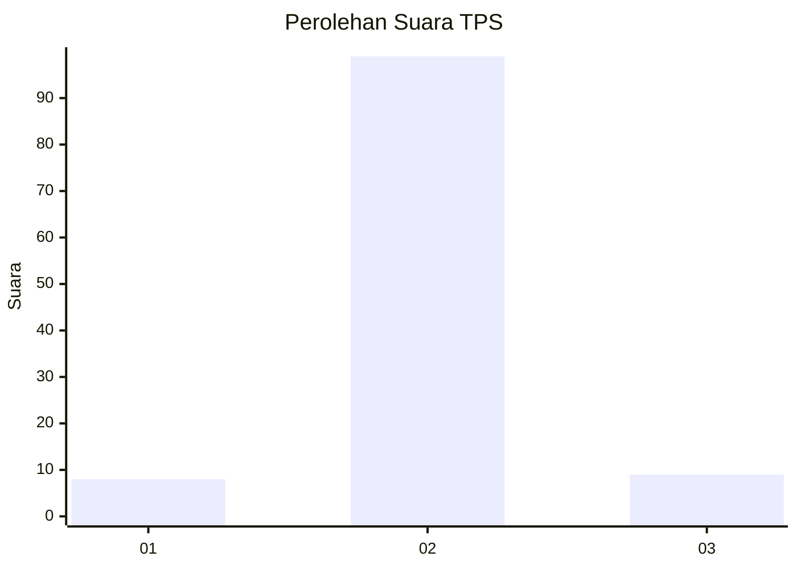
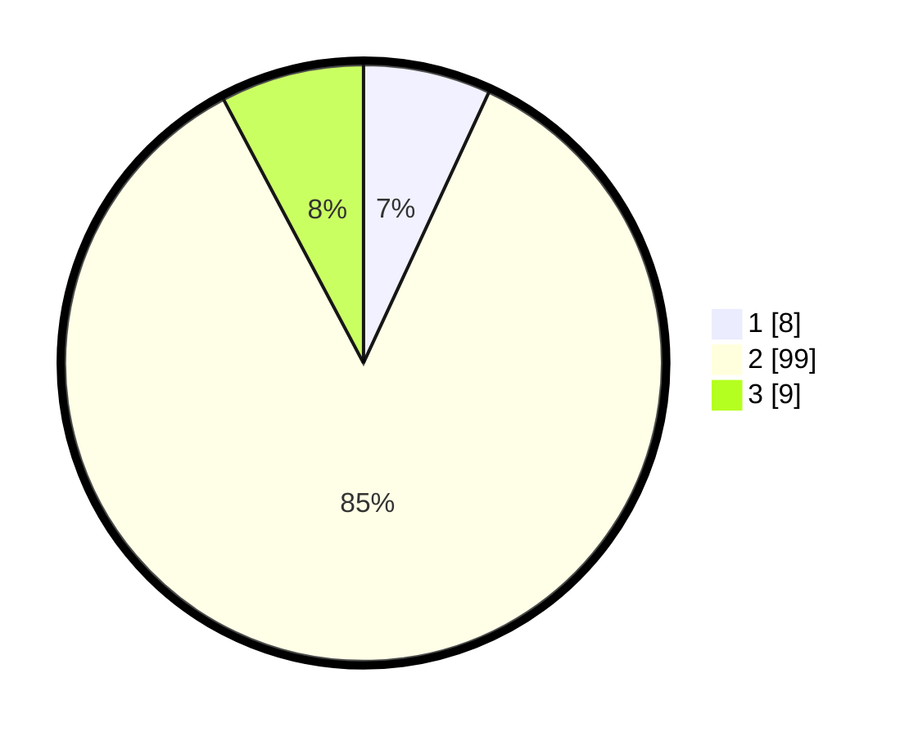

# Hasil

## Grafik

## Tabel

| No. | Nama Paslon    | Suara | Suara (raw) | Persentase |
|:--- |:-------------- | -----:| -----------:| ----------:|
| 1   | ANIES MUHAIMIN | 8     | [8][p-1]    | 6,90       |
| 2   | PRABOWO GIBRAN | 99    | [99][p-2]   | 85,34      |
| 3   | GANJAR MAHFUD  | 9     | [9][p-3]    | 7,76       |

[p-1]: https://github.com/gigit-pemilu/pemilu-2024-35-jawa-timur/blob/main/pilpres/hitung-suara/sub/35-jawa-timur/sub/09-jember/sub/28-ledokombo/sub/2003-karangpaiton/sub/001-tps/sub/paslon-1.txt
[p-2]: https://github.com/gigit-pemilu/pemilu-2024-35-jawa-timur/blob/main/pilpres/hitung-suara/sub/35-jawa-timur/sub/09-jember/sub/28-ledokombo/sub/2003-karangpaiton/sub/001-tps/sub/paslon-2.txt
[p-3]: https://github.com/gigit-pemilu/pemilu-2024-35-jawa-timur/blob/main/pilpres/hitung-suara/sub/35-jawa-timur/sub/09-jember/sub/28-ledokombo/sub/2003-karangpaiton/sub/001-tps/sub/paslon-3.txt

## Foto C Plano

https://sirekap-obj-formc.kpu.go.id/2112/pemilu/ppwp/35/09/28/20/03/3509282003001-20240218-105047--0bf7d823-5191-4aa8-bd90-ae610a4c0081.jpg

https://sirekap-obj-formc.kpu.go.id/2112/pemilu/ppwp/35/09/28/20/03/3509282003001-20240218-105123--dd756ac0-4821-482d-9ff7-cd2b588b553f.jpg

https://sirekap-obj-formc.kpu.go.id/2112/pemilu/ppwp/35/09/28/20/03/3509282003001-20240214-201231--2a555857-33ce-40fc-9527-c9e3ce39b847.jpg

## Metadata

| Key        | Value               |
| ---------- | ------------------- |
| Time Stamp | 2024-02-25 11:00:00 |

