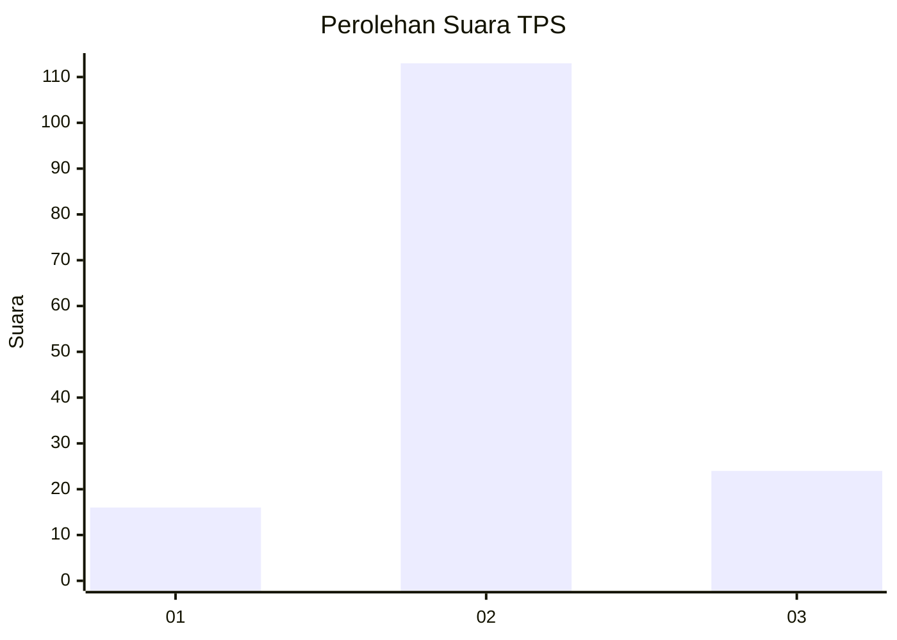
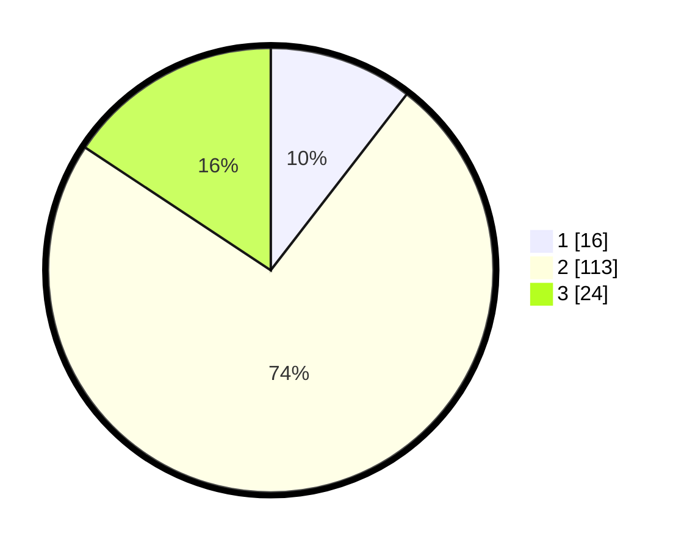

# Hasil

## Grafik

## Tabel

| No. | Nama Paslon    | Suara | Suara (raw) | Persentase |
|:--- |:-------------- | -----:| -----------:| ----------:|
| 1   | ANIES MUHAIMIN | 16    | [16][p-1]   | 10,46      |
| 2   | PRABOWO GIBRAN | 113   | [113][p-2]  | 73,86      |
| 3   | GANJAR MAHFUD  | 24    | [24][p-3]   | 15,69      |

[p-1]: https://github.com/gigit-pemilu/pemilu-2024-35-jawa-timur/blob/main/pilpres/hitung-suara/sub/35-jawa-timur/sub/09-jember/sub/28-ledokombo/sub/2003-karangpaiton/sub/003-tps/sub/paslon-1.txt
[p-2]: https://github.com/gigit-pemilu/pemilu-2024-35-jawa-timur/blob/main/pilpres/hitung-suara/sub/35-jawa-timur/sub/09-jember/sub/28-ledokombo/sub/2003-karangpaiton/sub/003-tps/sub/paslon-2.txt
[p-3]: https://github.com/gigit-pemilu/pemilu-2024-35-jawa-timur/blob/main/pilpres/hitung-suara/sub/35-jawa-timur/sub/09-jember/sub/28-ledokombo/sub/2003-karangpaiton/sub/003-tps/sub/paslon-3.txt

## Foto C Plano

https://sirekap-obj-formc.kpu.go.id/835d/pemilu/ppwp/35/09/28/20/03/3509282003003-20240218-110224--af256c74-87ab-4fb6-9287-69189142f8d4.jpg

https://sirekap-obj-formc.kpu.go.id/835d/pemilu/ppwp/35/09/28/20/03/3509282003003-20240218-110257--ee648f7f-14fd-4978-a69f-87ad92cbba9e.jpg

https://sirekap-obj-formc.kpu.go.id/835d/pemilu/ppwp/35/09/28/20/03/3509282003003-20240218-110336--01cacd54-529c-47b0-8fe8-abb5cadb3885.jpg

## Metadata

| Key        | Value               |
| ---------- | ------------------- |
| Time Stamp | 2024-02-19 06:16:00 |

## DATA PEMILIH TETAP

Jumlah pemilih dalam DPT: **182**.
 * L: **84**.
 * P: **98**.

## DATA PENGGUNA HAK PILIH

Jumlah pengguna hak pilih dalam DPT: **156**.
 * L: **71**.
 * P: **85**.

Jumlah pengguna hak pilih dalam DPTb: **880**.
 * L: **800**.
 * P: **88**.

Jumlah pengguna hak pilih dalam DPK: **0**.
 * L: **0**.
 * P: **0**.

Jumlah pengguna hak pilih: **156**.
 * L: **71**.
 * P: **85**.

## JUMLAH SUARA SAH DAN TIDAK SAH

JUMLAH SELURUH SUARA SAH: **153**.

JUMLAH SUARA TIDAK SAH: **3**.

JUMLAH SELURUH SUARA SAH DAN SUARA TIDAK SAH: **156**.

