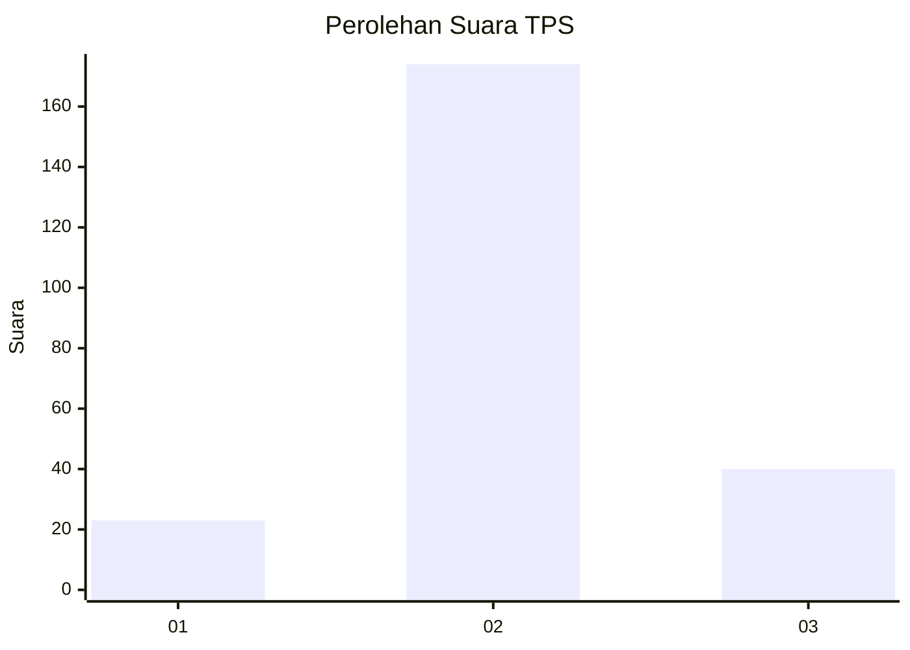
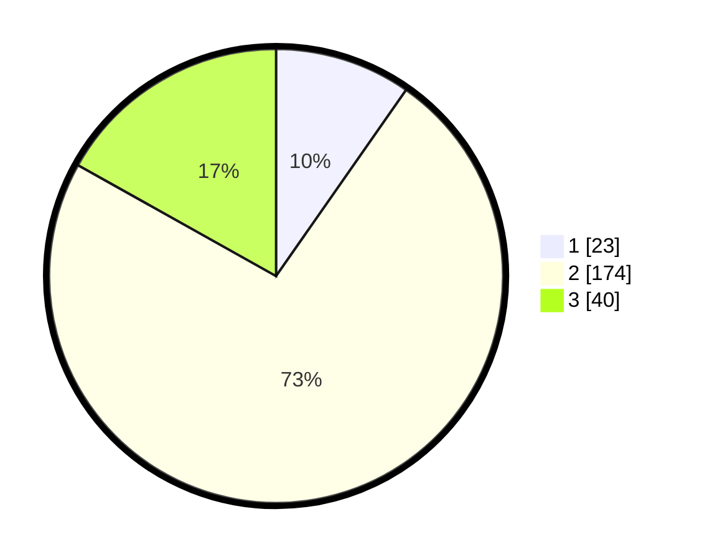

# Hasil

## Grafik

## Tabel

| No. | Nama Paslon    | Suara | Suara (raw) | Persentase |
|:--- |:-------------- | -----:| -----------:| ----------:|
| 1   | ANIES MUHAIMIN | 23    | [23][p-1]   | 9,70       |
| 2   | PRABOWO GIBRAN | 174   | [174][p-2]  | 73,42      |
| 3   | GANJAR MAHFUD  | 40    | [40][p-3]   | 16,88      |

[p-1]: https://github.com/gigit-pemilu/pemilu-2024/blob/main/pilpres/hitung-suara/sub/35-jawa-timur/sub/09-jember/sub/28-ledokombo/sub/2003-karangpaiton/sub/006-tps/sub/paslon-1.txt
[p-2]: https://github.com/gigit-pemilu/pemilu-2024/blob/main/pilpres/hitung-suara/sub/35-jawa-timur/sub/09-jember/sub/28-ledokombo/sub/2003-karangpaiton/sub/006-tps/sub/paslon-2.txt
[p-3]: https://github.com/gigit-pemilu/pemilu-2024/blob/main/pilpres/hitung-suara/sub/35-jawa-timur/sub/09-jember/sub/28-ledokombo/sub/2003-karangpaiton/sub/006-tps/sub/paslon-3.txt

## Foto C Plano

https://sirekap-obj-formc.kpu.go.id/7574/pemilu/ppwp/35/09/28/20/03/3509282003006-20240214-223934--267e8495-b550-45a0-9a04-eb3277cfafaa.jpg

https://sirekap-obj-formc.kpu.go.id/7574/pemilu/ppwp/35/09/28/20/03/3509282003006-20240214-204940--237dd8b0-7672-4b53-8a3b-3a7e678d109c.jpg

https://sirekap-obj-formc.kpu.go.id/7574/pemilu/ppwp/35/09/28/20/03/3509282003006-20240214-205209--5e575b96-fb3a-4e26-9d68-2b0eee7d12c6.jpg

## Metadata

| Key        | Value               |
| ---------- | ------------------- |
| Time Stamp | 2024-02-15 09:00:24 |

