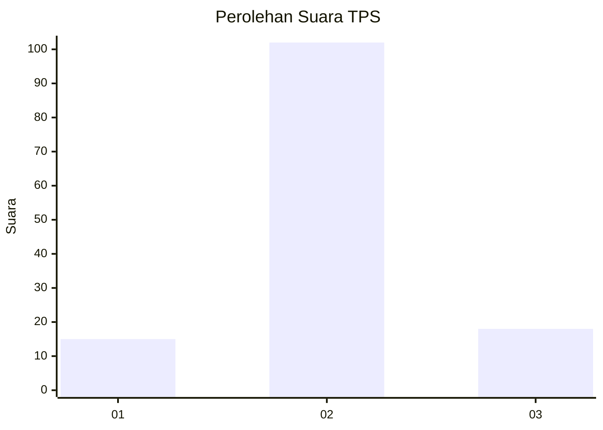
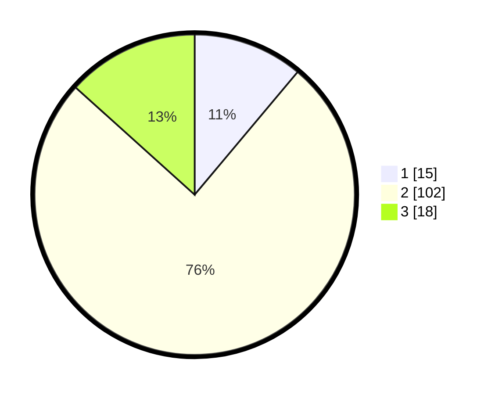

# Hasil

## Grafik

## Tabel

| No. | Nama Paslon    | Suara | Suara (raw) | Persentase |
|:--- |:-------------- | -----:| -----------:| ----------:|
| 1   | ANIES MUHAIMIN | 15    | [15][p-1]   | 11,11      |
| 2   | PRABOWO GIBRAN | 102   | [102][p-2]  | 75,56      |
| 3   | GANJAR MAHFUD  | 18    | [18][p-3]   | 13,33      |

[p-1]: https://github.com/gigit-pemilu/pemilu-2024-35-jawa-timur/blob/main/pilpres/hitung-suara/sub/35-jawa-timur/sub/09-jember/sub/28-ledokombo/sub/2004-sumberanget/sub/001-tps/sub/paslon-1.txt
[p-2]: https://github.com/gigit-pemilu/pemilu-2024-35-jawa-timur/blob/main/pilpres/hitung-suara/sub/35-jawa-timur/sub/09-jember/sub/28-ledokombo/sub/2004-sumberanget/sub/001-tps/sub/paslon-2.txt
[p-3]: https://github.com/gigit-pemilu/pemilu-2024-35-jawa-timur/blob/main/pilpres/hitung-suara/sub/35-jawa-timur/sub/09-jember/sub/28-ledokombo/sub/2004-sumberanget/sub/001-tps/sub/paslon-3.txt

## Foto C Plano

https://sirekap-obj-formc.kpu.go.id/d318/pemilu/ppwp/35/09/28/20/04/3509282004001-20240214-202826--8321fd0b-0e2c-4164-b3d9-653e6f961ebd.jpg

https://sirekap-obj-formc.kpu.go.id/d318/pemilu/ppwp/35/09/28/20/04/3509282004001-20240214-235533--256f8632-694a-4756-84dc-7a78acb49d48.jpg

https://sirekap-obj-formc.kpu.go.id/d318/pemilu/ppwp/35/09/28/20/04/3509282004001-20240214-213009--aeff7261-b066-48ea-ab5c-bffaa5e1b68e.jpg

## Metadata

| Key        | Value               |
| ---------- | ------------------- |
| Time Stamp | 2024-02-15 17:30:25 |

