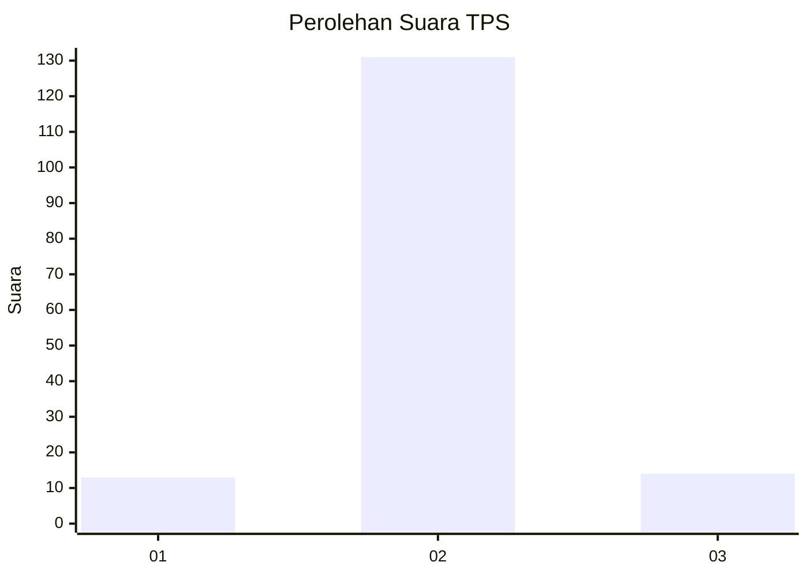
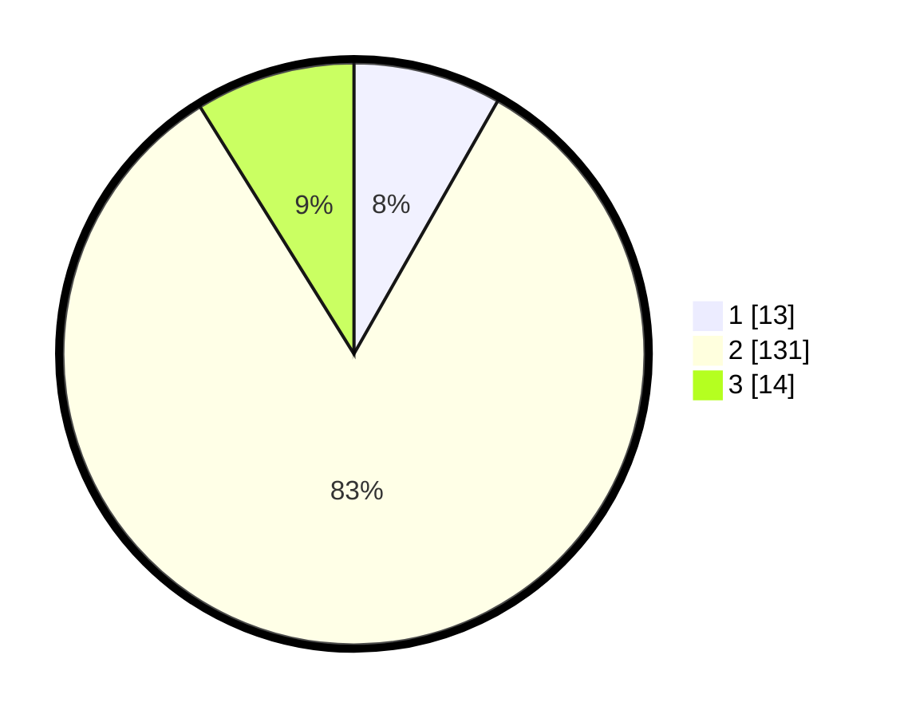

# Hasil

## Grafik

## Tabel

| No. | Nama Paslon    | Suara | Suara (raw) | Persentase |
|:--- |:-------------- | -----:| -----------:| ----------:|
| 1   | ANIES MUHAIMIN | 13    | [13][p-1]   | 8,23       |
| 2   | PRABOWO GIBRAN | 131   | [131][p-2]  | 82,91      |
| 3   | GANJAR MAHFUD  | 14    | [14][p-3]   | 8,86       |

[p-1]: https://github.com/gigit-pemilu/pemilu-2024/blob/main/pilpres/hitung-suara/sub/35-jawa-timur/sub/09-jember/sub/28-ledokombo/sub/2004-sumberanget/sub/006-tps/sub/paslon-1.txt
[p-2]: https://github.com/gigit-pemilu/pemilu-2024/blob/main/pilpres/hitung-suara/sub/35-jawa-timur/sub/09-jember/sub/28-ledokombo/sub/2004-sumberanget/sub/006-tps/sub/paslon-2.txt
[p-3]: https://github.com/gigit-pemilu/pemilu-2024/blob/main/pilpres/hitung-suara/sub/35-jawa-timur/sub/09-jember/sub/28-ledokombo/sub/2004-sumberanget/sub/006-tps/sub/paslon-3.txt

## Foto C Plano

https://sirekap-obj-formc.kpu.go.id/64f4/pemilu/ppwp/35/09/28/20/04/3509282004006-20240214-222003--db26ca5d-4fa6-4330-9df3-79a777d284a7.jpg

https://sirekap-obj-formc.kpu.go.id/64f4/pemilu/ppwp/35/09/28/20/04/3509282004006-20240214-222111--aed9c079-d3ca-4668-9ba7-45dcb56b3fe7.jpg

https://sirekap-obj-formc.kpu.go.id/64f4/pemilu/ppwp/35/09/28/20/04/3509282004006-20240214-222324--91847290-ff7e-44d0-9942-82a7a833dfe6.jpg

## Metadata

| Key        | Value               |
| ---------- | ------------------- |
| Time Stamp | 2024-02-15 15:00:29 |

