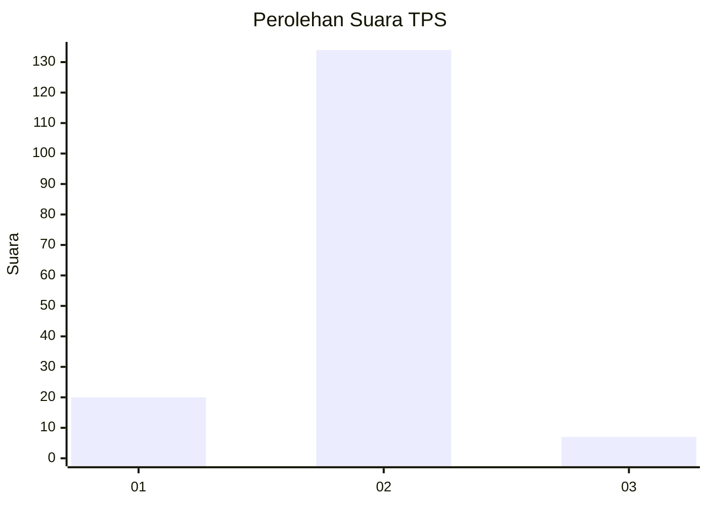
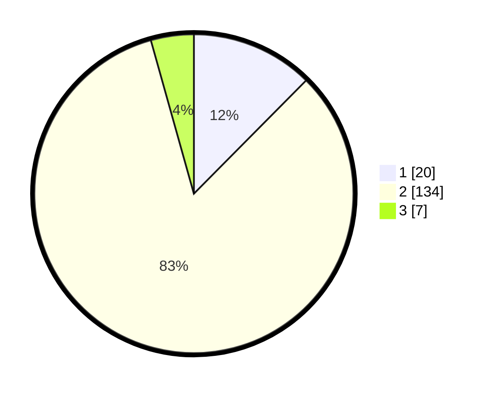

# Hasil

## Grafik

## Tabel

| No. | Nama Paslon    | Suara | Suara (raw) | Persentase |
|:--- |:-------------- | -----:| -----------:| ----------:|
| 1   | ANIES MUHAIMIN | 20    | [20][p-1]   | 12,42      |
| 2   | PRABOWO GIBRAN | 134   | [134][p-2]  | 83,23      |
| 3   | GANJAR MAHFUD  | 7     | [7][p-3]    | 4,35       |

[p-1]: https://github.com/gigit-pemilu/pemilu-2024-35-jawa-timur/blob/main/pilpres/hitung-suara/sub/35-jawa-timur/sub/09-jember/sub/28-ledokombo/sub/2004-sumberanget/sub/007-tps/sub/paslon-1.txt
[p-2]: https://github.com/gigit-pemilu/pemilu-2024-35-jawa-timur/blob/main/pilpres/hitung-suara/sub/35-jawa-timur/sub/09-jember/sub/28-ledokombo/sub/2004-sumberanget/sub/007-tps/sub/paslon-2.txt
[p-3]: https://github.com/gigit-pemilu/pemilu-2024-35-jawa-timur/blob/main/pilpres/hitung-suara/sub/35-jawa-timur/sub/09-jember/sub/28-ledokombo/sub/2004-sumberanget/sub/007-tps/sub/paslon-3.txt

## Foto C Plano

https://sirekap-obj-formc.kpu.go.id/0906/pemilu/ppwp/35/09/28/20/04/3509282004007-20240215-031444--e0d2299d-5bd8-45e1-8410-b29a39825aa3.jpg

https://sirekap-obj-formc.kpu.go.id/0906/pemilu/ppwp/35/09/28/20/04/3509282004007-20240215-031554--9d563023-b47d-4e5d-a6c7-21508884c48c.jpg

https://sirekap-obj-formc.kpu.go.id/0906/pemilu/ppwp/35/09/28/20/04/3509282004007-20240215-031641--892de370-a29d-4036-8f02-6784faf5a7dc.jpg

## Metadata

| Key        | Value               |
| ---------- | ------------------- |
| Time Stamp | 2024-02-15 17:30:25 |

