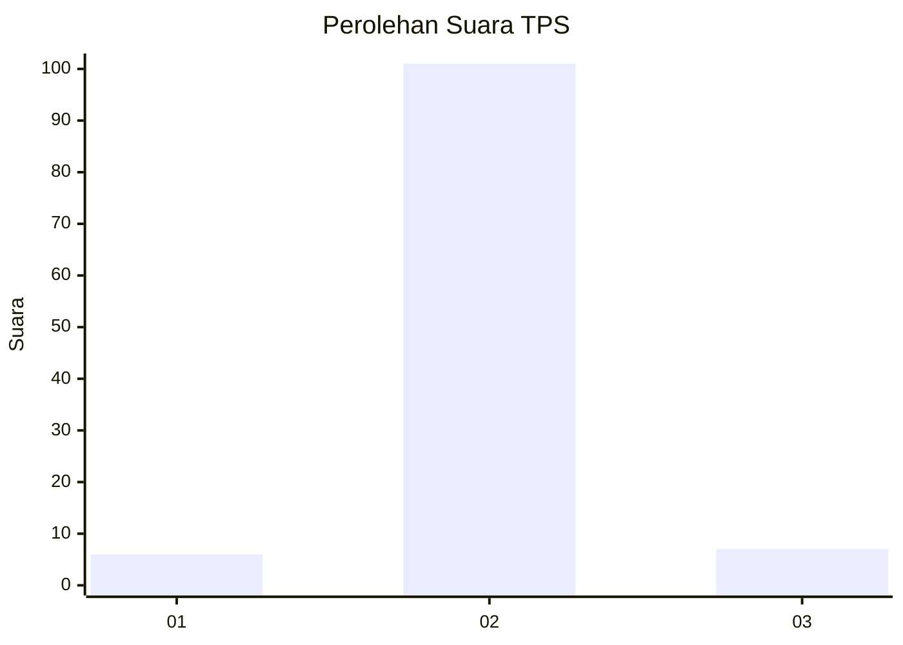
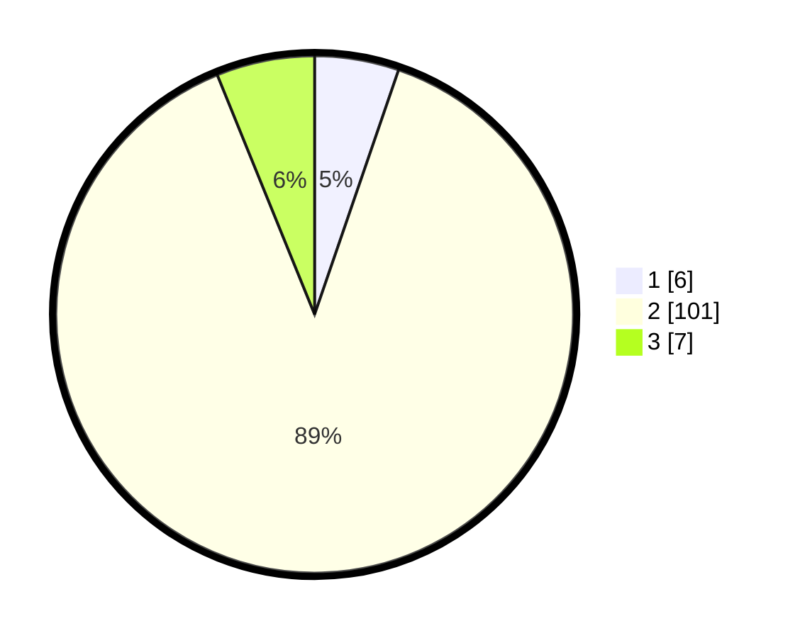

# Hasil

## Grafik

## Tabel

| No. | Nama Paslon    | Suara | Suara (raw) | Persentase |
|:--- |:-------------- | -----:| -----------:| ----------:|
| 1   | ANIES MUHAIMIN | 6     | [6][p-1]    | 5,26       |
| 2   | PRABOWO GIBRAN | 101   | [101][p-2]  | 88,60      |
| 3   | GANJAR MAHFUD  | 7     | [7][p-3]    | 6,14       |

[p-1]: https://github.com/gigit-pemilu/pemilu-2024/blob/main/pilpres/hitung-suara/sub/35-jawa-timur/sub/09-jember/sub/28-ledokombo/sub/2004-sumberanget/sub/010-tps/sub/paslon-1.txt
[p-2]: https://github.com/gigit-pemilu/pemilu-2024/blob/main/pilpres/hitung-suara/sub/35-jawa-timur/sub/09-jember/sub/28-ledokombo/sub/2004-sumberanget/sub/010-tps/sub/paslon-2.txt
[p-3]: https://github.com/gigit-pemilu/pemilu-2024/blob/main/pilpres/hitung-suara/sub/35-jawa-timur/sub/09-jember/sub/28-ledokombo/sub/2004-sumberanget/sub/010-tps/sub/paslon-3.txt

## Foto C Plano

https://sirekap-obj-formc.kpu.go.id/c70f/pemilu/ppwp/35/09/28/20/04/3509282004010-20240214-210520--933b844d-ba80-49ec-8c7b-ac9e3d6e23d5.jpg

https://sirekap-obj-formc.kpu.go.id/c70f/pemilu/ppwp/35/09/28/20/04/3509282004010-20240214-212027--6a49185f-9760-4bcf-9e88-324487e05984.jpg

https://sirekap-obj-formc.kpu.go.id/c70f/pemilu/ppwp/35/09/28/20/04/3509282004010-20240214-212520--c6bc1d19-08a4-4ef8-b2d7-6eb0cb479029.jpg

## Metadata

| Key        | Value               |
| ---------- | ------------------- |
| Time Stamp | 2024-02-15 17:30:25 |

