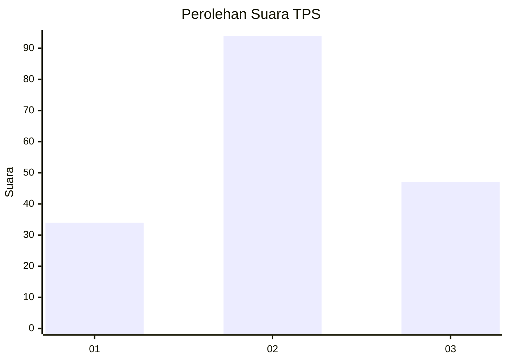
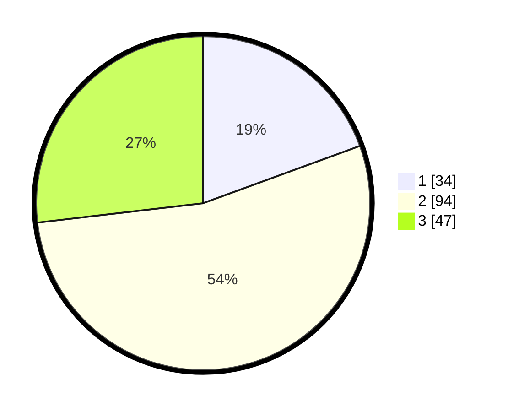

# Hasil

## Grafik

## Tabel

| No. | Nama Paslon    | Suara | Suara (raw) | Persentase |
|:--- |:-------------- | -----:| -----------:| ----------:|
| 1   | ANIES MUHAIMIN | 34    | [34][p-1]   | 19,43      |
| 2   | PRABOWO GIBRAN | 94    | [94][p-2]   | 53,71      |
| 3   | GANJAR MAHFUD  | 47    | [47][p-3]   | 26,86      |

[p-1]: https://github.com/gigit-pemilu/pemilu-2024/blob/main/pilpres/hitung-suara/sub/35-jawa-timur/sub/09-jember/sub/28-ledokombo/sub/2005-sukogidri/sub/005-tps/sub/paslon-1.txt
[p-2]: https://github.com/gigit-pemilu/pemilu-2024/blob/main/pilpres/hitung-suara/sub/35-jawa-timur/sub/09-jember/sub/28-ledokombo/sub/2005-sukogidri/sub/005-tps/sub/paslon-2.txt
[p-3]: https://github.com/gigit-pemilu/pemilu-2024/blob/main/pilpres/hitung-suara/sub/35-jawa-timur/sub/09-jember/sub/28-ledokombo/sub/2005-sukogidri/sub/005-tps/sub/paslon-3.txt

## Foto C Plano

https://sirekap-obj-formc.kpu.go.id/d94f/pemilu/ppwp/35/09/28/20/05/3509282005005-20240214-220137--39daa016-a4bb-4ec6-b250-f06f51ec6bc2.jpg

https://sirekap-obj-formc.kpu.go.id/d94f/pemilu/ppwp/35/09/28/20/05/3509282005005-20240215-003918--9cc67f31-0a20-4801-9338-31edbb02c52f.jpg

https://sirekap-obj-formc.kpu.go.id/d94f/pemilu/ppwp/35/09/28/20/05/3509282005005-20240215-004039--4c17dca0-8284-471d-aa66-bc4f1c01d15c.jpg

## Metadata

| Key        | Value               |
| ---------- | ------------------- |
| Time Stamp | 2024-02-15 17:30:25 |

