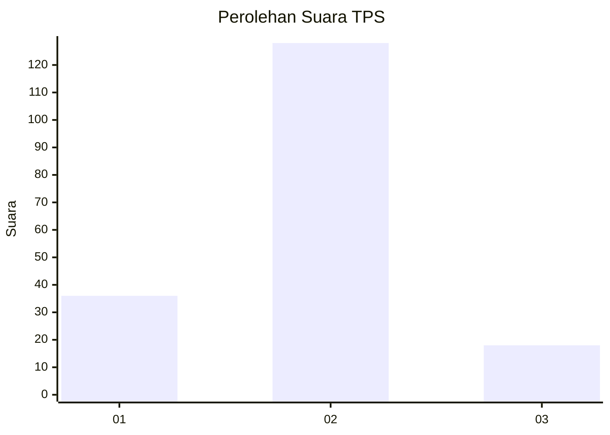
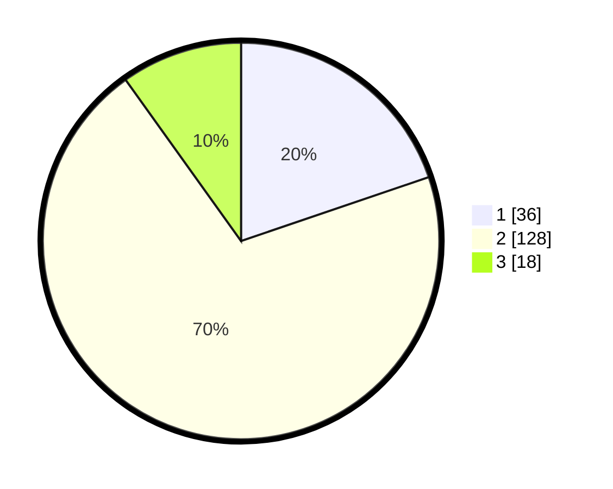

# Hasil

## Grafik

## Tabel

| No. | Nama Paslon    | Suara | Suara (raw) | Persentase |
|:--- |:-------------- | -----:| -----------:| ----------:|
| 1   | ANIES MUHAIMIN | 36    | [36][p-1]   | 19,78      |
| 2   | PRABOWO GIBRAN | 128   | [128][p-2]  | 70,33      |
| 3   | GANJAR MAHFUD  | 18    | [18][p-3]   | 9,89       |

[p-1]: https://github.com/gigit-pemilu/pemilu-2024-35-jawa-timur/blob/main/pilpres/hitung-suara/sub/35-jawa-timur/sub/09-jember/sub/28-ledokombo/sub/2005-sukogidri/sub/011-tps/sub/paslon-1.txt
[p-2]: https://github.com/gigit-pemilu/pemilu-2024-35-jawa-timur/blob/main/pilpres/hitung-suara/sub/35-jawa-timur/sub/09-jember/sub/28-ledokombo/sub/2005-sukogidri/sub/011-tps/sub/paslon-2.txt
[p-3]: https://github.com/gigit-pemilu/pemilu-2024-35-jawa-timur/blob/main/pilpres/hitung-suara/sub/35-jawa-timur/sub/09-jember/sub/28-ledokombo/sub/2005-sukogidri/sub/011-tps/sub/paslon-3.txt

## Foto C Plano

https://sirekap-obj-formc.kpu.go.id/1f75/pemilu/ppwp/35/09/28/20/05/3509282005011-20240214-162232--49761315-6087-4461-92a0-1cff6513a8d9.jpg

https://sirekap-obj-formc.kpu.go.id/1f75/pemilu/ppwp/35/09/28/20/05/3509282005011-20240214-162239--6cfefdee-437e-4b8d-9c2f-f3deb36a4256.jpg

https://sirekap-obj-formc.kpu.go.id/1f75/pemilu/ppwp/35/09/28/20/05/3509282005011-20240214-215804--d0b5a101-33bd-4f1b-8b43-bd7d8de175ad.jpg

## Metadata

| Key        | Value               |
| ---------- | ------------------- |
| Time Stamp | 2024-02-15 16:30:25 |

