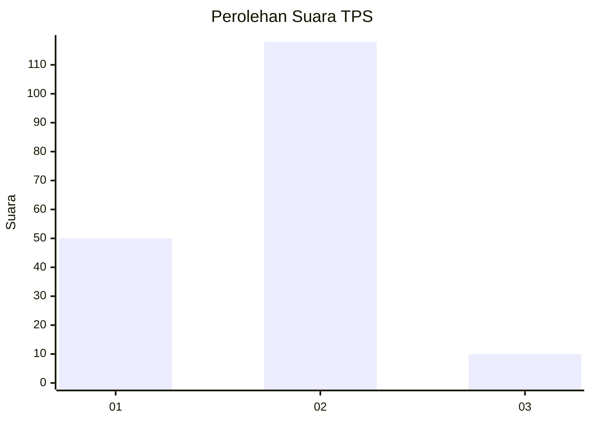
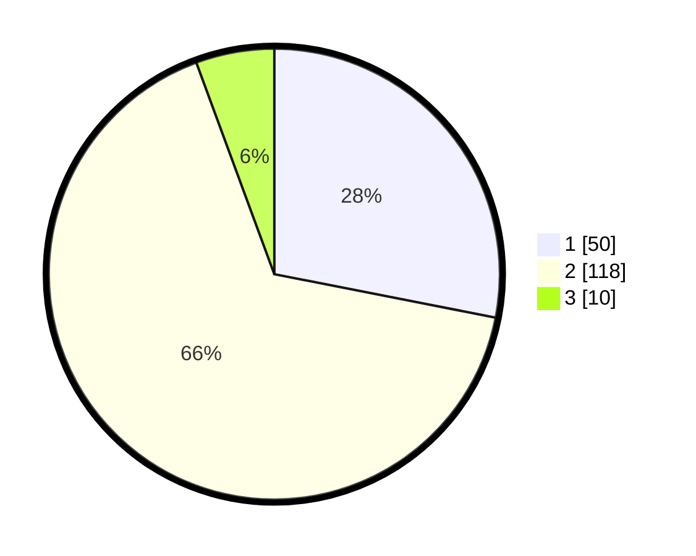

# Hasil

## Grafik

## Tabel

| No. | Nama Paslon    | Suara | Suara (raw) | Persentase |
|:--- |:-------------- | -----:| -----------:| ----------:|
| 1   | ANIES MUHAIMIN | 50    | [50][p-1]   | 28,09      |
| 2   | PRABOWO GIBRAN | 118   | [118][p-2]  | 66,29      |
| 3   | GANJAR MAHFUD  | 10    | [10][p-3]   | 5,62       |

[p-1]: https://github.com/gigit-pemilu/pemilu-2024-35-jawa-timur/blob/main/pilpres/hitung-suara/sub/35-jawa-timur/sub/09-jember/sub/28-ledokombo/sub/2006-ledokombo/sub/010-tps/sub/paslon-1.txt
[p-2]: https://github.com/gigit-pemilu/pemilu-2024-35-jawa-timur/blob/main/pilpres/hitung-suara/sub/35-jawa-timur/sub/09-jember/sub/28-ledokombo/sub/2006-ledokombo/sub/010-tps/sub/paslon-2.txt
[p-3]: https://github.com/gigit-pemilu/pemilu-2024-35-jawa-timur/blob/main/pilpres/hitung-suara/sub/35-jawa-timur/sub/09-jember/sub/28-ledokombo/sub/2006-ledokombo/sub/010-tps/sub/paslon-3.txt

## Foto C Plano

https://sirekap-obj-formc.kpu.go.id/8f90/pemilu/ppwp/35/09/28/20/06/3509282006010-20240214-230327--a516a7ba-1ffc-45ce-a115-170d65083ceb.jpg

https://sirekap-obj-formc.kpu.go.id/8f90/pemilu/ppwp/35/09/28/20/06/3509282006010-20240217-083956--56c13679-de66-49b2-acfd-9da23d086bf9.jpg

https://sirekap-obj-formc.kpu.go.id/8f90/pemilu/ppwp/35/09/28/20/06/3509282006010-20240214-231811--a38c8183-5754-42d3-9e73-bdbc23025df2.jpg

## Metadata

| Key        | Value               |
| ---------- | ------------------- |
| Time Stamp | 2024-02-24 22:31:28 |

