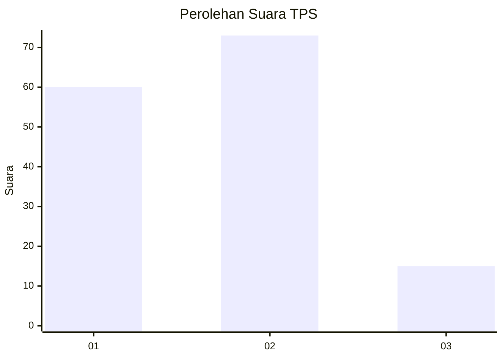
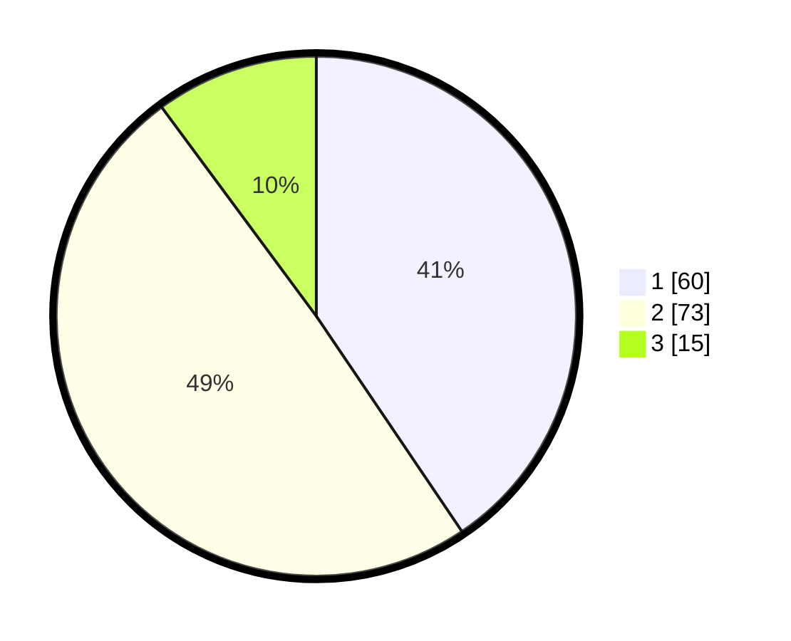

# Hasil

## Grafik

## Tabel

| No. | Nama Paslon    | Suara | Suara (raw) | Persentase |
|:--- |:-------------- | -----:| -----------:| ----------:|
| 1   | ANIES MUHAIMIN | 60    | [60][p-1]   | 40,54      |
| 2   | PRABOWO GIBRAN | 73    | [73][p-2]   | 49,32      |
| 3   | GANJAR MAHFUD  | 15    | [15][p-3]   | 10,14      |

[p-1]: https://github.com/gigit-pemilu/pemilu-2024-35-jawa-timur/blob/main/pilpres/hitung-suara/sub/35-jawa-timur/sub/09-jember/sub/28-ledokombo/sub/2007-sumberlesung/sub/013-tps/sub/paslon-1.txt
[p-2]: https://github.com/gigit-pemilu/pemilu-2024-35-jawa-timur/blob/main/pilpres/hitung-suara/sub/35-jawa-timur/sub/09-jember/sub/28-ledokombo/sub/2007-sumberlesung/sub/013-tps/sub/paslon-2.txt
[p-3]: https://github.com/gigit-pemilu/pemilu-2024-35-jawa-timur/blob/main/pilpres/hitung-suara/sub/35-jawa-timur/sub/09-jember/sub/28-ledokombo/sub/2007-sumberlesung/sub/013-tps/sub/paslon-3.txt

## Foto C Plano

https://sirekap-obj-formc.kpu.go.id/7938/pemilu/ppwp/35/09/28/20/07/3509282007013-20240215-000323--a8a3aeff-a7a6-47f5-b658-c005bc5cfdf1.jpg

https://sirekap-obj-formc.kpu.go.id/7938/pemilu/ppwp/35/09/28/20/07/3509282007013-20240215-000711--1a14bf6f-ce85-4d2a-b2ee-0a1184bc42af.jpg

https://sirekap-obj-formc.kpu.go.id/7938/pemilu/ppwp/35/09/28/20/07/3509282007013-20240215-000502--603484ff-912d-42e3-b51d-caee6032cda2.jpg

## Metadata

| Key        | Value               |
| ---------- | ------------------- |
| Time Stamp | 2024-02-15 02:10:27 |

