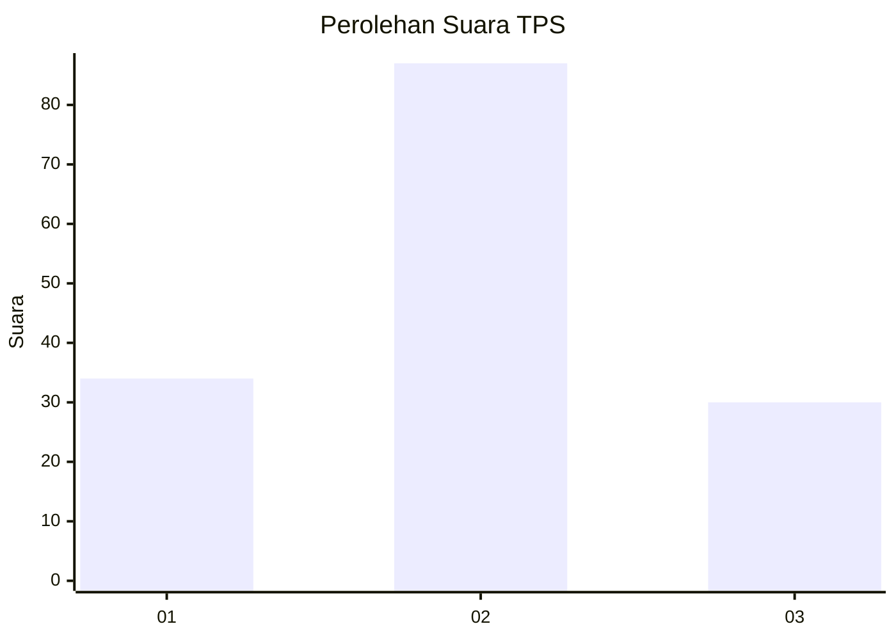
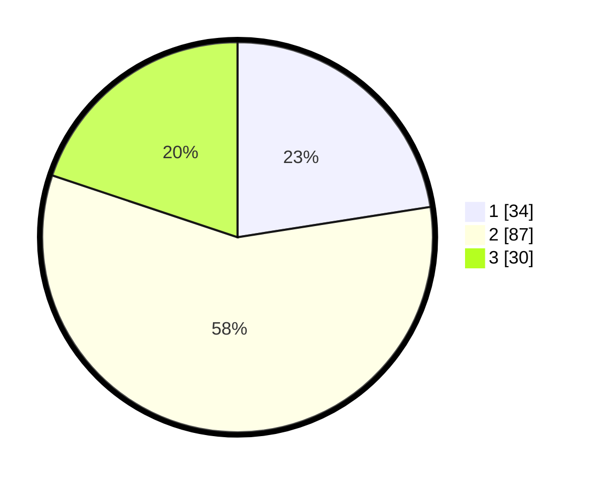

# Hasil

## Grafik

## Tabel

| No. | Nama Paslon    | Suara | Suara (raw) | Persentase |
|:--- |:-------------- | -----:| -----------:| ----------:|
| 1   | ANIES MUHAIMIN | 34    | [34][p-1]   | 22,52      |
| 2   | PRABOWO GIBRAN | 87    | [87][p-2]   | 57,62      |
| 3   | GANJAR MAHFUD  | 30    | [30][p-3]   | 19,87      |

[p-1]: https://github.com/gigit-pemilu/pemilu-2024-35-jawa-timur/blob/main/pilpres/hitung-suara/sub/35-jawa-timur/sub/09-jember/sub/28-ledokombo/sub/2007-sumberlesung/sub/020-tps/sub/paslon-1.txt
[p-2]: https://github.com/gigit-pemilu/pemilu-2024-35-jawa-timur/blob/main/pilpres/hitung-suara/sub/35-jawa-timur/sub/09-jember/sub/28-ledokombo/sub/2007-sumberlesung/sub/020-tps/sub/paslon-2.txt
[p-3]: https://github.com/gigit-pemilu/pemilu-2024-35-jawa-timur/blob/main/pilpres/hitung-suara/sub/35-jawa-timur/sub/09-jember/sub/28-ledokombo/sub/2007-sumberlesung/sub/020-tps/sub/paslon-3.txt

## Foto C Plano

https://sirekap-obj-formc.kpu.go.id/29cc/pemilu/ppwp/35/09/28/20/07/3509282007020-20240214-234020--c5883286-42a9-40ab-a056-8f1c531a0c5d.jpg

https://sirekap-obj-formc.kpu.go.id/29cc/pemilu/ppwp/35/09/28/20/07/3509282007020-20240214-234117--491e3c40-61c6-4bea-8579-26eec9c81c6c.jpg

https://sirekap-obj-formc.kpu.go.id/29cc/pemilu/ppwp/35/09/28/20/07/3509282007020-20240214-234231--62f699ab-7053-4f21-afea-22cc2a0b2a09.jpg

## Metadata

| Key        | Value               |
| ---------- | ------------------- |
| Time Stamp | 2024-02-15 17:30:25 |

