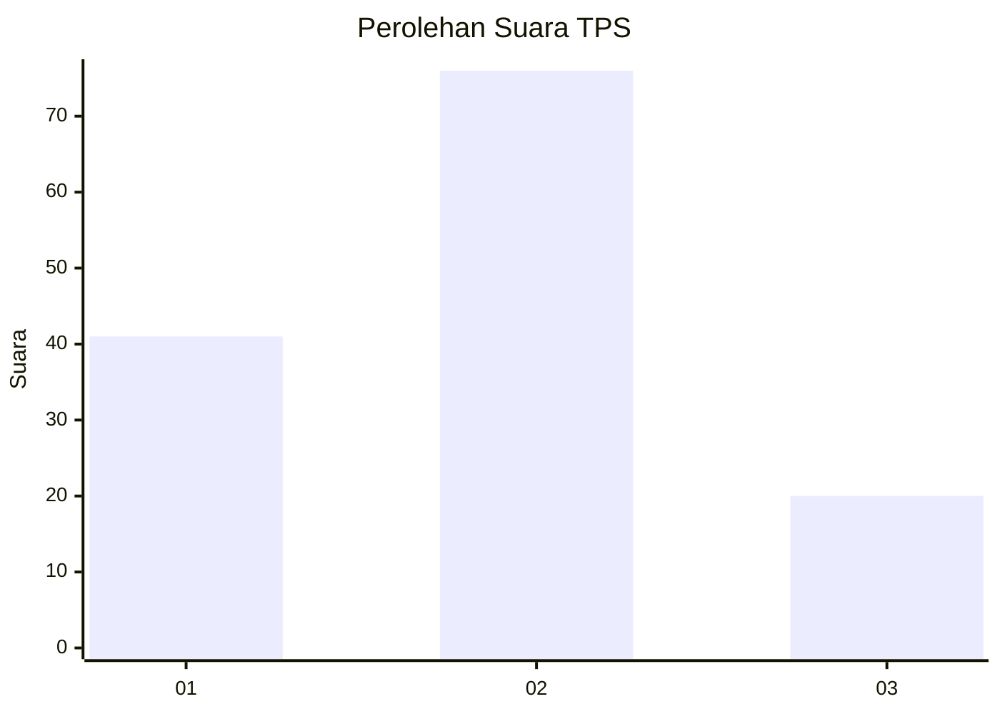
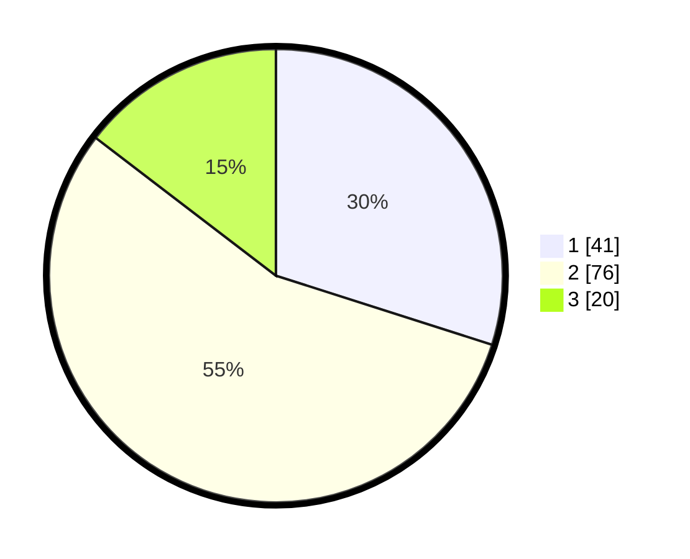

# Hasil

## Grafik

## Tabel

| No. | Nama Paslon    | Suara | Suara (raw) | Persentase |
|:--- |:-------------- | -----:| -----------:| ----------:|
| 1   | ANIES MUHAIMIN | 41    | [41][p-1]   | 29,93      |
| 2   | PRABOWO GIBRAN | 76    | [76][p-2]   | 55,47      |
| 3   | GANJAR MAHFUD  | 20    | [20][p-3]   | 14,60      |

[p-1]: https://github.com/gigit-pemilu/pemilu-2024/blob/main/pilpres/hitung-suara/sub/35-jawa-timur/sub/09-jember/sub/28-ledokombo/sub/2007-sumberlesung/sub/025-tps/sub/paslon-1.txt
[p-2]: https://github.com/gigit-pemilu/pemilu-2024/blob/main/pilpres/hitung-suara/sub/35-jawa-timur/sub/09-jember/sub/28-ledokombo/sub/2007-sumberlesung/sub/025-tps/sub/paslon-2.txt
[p-3]: https://github.com/gigit-pemilu/pemilu-2024/blob/main/pilpres/hitung-suara/sub/35-jawa-timur/sub/09-jember/sub/28-ledokombo/sub/2007-sumberlesung/sub/025-tps/sub/paslon-3.txt

## Foto C Plano

https://sirekap-obj-formc.kpu.go.id/7ded/pemilu/ppwp/35/09/28/20/07/3509282007025-20240215-002134--74efd6a2-30af-4831-893a-68122c4be764.jpg

https://sirekap-obj-formc.kpu.go.id/7ded/pemilu/ppwp/35/09/28/20/07/3509282007025-20240215-002654--d8d987a0-0837-4464-8581-ada82b311f18.jpg

https://sirekap-obj-formc.kpu.go.id/7ded/pemilu/ppwp/35/09/28/20/07/3509282007025-20240215-003137--74d7758e-15f5-4d67-bbda-67be62627ee6.jpg

## Metadata

| Key        | Value               |
| ---------- | ------------------- |
| Time Stamp | 2024-02-15 12:00:28 |

