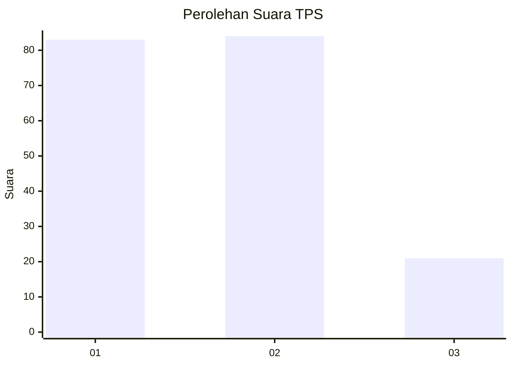
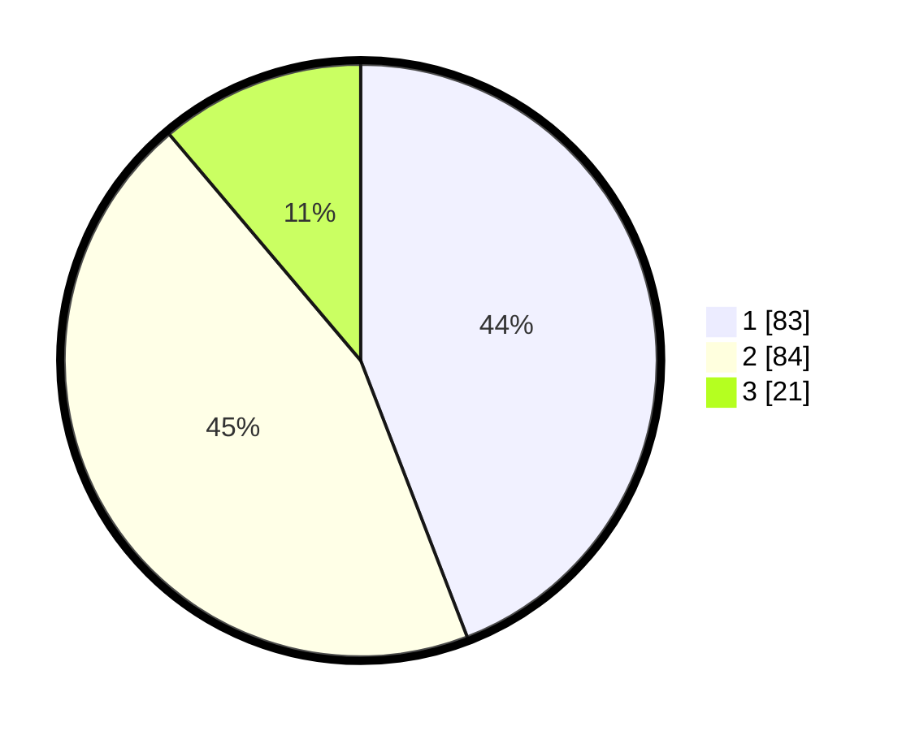

# Hasil

## Grafik

## Tabel

| No. | Nama Paslon    | Suara | Suara (raw) | Persentase |
|:--- |:-------------- | -----:| -----------:| ----------:|
| 1   | ANIES MUHAIMIN | 83    | [83][p-1]   | 44,15      |
| 2   | PRABOWO GIBRAN | 84    | [84][p-2]   | 44,68      |
| 3   | GANJAR MAHFUD  | 21    | [21][p-3]   | 11,17      |

[p-1]: https://github.com/gigit-pemilu/pemilu-2024-35-jawa-timur/blob/main/pilpres/hitung-suara/sub/35-jawa-timur/sub/09-jember/sub/28-ledokombo/sub/2008-sumbersalak/sub/004-tps/sub/paslon-1.txt
[p-2]: https://github.com/gigit-pemilu/pemilu-2024-35-jawa-timur/blob/main/pilpres/hitung-suara/sub/35-jawa-timur/sub/09-jember/sub/28-ledokombo/sub/2008-sumbersalak/sub/004-tps/sub/paslon-2.txt
[p-3]: https://github.com/gigit-pemilu/pemilu-2024-35-jawa-timur/blob/main/pilpres/hitung-suara/sub/35-jawa-timur/sub/09-jember/sub/28-ledokombo/sub/2008-sumbersalak/sub/004-tps/sub/paslon-3.txt

## Foto C Plano

https://sirekap-obj-formc.kpu.go.id/c3c4/pemilu/ppwp/35/09/28/20/08/3509282008004-20240215-002339--cbe65a9b-f148-4b64-b519-e0b25b11977b.jpg

https://sirekap-obj-formc.kpu.go.id/c3c4/pemilu/ppwp/35/09/28/20/08/3509282008004-20240214-233749--b09b4a37-cf0b-4e66-926f-eaae20075bc2.jpg

https://sirekap-obj-formc.kpu.go.id/c3c4/pemilu/ppwp/35/09/28/20/08/3509282008004-20240214-233915--3a18e9cf-7d12-4d19-bd25-5eb38f78c941.jpg

## Metadata

| Key        | Value               |
| ---------- | ------------------- |
| Time Stamp | 2024-02-15 18:00:26 |

